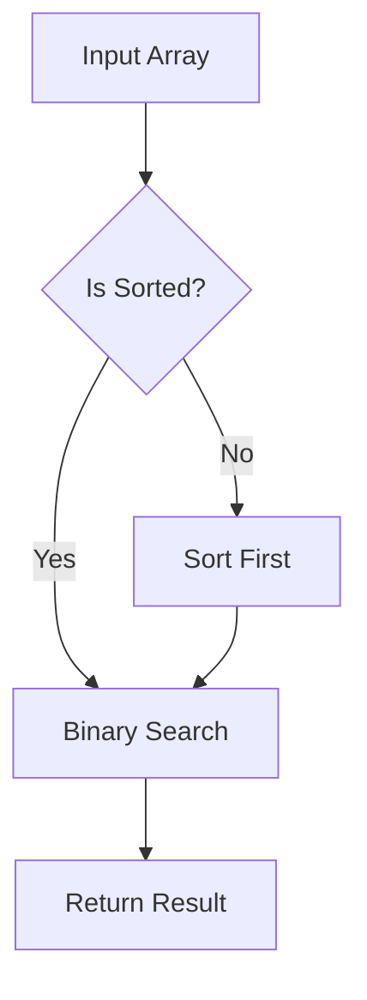
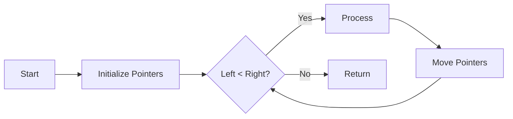
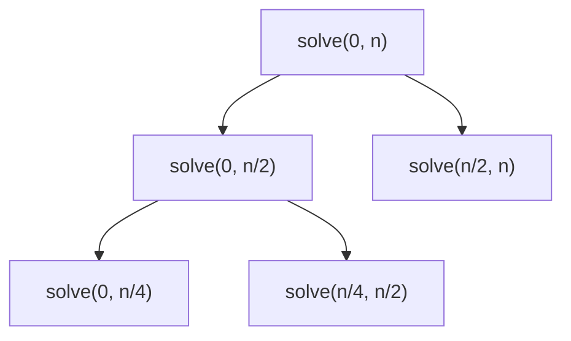
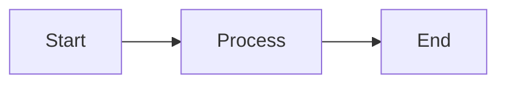

# GitHub Copilot Instructions for Blog-Astro

This document provides guidance for GitHub Copilot when working with this Astro-based blog project.

## Project Overview

This is a multilingual blog built with Astro, featuring:
- Support for English and Spanish content
- Markdown-based posts with frontmatter
- Tag-based organization
- RSS/Atom feeds
- SEO optimization
- Code syntax highlighting with copy buttons
- Image optimization with LQIP (Low Quality Image Placeholders)
- Mermaid diagrams and KaTeX math support

## Drafting Posts

### Workflow for Problem-Solving Posts (LeetCode/FreeCodeCamp Exercises)

When creating a post about solving a coding exercise (LeetCode, FreeCodeCamp, etc.), the user will provide relevant files containing:
- **The problem description**: Challenge statement, constraints, input/output examples
- **The solution**: The implemented code and algorithm approach
- **The process**: Thought process, alternative approaches considered, optimization steps

The AI agent's role is to:

#### 1. Analyze Context
Review all provided files to understand the coding challenge, solution approach, and problem-solving journey.

#### 2. Structure the Narrative
Create a clear, engaging post following this pattern:
- **Introduction**: Present the challenge and why it's interesting or useful
- **Problem Statement**: Clearly explain the problem, constraints, and examples
- **Approach & Analysis**: Explain the strategy and reasoning behind the solution
  - Initial thoughts and observations
  - Key insights that led to the solution
  - Alternative approaches considered
- **Solution**: Present the implementation with detailed explanations
  - Code walkthrough
  - Complexity analysis (time and space)
- **Optimization** (if applicable): Discuss improvements and trade-offs
- **Conclusion**: Key takeaways, patterns learned, and when to apply this approach

#### 3. Write with Agility
Use a clear, direct writing style that:
- Explains technical concepts concisely
- Uses active voice and present tense when appropriate
- Includes practical examples and real code snippets
- Avoids unnecessary jargon while maintaining technical accuracy

#### 4. Enhance with Visual Elements
Always include when applicable:

**Mathematical notation** (KaTeX): For algorithms, complexity analysis, recurrence relations
```markdown
The time complexity is $O(n \log n)$ where $n$ is the input size.

For recurrence relations:
$$
T(n) = 2T(n/2) + O(n) = O(n \log n)
$$

For mathematical proofs or formulas:
$$
\sum_{i=1}^{n} i = \frac{n(n+1)}{2}
$$
```

**Mermaid diagrams**: For visualizing algorithms, data structures, decision trees, state transitions
```markdown

```

```markdown

```

For algorithm visualization with recursion:
```markdown

```

#### 5. Technical Depth
Include:
- Code snippets with proper syntax highlighting and language tags
- Algorithm complexity analysis (Big O notation)
- Step-by-step solution walkthrough with comments
- Test cases and edge cases explanation
- Visual traces of algorithm execution when helpful
- Links to related problems or patterns
- Comparison of different approaches (brute force vs optimized)

#### 6. Frontmatter Template for Problem-Solving Posts
```yaml
---
title: "[Problem Name]: [Approach/Pattern Used]"
pubDate: YYYY-MM-DD
description: "A concise summary of the problem and solution approach"
tags: ["leetcode", "algorithms", "data-structures", "specific-pattern"]
category: "coding-challenges" # or "algorithms"
lang: "en" # or "es"
---
```

### Workflow for Project Posts

When creating a post about a project, the user will provide:
- **Relevant files**: Code snippets, configuration files, project structure
- **Documentation draft**: Raw notes, features list, technical decisions, challenges faced

The AI agent's role is to:

1. **Analyze Project Context**: Review all provided files to understand the project's purpose, architecture, and implementation details
2. **Structure the Documentation**: Create a well-organized post following this pattern:
   - **Introduction**: What the project is and why it exists
   - **Features**: Key capabilities and functionalities
   - **Technical Stack**: Technologies, frameworks, and tools used
   - **Architecture**: System design and component structure (use Mermaid diagrams)
   - **Implementation Details**: Notable code patterns, algorithms, or solutions
   - **Challenges & Solutions**: Problems encountered and how they were resolved
   - **Lessons Learned**: Key takeaways and future improvements
   - **Demo/Usage**: How to use or interact with the project
3. **Enhance Technical Writing**: Ensure clear, professional technical documentation
4. **Add Visual Elements**: Include diagrams, code snippets, and visual aids where helpful
5. **Maintain Project Context**: Preserve technical accuracy while making content accessible

### Workflow for General Posts

When creating other types of posts, the initial workflow involves pasting your raw notes into the newly created markdown file. These notes may be unordered or loosely structured. The AI agent's role is to:

1. **Organize Content**: Rearrange the notes into a logical structure with clear sections (e.g., introduction, body, conclusion).
2. **Enhance Readability**: Ensure the post is easy to read by improving sentence flow, grammar, and clarity.
3. **Add Comments**: Provide inline comments or suggestions for areas that need further elaboration or clarification.
4. **Ensure Coherence**: Verify that the post has a consistent tone and style, and that ideas are presented in a coherent manner.
5. **Optimize Structure**: Suggest or implement headings, subheadings, and formatting to make the post visually appealing and easy to navigate.

### Tips for Effective Collaboration

- **For problem-solving posts**: Share all relevant files (problem statement, solution code, thought process)
- **For project posts**: Provide relevant code files and a draft of the documentation with features, technical decisions, and challenges
- **For general posts**: Paste your notes as comprehensively as possible, even if they are unordered
- Highlight any specific points or sections you want the agent to focus on
- **Iterative Editing**: When editing posts, provide suggestions one at a time and implement them individually rather than making multiple changes at once. This allows for better review and refinement of each improvement
- Review the AI's edits and suggestions, and iterate as needed to finalize the post
- **For technical posts**: Indicate if you want specific sections with diagrams or mathematical notation

### Language Workflow

**IMPORTANT**: All posts are initially written in Spanish (`.es.md`). 

1. **Write in Spanish first**: Create and complete the post in Spanish with `lang: "es"` in the frontmatter
2. **Review and finalize**: Ensure the Spanish version is polished and complete
3. **Generate translation**: Before making a commit, create the English translation (`.en.md`) with `lang: "en"`
4. **Commit both versions**: Always commit Spanish and English versions together

This ensures consistency across languages and that both versions are available simultaneously.

## Content Structure

### Post Files Location
- English posts: `src/content/posts/*.en.md`
- Spanish posts: `src/content/posts/*.es.md`
- Drafts: `src/content/drafts/`

### Frontmatter Required Fields
```yaml
---
title: "Post Title"
pubDate: YYYY-MM-DD
description: "Brief post description"
tags: ["tag1", "tag2"]
category: "category-name"
lang: "en" # or "es"
---
```

### Optional Frontmatter Fields
```yaml
draft: false
image: "/images/post-image.jpg"
imageAlt: "Image description"
author: "Author Name"
```

## Code Style Guidelines

### TypeScript/JavaScript
- Use TypeScript for type safety
- Follow ESLint configuration in `eslint.config.mjs`
- Use modern ES6+ syntax
- Prefer functional components for Astro

### Markdown
- Use proper heading hierarchy (H1 for title, H2 for sections, H3 for subsections)
- Include code language tags for syntax highlighting
- Use relative links for internal references
- Optimize images and provide alt text

### CSS
- UnoCSS utility classes are available (see `uno.config.ts`)
- Custom styles in `src/styles/`
- Follow mobile-first responsive design

## Scripts Available

- `pnpm new-post`: Create a new post with template
- `pnpm format-posts`: Format existing posts
- `pnpm apply-lqip`: Generate LQIP for images
- `pnpm update-theme`: Update theme colors

## Common Tasks

### Creating a New Post
1. Run `pnpm new-post` or create file manually in `src/content/posts/`
2. Use the frontmatter template above
3. Write content with proper markdown formatting
4. Include code examples with language tags
5. Add tags for organization

### Adding Images
1. Place images in `src/assets/images/`
2. Reference in markdown: ``
3. Run `pnpm apply-lqip` to generate placeholders

### Adding Mermaid Diagrams
Use code blocks with `mermaid` language tag:
```markdown

```

### Adding Math Equations
Use KaTeX syntax:
- Inline: `$E = mc^2$`
- Block: `$$\sum_{i=1}^{n} i = \frac{n(n+1)}{2}$$`

## SEO Considerations

- Keep titles under 60 characters
- Descriptions between 120-160 characters
- Use descriptive URLs (slug based on filename)
- Include relevant keywords in content naturally
- Add alt text to all images
- Use proper heading structure

Refer to `SEO_OPTIMIZATION_GUIDE.md` for detailed SEO guidelines.

## Multilingual Support

- Create separate files for each language (`.en.md`, `.es.md`)
- Keep consistent URL structure across languages
- Translate all frontmatter fields
- Use language-specific tags when appropriate

## Important Notes

- Always validate markdown syntax before committing
- Test locally with `pnpm dev` before publishing
- Check for broken links and images
- Ensure mobile responsiveness of custom components
- Follow accessibility guidelines (WCAG 2.1 AA)
