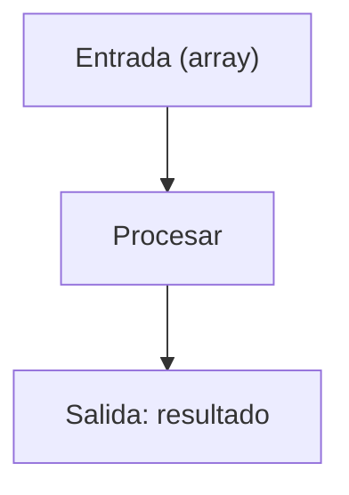
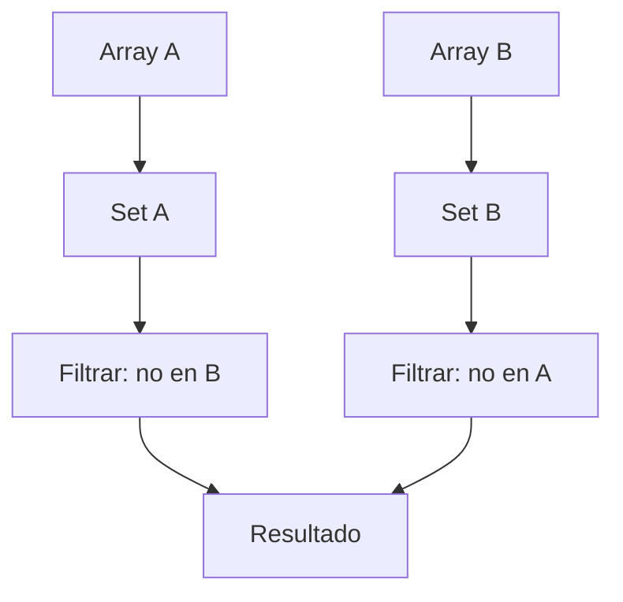

# Formato de Frontmatter para Posts del Blog

Todo post debe comenzar con un bloque de frontmatter en YAML, siguiendo este formato:

```yaml
---
title: "Validador de Ipv4 - FreeCodeCamp #25 Daily Challenge"
published: 2025-12-12T22:57:04.267Z
description: 'Resolvemos "Ipv4 Validator", un desafío de FreeCodeCamp que trabaja validación y análisis de strings.'
updated: ''
tags:
  - freecodecamp
  - daily-challenge
draft: false
pin: 0
toc: true
lang: "es"
abbrlink: "ipv4-validator"
---

```

Opcionales:
```yaml
draft: false
image: /images/post-image.jpg
imageAlt: Descripción de la imagen
author: Nombre del autor
```

# Instrucciones  para Redacción y Colaboración en Blog-Astro


## Propósito y Alcance

Guía integral para la creación, mejora y traducción de posts técnicos en el blog, dirigida tanto a la IA (Copilot) como a autores humanos. Incluye reglas de redacción, estructura, visuales, flujo multilingüe y colaboración.

---

## 1. Flujo de Trabajo General

### 1.1. Tipos de Posts
- **Resolución de problemas** (LeetCode, FreeCodeCamp, etc.)
- **Posts de proyectos** (explicación de código, arquitectura, decisiones)
- **Posts generales** (notas, reflexiones, guías)

### 1.2. Fases del Proceso
1. **Redacción inicial en español**
2. **Mejora de redacción y estilo**
3. **Revisión colaborativa**
4. **Traducción al inglés**
5. **Publicación de ambas versiones**

---

## 2. Mejora de Redacción y Estilo

- Oraciones concisas, sin relleno innecesario
- Eliminar redundancias y explicaciones circulares
- Accesible para principiantes, interesante para avanzados
- Mantener tono técnico-cercano y voz del autor
- Uso de listas, tablas, bloques de código comentados
- Secciones claras con encabezados
- Preguntas retóricas y emojis/símbolos para feedback visual

### Checklist de Mejora
- [ ] ¿Las oraciones son directas y sin palabras de relleno?
- [ ] ¿Cada sección aporta información nueva (sin redundancias)?
- [ ] ¿Un principiante puede seguir el razonamiento paso a paso?
- [ ] ¿Un lector avanzado encuentra algo interesante (optimizaciones, trade-offs)?
- [ ] ¿Los diagramas/fórmulas agregados clarifican conceptos?
- [ ] ¿La ortografía y gramática están correctas?
- [ ] ¿El frontmatter (title, description, tags) es preciso?

---

## 3. Visuales: Diagramas Mermaid y KaTeX

### 3.1. Mermaid
- Usar para flujos, estructuras de datos, relaciones, árboles de decisión
- Preferir diagramas verticales (`TD`/`TB`) para mejor visualización móvil
- Proteger caracteres especiales en nodos: envolver texto con `""` dentro del delimitador de forma
- Ejemplo:



### 3.2. KaTeX
- Usar para fórmulas de complejidad, definiciones formales, expresiones matemáticas
- Inline: `$O(n \log n)$`  |  Block: `$$...$$`

---

## 4. Estructura Recomendada de Posts

1. **Introducción/Enunciado**
2. **Análisis Inicial**
3. **Desarrollo de la Solución**
4. **Implementación** (código comentado)
5. **Análisis de Complejidad**
6. **Casos Edge**
7. **Reflexiones/Aprendizajes**
8. **Recursos**

---

## 5. Proceso Multilingüe

- Escribir y mejorar primero en español (`.es.md`, `lang: "es"`)
- Revisar y aprobar versión en español
- Traducir al inglés (`.en.md`, `lang: "en"`), adaptando expresiones y manteniendo diagramas/fórmulas
- Publicar ambas versiones juntas

---

## 6. Frontmatter y Convenciones

### 6.1. Campos requeridos
```yaml
---
title: Título del post
pubDate: YYYY-MM-DD
description: Breve descripción
tags: [tag1, tag2]
category: categoría
lang: es # o "en"
---
```

### 6.2. Opcionales
```yaml
draft: false
image: /images/post-image.jpg
imageAlt: Descripción de la imagen
author: Nombre del autor
```

---

## 7. Código y Formato

- TypeScript: usar tipado, seguir ESLint, ES6+, componentes funcionales
- Markdown: jerarquía de headings, code blocks con lenguaje, links relativos, imágenes optimizadas
- CSS: UnoCSS, estilos en `src/styles/`, mobile-first

---

## 8. Colaboración y Revisión

- Sugerir cambios uno a la vez para revisión iterativa
- Explicar cada modificación significativa
- Esperar feedback antes de traducir
- Mantener consistencia y claridad

---

## 9. Recursos y Tareas Comunes

- Scripts: `pnpm new-post`, `pnpm format-posts`, `pnpm apply-lqip`, `pnpm update-theme`
- Ubicación de archivos: `src/content/posts/`, `src/content/drafts/`, imágenes en `src/assets/images/`
- Validar markdown, probar localmente, revisar enlaces e imágenes, accesibilidad

---

## 10. Qué NO hacer

- ❌ Cambiar la voz del autor
- ❌ Agregar formalidad excesiva
- ❌ Simplificar en exceso
- ❌ Diagramas/matemáticas solo por estética
- ❌ Eliminar humor sutil o comentarios personales

---

## 11. Ejemplo de Diagrama Mermaid



---

## 12. Notas Finales

Este documento es la referencia principal para la colaboración y redacción en el blog. Si tienes dudas, consulta aquí antes de preguntar o modificar el flujo.
