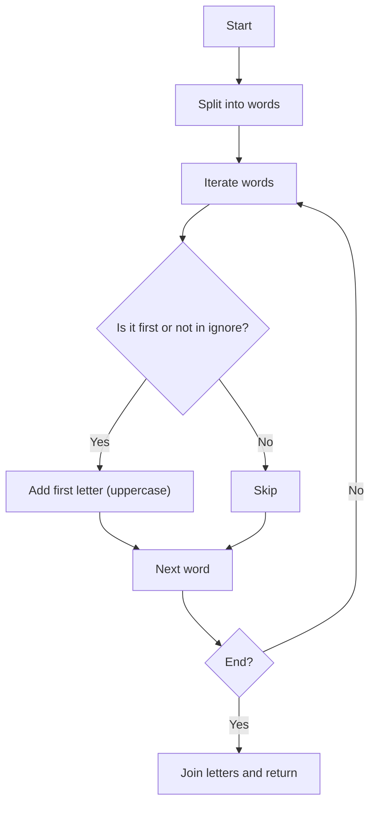

## Acronym Builder

### 1. Problem Statement

Given a string of one or more words, return the acronym following these rules:

- The acronym is the first letter of each word (uppercase), unless the word is in the ignore list and not the first word.
- Ignore words (except if first): a, for, an, and, by, of.
- The order of the letters matches the original order.
- No spaces in the result.

---

### 2. Test Cases

| Input                                                                  | Expected Acronym |
|------------------------------------------------------------------------|------------------|
| Search Engine Optimization                                             | SEO              |
| Frequently Asked Questions                                             | FAQ              |
| National Aeronautics and Space Administration                          | NASA             |
| Federal Bureau of Investigation                                        | FBI              |
| For your information                                                   | FYI              |
| By the way                                                             | BTW              |
| An unstoppable herd of waddling penguins overtakes the icy mountains and sings happily | AUHWPOTIMSH       |

---

### 3. Solution & Code

**Strategy:**

1. Split the string into words.
2. Define a `Set` with the ignore words.
3. Iterate each word:

- If it’s the first word, always take it.
- If not in the ignore set, take it.
- Add the first letter (uppercase) to the acronym.

4. Join the letters and return the result.

```js
function buildAcronym(str) {
  const ignore = new Set(['a', 'for', 'an', 'and', 'by', 'of'])
  return str
    .split(/\s+/)
    .filter(Boolean)
    .reduce((acronym, word, idx) => {
      if (idx === 0 || !ignore.has(word.toLowerCase())) {
        return acronym + word[0].toUpperCase()
      }
      return acronym
    }, '')
}
```

#### Flowchart



---

### 4. Complexity

- **Time:** $O(n)$, one pass through the words.
- **Space:** $O(n)$, for the words array and ignore set.

---

### 5. Edge Cases

- Empty string → empty acronym
- All words ignored → only the first is taken
- Mixed case: normalized for comparison
- Multiple spaces: filtered

---

### 6. Reflections

- Using a `Set` for ignore words is efficient and clear.
- The algorithm is robust and easy to adapt (e.g., to ignore more words).
- Can be improved by removing punctuation or allowing a configurable ignore list.

---

### 7. Resources

- [String.prototype.split() on MDN](https://developer.mozilla.org/en-US/docs/Web/JavaScript/Reference/Global_Objects/String/split)
- [Set in JavaScript](https://developer.mozilla.org/en-US/docs/Web/JavaScript/Reference/Global_Objects/Set)
