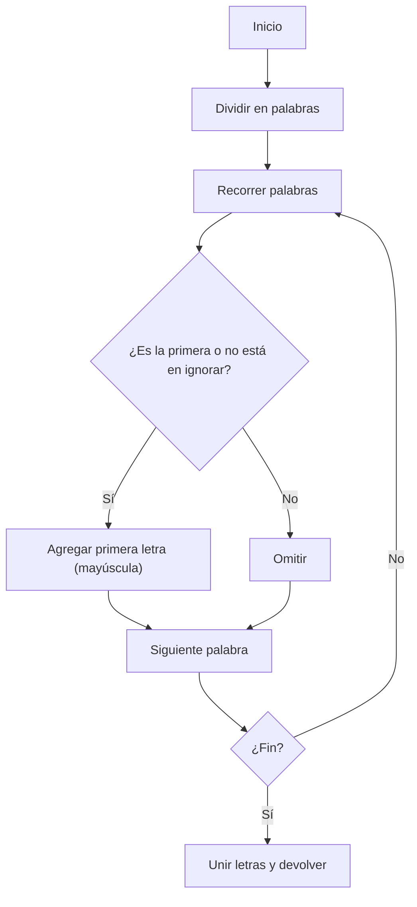

## Acronym Builder

### 1. Enunciado

Dada una cadena de una o más palabras, devuelve el acrónimo siguiendo estas reglas:

- El acrónimo es la primera letra de cada palabra (en mayúscula), salvo que la palabra esté en la lista de ignorar y no sea la primera.
- Palabras a ignorar (excepto si son la primera): a, for, an, and, by, of.
- El orden de las letras respeta el orden original.
- Sin espacios en el resultado.

---

### 2. Casos de prueba

| Entrada                                                                 | Acrónimo esperado |
|-------------------------------------------------------------------------|-------------------|
| Search Engine Optimization                                              | SEO               |
| Frequently Asked Questions                                              | FAQ               |
| National Aeronautics and Space Administration                           | NASA              |
| Federal Bureau of Investigation                                         | FBI               |
| For your information                                                    | FYI               |
| By the way                                                             | BTW               |
| An unstoppable herd of waddling penguins overtakes the icy mountains and sings happily | AUHWPOTIMSH        |

---

### 3. Solución y Código

**Estrategia:**

1. Dividir la cadena en palabras.
2. Definir un `Set` con las palabras a ignorar.
3. Recorrer cada palabra:
   - Si es la primera, siempre se toma.
   - Si no está en el set de ignorar, se toma.
   - Se agrega la primera letra en mayúscula al acrónimo.
4. Unir las letras y devolver el resultado.

```js
function buildAcronym(str) {
  const ignore = new Set(['a', 'for', 'an', 'and', 'by', 'of'])
  return str
    .split(/\s+/)
    .filter(Boolean)
    .reduce((acronym, word, idx) => {
      if (idx === 0 || !ignore.has(word.toLowerCase())) {
        return acronym + word[0].toUpperCase()
      }
      return acronym
    }, '')
}
```

#### Diagrama de flujo



---

### 4. Complejidad

- **Temporal:** $O(n)$, una pasada por las palabras.
- **Espacial:** $O(n)$, por el array de palabras y el set de ignorar.

---

### 5. Casos Edge

- Cadena vacía → acrónimo vacío
- Todas las palabras ignoradas → solo la primera se toma
- Mayúsculas/minúsculas mezcladas: se normaliza para comparar
- Múltiples espacios: se filtran

---

### 6. Reflexiones

- Usar `Set` para ignorar palabras es eficiente y claro.
- El algoritmo es robusto y fácil de adaptar (por ejemplo, para ignorar más palabras).
- Se puede mejorar quitando signos de puntuación o permitiendo una lista configurable.

---

### 7. Recursos

- [String.prototype.split() en MDN](https://developer.mozilla.org/es/docs/Web/JavaScript/Reference/Global_Objects/String/split)
- [Set en JavaScript](https://developer.mozilla.org/es/docs/Web/JavaScript/Reference/Global_Objects/Set)
