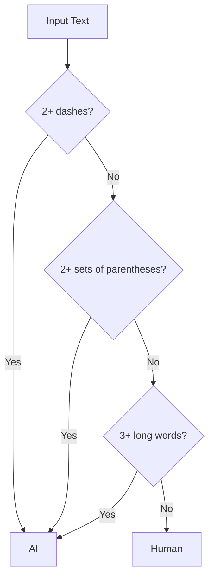

## AI Detector: Analyzing Text with Simple Rules

Today we tackle the "AI Detector" challenge from FreeCodeCamp. The goal is to identify whether a string of text was likely generated by artificial intelligence (AI) using straightforward string analysis rules.

## Problem Statement

> Given a string containing one or more sentences, determine if it was likely generated by AI using the following rules:
>
> - Contains two or more dashes (`-`).
> - Contains two or more sets of parentheses `()`. The text may be inside the parentheses.
> - Contains three or more words with 7 or more letters.

If any of these rules are met, the result should be "AI". If none are met, the result is "Human".

### Examples

| Text | Expected Result | Reason |
|------|----------------|--------|
|`The quick brown fox jumped over the lazy dog.`|Human|Does not meet any rule|
|`Yes - you're right! I made a mistake there - let me try again.`|AI|Has two dashes|
|`The extraordinary students were studying vivaciously.`|AI|Three long words|
|`The (excited) student was (coding) in the library.`|AI|Two sets of parentheses|

## Rule Visualization



## Approach & Analysis

To solve this challenge, we can use regular expressions (regex), which allow us to efficiently and concisely search for patterns in text. The three rules translate directly into regex searches:

1. **Dashes:** Search for the `-` character and count its occurrences.
2. **Parentheses sets:** Search for groups of parentheses with content inside.
3. **Long words:** Search for words with 7 or more letters.

### Why regex?

- The code is compact and easy to read.
- It allows searching for specific patterns without manually iterating over each character.

## Step-by-Step Implementation

Let's see how each rule is implemented in JavaScript:

### 1. Counting dashes

```js
const dashCount = (text.match(/-/g) || []).length
```

If `dashCount >= 2`, the text is considered AI-generated.

### 2. Counting sets of parentheses

```js
const parenCount = (text.match(/\([^)]*\)/g) || []).length
```

If `parenCount >= 2`, the text is considered AI-generated.

### 3. Counting long words

```js
const longWords = (text.match(/\b[a-z]{7,}\b/gi) || []).length
```

If `longWords >= 3`, the text is considered AI-generated.

### 4. Final decision

```js
if (dashCount >= 2 || parenCount >= 2 || longWords >= 3) {
  return 'AI'
} else {
  return 'Human'
}
```

## Complete Code

```js
function aiDetector(text) {
  const dashCount = (text.match(/-/g) || []).length
  if (dashCount >= 2)
    return 'AI'

  const parenCount = (text.match(/\([^)]*\)/g) || []).length
  if (parenCount >= 2)
    return 'AI'

  const longWords = (text.match(/\b[a-z]{7,}\b/gi) || []).length
  if (longWords >= 3)
    return 'AI'

  return 'Human'
}
```

## Complexity Analysis

Each regular expression scans the text once, so the time complexity is:

$$
T(n) = O(n)
$$

where $n$ is the length of the text.

Space complexity is also $O(n)$ in the worst case, due to temporary arrays created by the searches.

## Edge Cases & Considerations

- **Empty text:** Returns "Human".
- **Consecutive dashes:** Example: `Hello--world` counts as two dashes.
- **Empty parentheses:** If you want to count empty ones too, you can adjust the regex to `/\([^)]*\)/g`.
- **Words with punctuation:** The regex correctly ignores punctuation.
- **Case sensitivity:** Both uppercase and lowercase are considered.
- **Nested parentheses:** Only outer ones are detected.
- **Dashes in words:** Each dash counts, even inside a word.

## Reflections & Learnings

- Translating logical rules into regex patterns.
- Evaluating conditions for classification.

## Resources & References

- [MDN Web Docs: Regular Expressions in JavaScript](https://developer.mozilla.org/en-US/docs/Web/JavaScript/Guide/Regular_Expressions)
- [MDN Web Docs: String.prototype.match()](https://developer.mozilla.org/en-US/docs/Web/JavaScript/Reference/Global_Objects/String/match)
- [FreeCodeCamp Articles](https://www.freecodecamp.org/news/tag/algorithms/)
