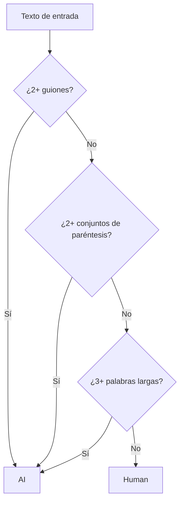

## Detector de IA: Analizando Texto con Reglas Simples

Hoy resolvemos el desafío "AI Detector" de FreeCodeCamp,se trata de identificar si un texto fue probablemente generado por inteligencia artificial (IA) usando reglas sencillas de análisis de cadenas.

## Enunciado del Problema

> Dado un string de una o más oraciones, determina si fue probablemente generado por IA usando las siguientes reglas:
>
> - Contiene dos o más guiones (`-`).
> - Contiene dos o más conjuntos de paréntesis `()`. El texto puede estar dentro de los paréntesis.
> - Contiene tres o más palabras con 7 o más letras.

Si alguna de estas reglas se cumple, el resultado debe ser "AI". Si ninguna se cumple, el resultado es "Human".

### Ejemplos

| Texto | Resultado esperado | Razón |
|-------|-------------------|-------|
|`The quick brown fox jumped over the lazy dog.`|Human|No cumple ninguna regla|
|`Yes - you're right! I made a mistake there - let me try again.`|AI|Tiene dos guiones|
|`The extraordinary students were studying vivaciously.`|AI|Tres palabras largas|
|`The (excited) student was (coding) in the library.`|AI|Dos conjuntos de paréntesis|

## Visualización de las Reglas



## Enfoque y Análisis

Para resolver este reto, podemos usar expresiones regulares (regex), que nos permiten buscar patrones en el texto de forma eficiente y concisa. Las tres reglas se pueden traducir directamente a búsquedas con regex:

1. **Guiones:** Buscar el carácter `-` y contar cuántos aparecen.
2. **Conjuntos de paréntesis:** Buscar grupos de paréntesis con contenido dentro.
3. **Palabras largas:** Buscar palabras de 7 o más letras.

### ¿Por qué regex?

- El código es compacto y fácil de leer.
- Permite buscar patrones específicos sin recorrer manualmente cada carácter.

## Implementación Paso a Paso

Veamos cómo se implementa cada regla en JavaScript:

### 1. Contar guiones

```js
const dashCount = (text.match(/-/g) || []).length
```

Si `dashCount >= 2`, el texto se considera generado por IA.

### 2. Contar conjuntos de paréntesis

```js
const parenCount = (text.match(/\([^)]*\)/g) || []).length
```

Si `parenCount >= 2`, el texto se considera generado por IA.

### 3. Contar palabras largas

```js
const longWords = (text.match(/\b[a-z]{7,}\b/gi) || []).length
```

Si `longWords >= 3`, el texto se considera generado por IA.

### 4. Decisión final

```js
if (dashCount >= 2 || parenCount >= 2 || longWords >= 3) {
  return 'AI'
} else {
  return 'Human'
}
```

## Código Completo

```js
function aiDetector(text) {
  const dashCount = (text.match(/-/g) || []).length
  if (dashCount >= 2)
    return 'AI'

  const parenCount = (text.match(/\([^)]*\)/g) || []).length
  if (parenCount >= 2)
    return 'AI'

  const longWords = (text.match(/\b[a-z]{7,}\b/gi) || []).length
  if (longWords >= 3)
    return 'AI'

  return 'Human'
}
```

## Análisis de Complejidad

Cada expresión regular recorre el texto una vez, por lo que la complejidad temporal es:

$$
T(n) = O(n)
$$

donde $n$ es la longitud del texto.

La complejidad espacial también es $O(n)$ en el peor caso, por los arreglos temporales creados por las búsquedas.

## Casos Edge y Consideraciones

- **Texto vacío:** Devuelve "Human".
- **Guiones consecutivos:** Ejemplo: `Hello--world` cuenta como dos guiones.
- **Paréntesis vacíos:** Si se quiere contar también los vacíos, se puede ajustar la expresión a `/\([^)]*\)/g`.
- **Palabras con signos de puntuación:** La expresión ignora correctamente los signos.
- **Mayúsculas y minúsculas:** Se consideran ambas.
- **Paréntesis anidados:** Solo se detectan los externos.
- **Guiones en palabras:** Cada guion cuenta, aunque esté dentro de una palabra.

## Reflexiones y Aprendizajes

- Traducir reglas lógicas a patrones regex.
- Evaluación de condiciones para clasificación.

## Recursos y Referencias

- [MDN Web Docs: Expresiones Regulares en JavaScript](https://developer.mozilla.org/es/docs/Web/JavaScript/Guide/Regular_Expressions)
- [MDN Web Docs: String.prototype.match()](https://developer.mozilla.org/es/docs/Web/JavaScript/Reference/Global_Objects/String/match)
- [Articulos de FreeCodeCamp](https://www.freecodecamp.org/news/tag/algorithms/)
