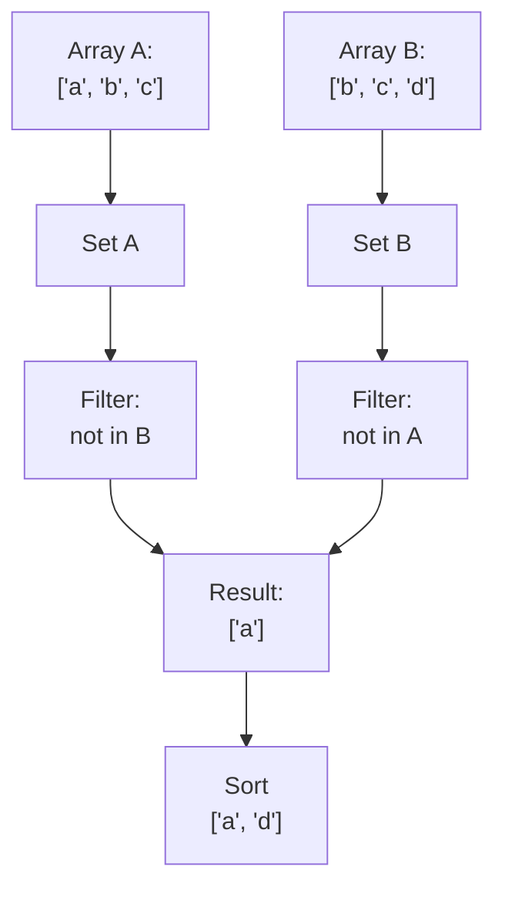

## Array Diff - Analysis and Explanation

## Problem Statement

Given two arrays of strings, return a new array containing all the strings that appear in only one of the two arrays.

- The resulting array must be sorted alphabetically.

## Initial Analysis

### Problem Understanding

The problem asks us to find the symmetric difference between two arrays of strings, that is, the elements that are unique to each array.

### Test Cases

| Array 1           | Array 2           | Expected Output           |
|-------------------|-------------------|--------------------------|
| ["a", "b", "c"]     | ["b", "c", "d"]     | ["a", "d"]               |
| []                | []                | []                       |
| ["x", "y"]         | ["a", "b"]         | ["a", "b", "x", "y"]       |
| ["a", "a", "b"]     | ["b", "c", "c"]     | ["a", "c"]               |

## Solution Development

### Chosen Strategy



This diagram shows the flow of conversion, filtering, and sorting to obtain the ordered symmetric difference.

To solve this problem, I chose to use sets (`Set`). This allows us to remove duplicates within each array and makes it easy to check if an element exists in the other array. Sets provide the `has` method, which allows checking for the existence of an element in average O(1) time. Although there are no specified size constraints for the arrays, this approach is efficient and clear for most practical cases. Finally, to return the sorted result, I convert the resulting set to an array and use the `sort` method.

### Step-by-Step Implementation

1. Convert both arrays to `Set` to remove duplicates.
2. Iterate over the first set and add to the result the elements not in the second set.
3. Iterate over the second set and add to the result the elements not in the first set.
4. Combine both results into a single array.
5. Sort the resulting array alphabetically.
6. Return the sorted array.

### JavaScript Code

```js
// Returns the elements that are only in one of the two arrays (symmetric difference), sorted alphabetically
function arrayDiff(arr1, arr2) {
  // 1. Convert to Set to remove duplicates
  const set1 = new Set(arr1)
  const set2 = new Set(arr2)
  const result = []

  // 2. Elements unique to arr1
  for (const el of set1) {
    if (!set2.has(el))
      result.push(el)
  }
  // 3. Elements unique to arr2
  for (const el of set2) {
    if (!set1.has(el))
      result.push(el)
  }
  // 4. Sort alphabetically
  return result.sort()
}

// Usage examples
console.log(arrayDiff(['a', 'b', 'c'], ['b', 'c', 'd'])) // ["a", "d"]
console.log(arrayDiff(['x', 'y'], ['a', 'b'])) // ["a", "b", "x", "y"]
console.log(arrayDiff(['a', 'a', 'b'], ['b', 'c', 'c'])) // ["a", "c"]
console.log(arrayDiff([], [])) // []
```

## Complexity Analysis

### Time Complexity

The time complexity of the solution is O(n + m + k·log k), where:

- n is the number of elements in the first array,
- m is the number of elements in the second array,
- k is the total number of unique elements that appear only in one of the two arrays (size of the result).

Explanation:

- Converting both arrays to Set takes O(n) and O(m) respectively.
- Iterating over both sets to build the result takes O(n) + O(m) in the worst case.
- Finally, sorting the result array takes O(k·log k), where k is the size of the result.

In practice, the dominant operation is usually the final sort if the result is large.

### Space Complexity

The space complexity is O(n + m + k):

- O(n) for the Set of the first array,
- O(m) for the Set of the second array,
- O(k) for the result array.

No significant additional structures are created, so memory usage is efficient relative to the input and output size.

### Edge Cases and Considerations

- **Empty arrays:** If both arrays are empty, the result is an empty array. If one is empty, the result is the other array (without duplicates and sorted).
- **Repeated elements:** Duplicates in the input do not affect the result, as they are removed when converting to Set.
- **All elements in common:** If both arrays contain exactly the same elements (regardless of order or repetitions), the result is an empty array.
- **Case sensitivity:** The comparison is case-sensitive, i.e., 'A' and 'a' are considered different.
- **Non-string elements:** If elements that are not strings are received, unexpected results or errors may occur, as the function assumes all elements are strings.
- **Output order:** The result is always sorted alphabetically, regardless of input order.

### Concepts Applied

- Use of sets (`Set`) to remove duplicates and enable efficient lookups.
- Symmetric difference as a classic set theory pattern.
- Composition of array methods (`sort`, `push`) to build the solution declaratively and readably.

### Reflections and Learnings

- This problem reinforces the importance of choosing the right data structure (Set) to optimize both clarity and efficiency.
- Symmetric difference is a useful and frequent pattern in collection manipulation problems.
- It's essential to consider edge cases (empty, duplicates, case sensitivity) from the solution design stage.

### Possible Optimizations

- If the input arrays were very large and maximum efficiency was required, the conversion to array for sorting could be avoided if order was not relevant.
- For inputs with complex objects, a custom equality function would be needed.

### Note on Asymptotic Efficiency

The presented solution is asymptotically optimal for the requirements of this problem. "Asymptotically" means that, when analyzing the algorithm's behavior for very large inputs (as the size of the arrays tends to infinity), there is no general algorithm that solves the problem in less time in the worst case. The sorting step has a lower bound of O(k·log k) for unsorted data, so it's not possible to improve the total time efficiency if the output must be sorted alphabetically. It would only be possible to avoid sorting if order didn't matter, but under the given requirements, the solution is asymptotically optimal.

## Resources and References

- [Array.prototype.sort() - MDN](https://developer.mozilla.org/en-US/docs/Web/JavaScript/Reference/Global_Objects/Array/sort)
- [Set - MDN](https://developer.mozilla.org/en-US/docs/Web/JavaScript/Reference/Global_Objects/Set)
- [Array.prototype.push() - MDN](https://developer.mozilla.org/en-US/docs/Web/JavaScript/Reference/Global_Objects/Array/push)
- [Set.prototype.has() - MDN](https://developer.mozilla.org/en-US/docs/Web/JavaScript/Reference/Global_Objects/Set/has)
- [Big O Notation (Wikipedia)](https://en.wikipedia.org/wiki/Big_O_notation)
