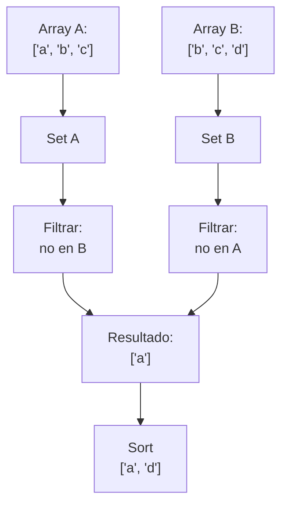

## Array Diff - Análisis y Explicación

## Enunciado del Problema

Dados dos arrays con strings, retorna un nuevo array que contenga todos los strings que aparecen en solo uno de los dos arrays.

- El array resultante debe estar ordenado alfabéticamente.

## Análisis Inicial

### Comprensión del Problema

El problema nos pide encontrar la diferencia simétrica entre dos arrays de strings, es decir, los elementos que son únicos en cada array.

### Casos de Prueba

| Array 1           | Array 2           | Salida esperada           |
|-------------------|-------------------|---------------------------|
| ["a", "b", "c"]     | ["b", "c", "d"]     | ["a", "d"]                |
| []                | []                | []                        |
| ["x", "y"]         | ["a", "b"]         | ["a", "b", "x", "y"]        |
| ["a", "a", "b"]     | ["b", "c", "c"]     | ["a", "c"]                |

## Desarrollo de la Solución

### Estrategia Elegida



Este diagrama muestra el flujo de conversión, filtrado y ordenamiento para obtener la diferencia simétrica ordenada.

Para resolver este problema elegí usar conjuntos (`Set`). Esto permite eliminar duplicados dentro de cada array y facilita la verificación de pertenencia de un elemento en el otro array. Los `Set` ofrecen el método `has`, que permite comprobar la existencia de un elemento en tiempo promedio O(1). Aunque no se especifican restricciones de tamaño para los arrays, este enfoque es eficiente y claro para la mayoría de los casos prácticos. Finalmente, para devolver el resultado ordenado, convierto el conjunto resultante a array y utilizo el método `sort`.

### Implementación Paso a Paso

1. Convertir ambos arrays a `Set` para eliminar duplicados.
2. Recorrer el primer set y agregar al resultado los elementos que no estén en el segundo set.
3. Recorrer el segundo set y agregar al resultado los elementos que no estén en el primer set.
4. Unir ambos resultados en un solo array.
5. Ordenar alfabéticamente el array resultante.
6. Retornar el array ordenado.

### Código JavaScript

```js
// Devuelve los elementos que están solo en uno de los dos arrays (diferencia simétrica), ordenados alfabéticamente
function arrayDiff(arr1, arr2) {
  // 1. Convertir a Set para eliminar duplicados
  const set1 = new Set(arr1)
  const set2 = new Set(arr2)
  const result = []

  // 2. Elementos únicos de arr1
  for (const el of set1) {
    if (!set2.has(el))
      result.push(el)
  }
  // 3. Elementos únicos de arr2
  for (const el of set2) {
    if (!set1.has(el))
      result.push(el)
  }
  // 4. Ordenar alfabéticamente
  return result.sort()
}

// Ejemplo de uso
console.log(arrayDiff(['a', 'b', 'c'], ['b', 'c', 'd'])) // ["a", "d"]
console.log(arrayDiff(['x', 'y'], ['a', 'b'])) // ["a", "b", "x", "y"]
console.log(arrayDiff(['a', 'a', 'b'], ['b', 'c', 'c'])) // ["a", "c"]
console.log(arrayDiff([], [])) // []
```
## Análisis de Complejidad

### Complejidad Temporal

La complejidad temporal de la solución es O(n + m + k·log k), donde:

- n es la cantidad de elementos en el primer array,
- m es la cantidad de elementos en el segundo array,
- k es la cantidad total de elementos únicos que aparecen solo en uno de los dos arrays (tamaño del resultado).

Explicación:

- Convertir ambos arrays a Set toma O(n) y O(m) respectivamente.
- Recorrer ambos sets para construir el resultado toma O(n) + O(m) en el peor caso.
- Finalmente, ordenar el array resultado toma O(k·log k), siendo k el tamaño del resultado.

En la práctica, la operación dominante suele ser el sort final si el resultado es grande.

### Complejidad Espacial

La complejidad espacial es O(n + m + k):

- O(n) para el Set del primer array,
- O(m) para el Set del segundo array,
- O(k) para el array resultado.

No se crean estructuras adicionales significativas, por lo que el uso de memoria es eficiente respecto al tamaño de la entrada y la salida.

### Casos Edge y Consideraciones

- **Arrays vacíos:** Si ambos arrays están vacíos, el resultado es un array vacío. Si uno está vacío, el resultado es el otro array (sin duplicados y ordenado).
- **Elementos repetidos:** Los duplicados en la entrada no afectan el resultado, ya que se eliminan al convertir a Set.
- **Todos los elementos en común:** Si ambos arrays contienen exactamente los mismos elementos (sin importar el orden o repeticiones), el resultado es un array vacío.
- **Sensibilidad a mayúsculas/minúsculas:** La comparación es case-sensitive, es decir, 'A' y 'a' se consideran diferentes.
- **Elementos no string:** Si se reciben elementos que no son strings, pueden producirse resultados inesperados o errores, ya que la función asume que todos los elementos son strings.
- **Orden de salida:** El resultado siempre está ordenado alfabéticamente, independientemente del orden de entrada.

### Conceptos Aplicados

- Uso de conjuntos (`Set`) para eliminar duplicados y facilitar búsquedas eficientes.
- Diferencia simétrica como patrón clásico de teoría de conjuntos.
- Composición de métodos de array (`sort`, `push`) para construir la solución de forma declarativa y legible.

### Reflexiones y Aprendizajes

- Este problema refuerza la importancia de elegir la estructura de datos adecuada (Set) para optimizar tanto claridad como eficiencia.
- La diferencia simétrica es un patrón útil y frecuente en problemas de manipulación de colecciones.
- Es fundamental considerar los edge cases (vacíos, duplicados, sensibilidad a mayúsculas) desde el diseño de la solución.

### Posibles Optimizaciones

- Si los arrays de entrada fueran muy grandes y se requiriera máxima eficiencia, se podría evitar la conversión a array para el sort si el orden no fuera relevante.
- Para entradas con objetos complejos, sería necesario definir una función de igualdad personalizada.

### Consideración sobre eficiencia asintótica

La solución presentada es asintóticamente óptima para el requerimiento de este problema. "Asintóticamente" significa que, al analizar el comportamiento del algoritmo para entradas muy grandes (cuando el tamaño de los arrays tiende a infinito), no existe un algoritmo general que resuelva el problema en menos tiempo en el peor caso. El paso de ordenar el resultado tiene una cota inferior de O(k·log k) para datos no ordenados, por lo que no es posible mejorar la eficiencia temporal total si se requiere que la salida esté ordenada alfabéticamente. Solo sería posible evitar el sort si el orden no importara, pero bajo la consigna dada, la solución es óptima en términos asintóticos.

## Recursos y Referencias

- [Array.prototype.sort() - MDN](https://developer.mozilla.org/en-US/docs/Web/JavaScript/Reference/Global_Objects/Array/sort)
- [Set - MDN](https://developer.mozilla.org/en-US/docs/Web/JavaScript/Reference/Global_Objects/Set)
- [Array.prototype.push() - MDN](https://developer.mozilla.org/en-US/docs/Web/JavaScript/Reference/Global_Objects/Array/push)
- [Set.prototype.has() - MDN](https://developer.mozilla.org/en-US/docs/Web/JavaScript/Reference/Global_Objects/Set/has)
- [Big O Notation (Wikipedia)](https://en.wikipedia.org/wiki/Big_O_notation)
- [Análisis asintótico (Khan Academy, español)](https://es.khanacademy.org/computing/computer-science/algorithms/asymptotic-notation/a/big-o-notation)
