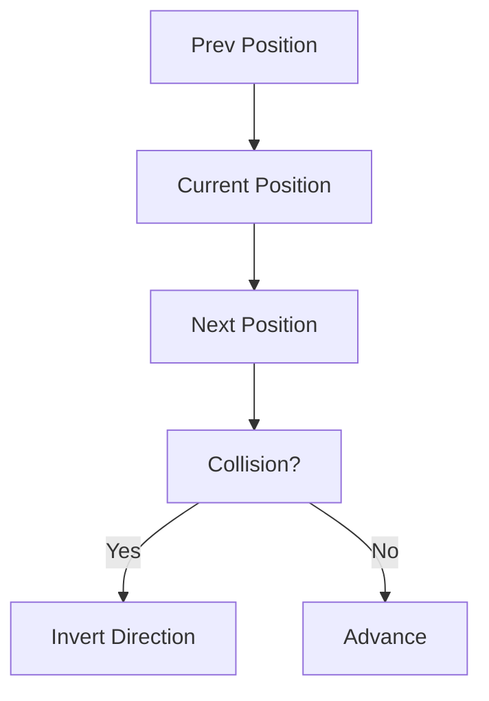
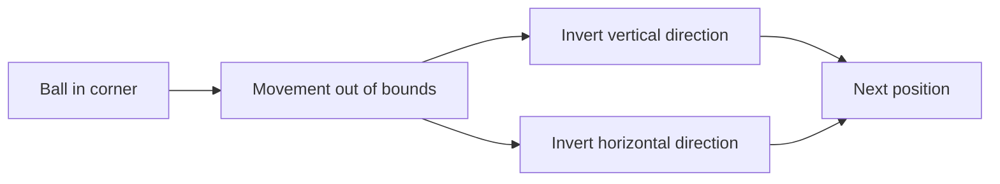

## Challenge: Ball Trajectory (FreeCodeCamp Daily Challenge)

Have you ever wondered how classic video games like Pong calculate the movement of a ball? Today's FreeCodeCamp challenge invites us to simulate that behavior in a matrix using JavaScript.

## Problem Statement

> Given a matrix (array of arrays) indicating the current location of the ball (`2`) and its previous location (`1`), you must return the indices of the matrix corresponding to the ball's next position. The ball moves in a straight line and bounces off the edges.

**Visual Example:**



## Analysis & Strategy

To solve this problem, we follow these steps:

1. **Identify positions:** Search the matrix for where the ball is now (`2`) and where it was before (`1`).
2. **Calculate direction:** Use the difference between both positions to determine the movement direction.
3. **Simulate movement:** Add that vector to the current position to get the next position.
4. **Handle bounces:** If the ball is about to leave the matrix, invert the corresponding direction (like in Pong).
5. **Return the result:** Return the `[row, column]` indices of the next position.

### Example matrix and movement

Suppose this matrix:

```markdown
[[0,0,0,0],
 [0,0,0,0],
 [0,1,2,0],
 [0,0,0,0]]
```

The ball was at `[2,1]` and is now at `[2,2]`. The movement vector is `[0,1]` (same row, one column to the right). The next position will be `[2,3]`.

## Step-by-Step Implementation

Let's see how this translates to code:

```javascript
function getNextLocation(matrix) {
  const rows = matrix.length
  const cols = matrix[0].length
  let current = null
  let previous = null

  // 1. Find current and previous positions
  for (let r = 0; r < rows; r++) {
    for (let c = 0; c < cols; c++) {
      if (matrix[r][c] === 2)
        current = [r, c]
      if (matrix[r][c] === 1)
        previous = [r, c]
    }
  }

  if (!current || !previous)
    return null

  // 2. Calculate movement direction
  let moveRow = current[0] - previous[0]
  let moveCol = current[1] - previous[1]

  // 3. Calculate next position
  let nextRow = current[0] + moveRow
  let nextCol = current[1] + moveCol

  // 4. Bounce on edges
  if (nextRow < 0 || nextRow >= rows) {
    moveRow *= -1
    nextRow = current[0] + moveRow
  }
  if (nextCol < 0 || nextCol >= cols) {
    moveCol *= -1
    nextCol = current[1] + moveCol
  }

  // 5. Return next position
  return [nextRow, nextCol]
}
```

### How does it work?

1. We loop through the matrix to find the positions.
2. We calculate the movement vector.
3. We simulate the advance and check for bounces.
4. We return the new position.

## Bounce Visualization

Imagine the ball approaching a corner:



## Test Cases

Let's see some practical examples:

| Matrix | Expected Output |
|--------|-----------------|
| `[[0,0,0,0],[0,0,0,0],[0,1,2,0],[0,0,0,0]]` | `[2, 3]` |
| `[[0,0,0,0],[0,0,1,0],[0,2,0,0],[0,0,0,0]]` | `[3, 0]` |
| `[[0,2,0,0],[1,0,0,0],[0,0,0,0],[0,0,0,0]]` | `[1, 2]` |
| `[[0,0,0,0],[0,0,0,0],[2,0,0,0],[0,1,0,0]]` | `[1, 1]` |
| `[[0,0,0,0],[0,0,0,0],[0,0,1,0],[0,0,0,2]]` | `[2, 2]` |

## Algorithm Complexity

The function loops through the entire matrix once to find the positions:

- **Time:** $O(n \times m)$ where $n$ is the number of rows and $m$ the number of columns.
- **Space:** $O(1)$, we only use variables for positions and dimensions.

## Edge Cases & Considerations

- **Ball in a corner:** If the next move takes it out in both directions, both components are inverted.
- **Ball on an edge:** Only the corresponding direction is inverted.
- **No valid positions:** If `1` or `2` are not found, returns `null`.
- **Small matrices:** The algorithm works even for 2x2 matrices.
- **Diagonal movements:** The vector allows any direction.

## Reflections & Learnings

- Looping through matrices and searching for values.
- Calculating movement vectors.
- Simulating bounces like in video games.
- Handling boundaries and validating inputs.

## Resources & Related Reading

- [Arrays in JavaScript (MDN)](https://developer.mozilla.org/en-US/docs/Web/JavaScript/Reference/Global_Objects/Array)
- [Bounce simulation in video games](https://en.wikipedia.org/wiki/Pong)
- [Matrix structure](https://www.geeksforgeeks.org/dsa/matrix/)
