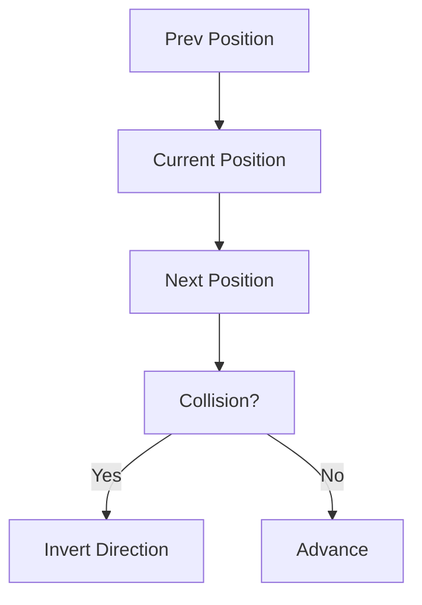
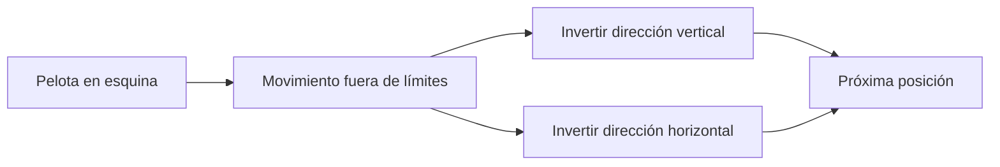

## Desafío: Trayectoria de una Pelota (FreeCodeCamp Daily Challenge)

¿Alguna vez te preguntaste cómo los videojuegos clásicos como Pong calculan el movimiento de una pelota? El reto de hoy de FreeCodeCamp invita a simular ese comportamiento en una matriz usando JavaScript.

## Enunciado del Problema

> Dada una matriz (array de arrays) que indica la ubicación actual de la pelota (`2`) y su ubicación previa (`1`), debes devolver los índices de la matriz correspondientes a la próxima posición de la pelota. La pelota se mueve en línea recta y rebota en los bordes.

**Ejemplo visual:**



## Análisis y Estrategia

Para resolver este problema, seguimos estos pasos:

1. **Identificar posiciones:** Buscar en la matriz dónde está la pelota ahora (`2`) y dónde estaba antes (`1`).
2. **Calcular dirección:** Usar la diferencia entre ambas posiciones para saber hacia dónde se mueve.
3. **Simular movimiento:** Sumar ese vector a la posición actual para obtener la próxima posición.
4. **Gestionar rebotes:** Si la pelota va a salir de la matriz, invertir la dirección correspondiente (como en Pong).
5. **Devolver el resultado:** Retornar los índices `[fila, columna]` de la próxima posición.

### Ejemplo de matriz y movimiento

Supongamos esta matriz:

```markdown
[[0,0,0,0],
 [0,0,0,0],
 [0,1,2,0],
 [0,0,0,0]]
```

La pelota estaba en `[2,1]` y ahora está en `[2,2]`. El vector de movimiento es `[0,1]` (misma fila, una columna a la derecha). La próxima posición será `[2,3]`.

## Implementación Paso a Paso

Veamos cómo se traduce esto a código:

```javascript
function getNextLocation(matrix) {
  const rows = matrix.length
  const cols = matrix[0].length
  let current = null
  let previous = null

  // 1. Buscar posiciones actual y previa
  for (let r = 0; r < rows; r++) {
    for (let c = 0; c < cols; c++) {
      if (matrix[r][c] === 2)
        current = [r, c]
      if (matrix[r][c] === 1)
        previous = [r, c]
    }
  }

  if (!current || !previous)
    return null

  // 2. Calcular dirección del movimiento
  let moveRow = current[0] - previous[0]
  let moveCol = current[1] - previous[1]

  // 3. Calcular próxima posición
  let nextRow = current[0] + moveRow
  let nextCol = current[1] + moveCol

  // 4. Rebote en bordes
  if (nextRow < 0 || nextRow >= rows) {
    moveRow *= -1
    nextRow = current[0] + moveRow
  }
  if (nextCol < 0 || nextCol >= cols) {
    moveCol *= -1
    nextCol = current[1] + moveCol
  }

  // 5. Retornar la próxima posición
  return [nextRow, nextCol]
}
```

### ¿Cómo funciona?

1. Recorremos la matriz para encontrar las posiciones.
2. Calculamos el vector de movimiento.
3. Simulamos el avance y comprobamos si hay rebote.
4. Devolvemos la nueva posición.

## Visualización del Rebote

Imagina la pelota acercándose a una esquina:



## Casos de Prueba

Veamos algunos ejemplos prácticos:

| Matriz | Salida esperada |
|--------|-----------------|
| `[[0,0,0,0],[0,0,0,0],[0,1,2,0],[0,0,0,0]]` | `[2, 3]` |
| `[[0,0,0,0],[0,0,1,0],[0,2,0,0],[0,0,0,0]]` | `[3, 0]` |
| `[[0,2,0,0],[1,0,0,0],[0,0,0,0],[0,0,0,0]]` | `[1, 2]` |
| `[[0,0,0,0],[0,0,0,0],[2,0,0,0],[0,1,0,0]]` | `[1, 1]` |
| `[[0,0,0,0],[0,0,0,0],[0,0,1,0],[0,0,0,2]]` | `[2, 2]` |

## Complejidad Algorítmica

La función recorre toda la matriz una sola vez para encontrar las posiciones:

- **Tiempo:** $O(n \times m)$ donde $n$ es el número de filas y $m$ el de columnas.
- **Espacio:** $O(1)$, solo usamos variables para posiciones y dimensiones.

## Edge Cases y Consideraciones

- **Pelota en una esquina:** Si el siguiente movimiento la lleva fuera en ambas direcciones, se invierten ambos componentes.
- **Pelota en un borde:** Solo se invierte la dirección correspondiente.
- **Sin posiciones válidas:** Si no se encuentra `1` o `2`, retorna `null`.
- **Matrices pequeñas:** El algoritmo funciona incluso en matrices 2x2.
- **Movimientos diagonales:** El vector permite cualquier dirección.

## Reflexiones y Aprendizajes

- Recorrer matrices y buscar valores.
- Calcular vectores de movimiento.
- Simular rebotes como en videojuegos.
- Controlar límites y validar entradas.

## Recursos y Lecturas Relacionadas

- [Arrays en JavaScript (MDN)](https://developer.mozilla.org/es/docs/Web/JavaScript/Reference/Global_Objects/Array)
- [Simulación de rebotes en videojuegos](https://es.wikipedia.org/wiki/Pong)
- [Estructura de matrices](https://www.geeksforgeeks.org/dsa/matrix/)
