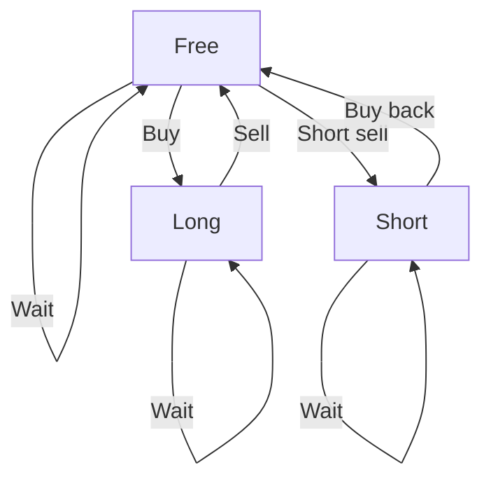

---

## Best Time To Buy and Sell Stock V (The Revenge!)

> **Why is this problem special?**
>
> Unlike classic stock problems, here you can also perform **short selling** in addition to regular buys. This multiplies the options and complexity—but also makes it more interesting!

---

## Problem Statement and Constraints

You are given an array of integers `prices`, where `prices[i]` is the price of a stock on day $i$, and an integer $k$.

You may perform at most $k$ transactions, of two types:

- **Regular transaction:** Buy on day $i$ and sell later on day $j$ ($i < j$). Profit: $prices[j] - prices[i]$.
- **Short sale:** Sell on day $i$ and buy back later on day $j$ ($i < j$). Profit: $prices[i] - prices[j]$.

You cannot have more than one open transaction at a time, and you must close one before opening another.

**Constraints:**

- $2 \leq prices.length \leq 10^3$
- $1 \leq prices[i] \leq 10^9$
- $1 \leq k \leq prices.length / 2$

---

## Example

| prices                | k | Max profit | Explanation                                                                 |
|-----------------------|---|------------|----------------------------------------------------------------------------|
| [1,7,9,8,2]           | 2 | 14         | Buy at 1→9, then short sell 8→2                                            |
| [12,16,19,19,8,1,19]  | 3 | 36         | Buy 12→19, short sell 19→8, buy 1→19                                       |

---

## Why Dynamic Programming?

This problem is ideal for DP because:

- There are sequential decisions (buy, sell, wait, open/close short).
- The optimal result depends on previous decisions.
- There are repeated subproblems.

**What makes this problem special?**

- There are two types of transactions (regular and short).
- The state is more complex than in classic stock problems.

---

## State Modeling and Decisions

For DP, we need to define the minimal state that describes the situation:

- Current day $i$
- Completed transactions $t$
- Do I have an open position? Of what type? (none, long, short)

**State table:**

| State   | What does it mean?                |
|---------|-----------------------------------|
| Free    | No open position                  |
| Long    | Bought, waiting to sell           |
| Short   | Short sold, waiting to buy back   |

**Options in each state:**

- Wait (move to next day)
- Open a position (if free)
- Close a position (if one is open)



**Example state:**
> Day 3, 1 transaction done, have a short position open.

---

## Solution Strategy and Progression

### 1. Recursive modeling (top-down)

We define a function $dp(i, t, state)$ that returns the maximum profit from day $i$, with $t$ transactions done and the current state.

**Pseudocode:**

```python
def dp(i, t, state):
  if i == n or t == k:
    return 0
  # If we've already computed this state, return the stored result
  if (i, t, state) in memo:
    return memo[(i, t, state)]
  # Option 1: wait
  res = dp(i+1, t, state)
  # Option 2: open/close position depending on state...
  # ...
  memo[(i, t, state)] = res
  return res
```

**Why is this not optimal?**

- The state may include the opening price, multiplying subproblems.
- The recursion explores many redundant branches.
- Complexity: $O(n^2 k)$ (does not scale for large $n$).

### 2. Tabular optimization (bottom-up)

Inspired by classic stock problems, we minimize the state:

- $free[t]$: max profit with $t$ transactions and no open position.
- $holdLong[t]$: max profit with $t$ transactions and a long position open.
- $holdShort[t]$: max profit with $t$ transactions and a short position open.

For each day and each $t$, we update these states considering opening/closing positions.

**Advantages:**

- Complexity $O(nk)$
- Space $O(k)$
- Compact and efficient code

---

## Implementation (key fragment)

```python
# Initialization
free = [0] * (k+1)
holdLong = [-float('inf')] * (k+1)
holdShort = [-float('inf')] * (k+1)

for price in prices:
    for t in range(k, 0, -1):
        # Close long position
        free[t] = max(free[t], holdLong[t] + price)
        # Close short position
        free[t] = max(free[t], holdShort[t] - price)
        # Open long position
        holdLong[t] = max(holdLong[t], free[t-1] - price)
        # Open short position
        holdShort[t] = max(holdShort[t], free[t-1] + price)
```

**Why is it efficient?**

- We only depend on the previous day and the number of transactions.
- We do not store the opening price explicitly.

---

## Complexity Analysis

- **Top-down:** $O(n^2 k)$ time, $O(n^2 k)$ space (due to opening price)
- **Bottom-up (final):** $O(nk)$ time, $O(k)$ space

| Approach   | Time         | Space        | Notes                                 |
|------------|--------------|--------------|---------------------------------------|
| Top-down   | $O(n^2 k)$   | $O(n^2 k)$   | Intuitive, but slow for large $n$     |
| Bottom-up  | $O(nk)$      | $O(k)$       | Efficient and scalable                |

---

## Edge Cases and Tips

- $prices.length < 2$ → cannot operate
- $k = 0$ → cannot operate
- All prices equal → profit 0
- Prices always decrease → only short selling is optimal
- Prices always increase → only regular transactions are optimal

---

## Reflections and Learnings

- Recursive DP is useful for modeling and understanding, but can be inefficient if the state is large.
- Finding patterns and minimizing the state is key for efficiency.
- The bottom-up approach is the standard in production for stock problems with $k$ transactions.

**Could it have been solved differently?**

The process followed is logical and standard for this type of problem. The transition from top-down to bottom-up is natural and shows maturity in analysis. There is no smarter shortcut without losing generality or clarity.

---

## Resources and References

- [LeetCode Best Time to Buy and Sell Stock V](https://leetcode.com/problems/best-time-to-buy-and-sell-stock-v/)
- [Short selling explained (Investopedia)](https://www.investopedia.com/terms/s/shortselling.asp)
