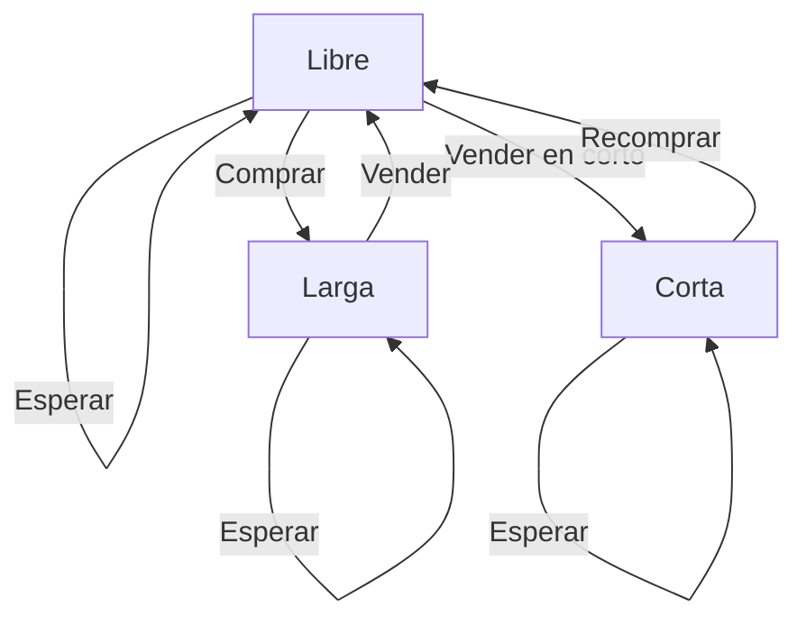

---

## Mejor Momento Para Comprar y Vender Acciones V (La Venganza!)

> **¿Por qué este problema es especial?**
>
> A diferencia de los clásicos de acciones, aquí puedes hacer **ventas en corto** además de compras normales. Eso multiplica las opciones y la complejidad, ¡pero también lo hace más interesante!

---

## Enunciado y Restricciones

Se te da un array de enteros `prices`, donde `prices[i]` es el precio de una acción el día $i$, y un entero $k$.

Puedes realizar como máximo $k$ transacciones, de dos tipos:

- **Transacción normal:** Comprar en el día $i$ y vender después en el día $j$ ($i < j$). Ganancia: $prices[j] - prices[i]$.
- **Venta en corto:** Vender en el día $i$ y recomprar después en el día $j$ ($i < j$). Ganancia: $prices[i] - prices[j]$.

No puedes tener más de una transacción abierta a la vez, y debes cerrar una antes de abrir otra.

**Restricciones:**

- $2 \leq prices.length \leq 10^3$
- $1 \leq prices[i] \leq 10^9$
- $1 \leq k \leq prices.length / 2$

---

## Ejemplo

| prices                | k | Máxima ganancia | Explicación                                                                 |
|-----------------------|---|-----------------|----------------------------------------------------------------------------|
| [1,7,9,8,2]           | 2 | 14              | Compra en 1→9, luego venta en corto 8→2                                    |
| [12,16,19,19,8,1,19]  | 3 | 36              | Compra 12→19, venta en corto 19→8, compra 1→19                             |

---

## ¿Por qué Programación Dinámica?

Este problema es ideal para DP porque:

- Hay decisiones secuenciales (comprar, vender, esperar, abrir/cerrar corto).
- El resultado óptimo depende de decisiones previas.
- Hay subproblemas repetidos.

**¿Qué hace especial a este problema?**

- Hay dos tipos de transacción (normal y en corto).
- El estado es más complejo que en los problemas clásicos de acciones.

---

---

## Modelado de Estados y Decisiones

Para DP, necesitamos definir el estado mínimo que describe la situación:

- Día actual $i$
- Transacciones completadas $t$
- ¿Tengo una posición abierta? ¿De qué tipo? (ninguna, larga, corta)

**Tabla de estados:**

| Estado         | ¿Qué significa?                         |
|---------------|------------------------------------------|
| Libre         | Sin posición abierta                     |
| Larga         | Compré, esperando vender                 |
| Corta         | Vendí en corto, esperando recomprar      |

**Opciones en cada estado:**

- Esperar (pasar al siguiente día)
- Abrir posición (si estoy libre)
- Cerrar posición (si tengo una abierta)



**Ejemplo de estado:**
> Día 3, 1 transacción hecha, tengo una posición corta abierta.

---

## Estrategia y Progresión de la Solución

### 1. Modelado recursivo (top-down)

Planteamos una función $dp(i, t, estado)$ que devuelve la máxima ganancia desde el día $i$, con $t$ transacciones hechas y el estado actual.

**Pseudocódigo:**

```python
def dp(i, t, estado):
  if i == n or t == k:
    return 0
  # Si ya calculamos este estado, devolvemos el resultado guardado
  if (i, t, estado) en memo:
    return memo[(i, t, estado)]
  # Opción 1: esperar
  res = dp(i+1, t, estado)
  # Opción 2: abrir/cerrar posición según el estado...
  # ...
  memo[(i, t, estado)] = res
  return res
```

**¿Por qué no es óptimo?**

- El estado puede incluir el precio de apertura, multiplicando los subproblemas.
- La recursión explora muchas ramas redundantes.
- Complejidad: $O(n^2 k)$ (no escala para $n$ grande).

### 2. Optimización tabular (bottom-up)

Inspirados en problemas clásicos de acciones, minimizamos el estado:

- $free[t]$: máxima ganancia con $t$ transacciones y sin posición abierta.
- $holdLong[t]$: máxima ganancia con $t$ transacciones y una posición larga abierta.
- $holdShort[t]$: máxima ganancia con $t$ transacciones y una posición corta abierta.

En cada día y para cada $t$, actualizamos estos estados considerando abrir/cerrar posiciones.

**Ventajas:**

- Complejidad $O(nk)$
- Espacio $O(k)$
- Código compacto y eficiente

---

## Implementación (fragmento clave)

```python
# Inicialización
free = [0] * (k+1)
holdLong = [-float('inf')] * (k+1)
holdShort = [-float('inf')] * (k+1)

for price in prices:
    for t in range(k, 0, -1):
        # Cerrar posición larga
        free[t] = max(free[t], holdLong[t] + price)
        # Cerrar posición corta
        free[t] = max(free[t], holdShort[t] - price)
        # Abrir posición larga
        holdLong[t] = max(holdLong[t], free[t-1] - price)
        # Abrir posición corta
        holdShort[t] = max(holdShort[t], free[t-1] + price)
```

**¿Por qué es eficiente?**

- Solo dependemos del día anterior y el número de transacciones.
- No guardamos el precio de apertura explícitamente.

---

## Análisis de Complejidad

- **Top-down:** $O(n^2 k)$ tiempo, $O(n^2 k)$ espacio (por el precio de apertura)
- **Bottom-up (final):** $O(nk)$ tiempo, $O(k)$ espacio

| Enfoque   | Temporal      | Espacial      | Observaciones                         |
|-----------|--------------|--------------|---------------------------------------|
| Top-down  | $O(n^2 k)$    | $O(n^2 k)$    | Intuitivo, pero lento para $n$ grande |
| Bottom-up | $O(nk)$       | $O(k)$        | Eficiente y escalable                 |

---

## Casos Edge y Consejos

- $prices.length < 2$ → no se puede operar
- $k = 0$ → no se puede operar
- Todos los precios iguales → ganancia 0
- Precios siempre bajan → solo ventas en corto
- Precios siempre suben → solo transacciones normales

---

## Reflexiones y Aprendizajes

- La DP recursiva es útil para modelar y entender, pero puede ser ineficiente si el estado es grande.
- Buscar patrones y minimizar el estado es clave para eficiencia.
- El enfoque bottom-up es el estándar en producción para problemas de acciones con $k$ transacciones.

**¿Podría haberse resuelto de otra forma?**

El proceso seguido es lógico y estándar para este tipo de problemas. La transición de top-down a bottom-up es natural y muestra madurez en el análisis. No hay un atajo más inteligente sin perder generalidad o claridad.

---

---

## Recursos y Referencias

- [LeetCode Best Time to Buy and Sell Stock V](https://leetcode.com/problems/best-time-to-buy-and-sell-stock-v/)
- [Explicación de ventas en corto (Investopedia)](https://www.investopedia.com/terms/s/shortselling.asp)
