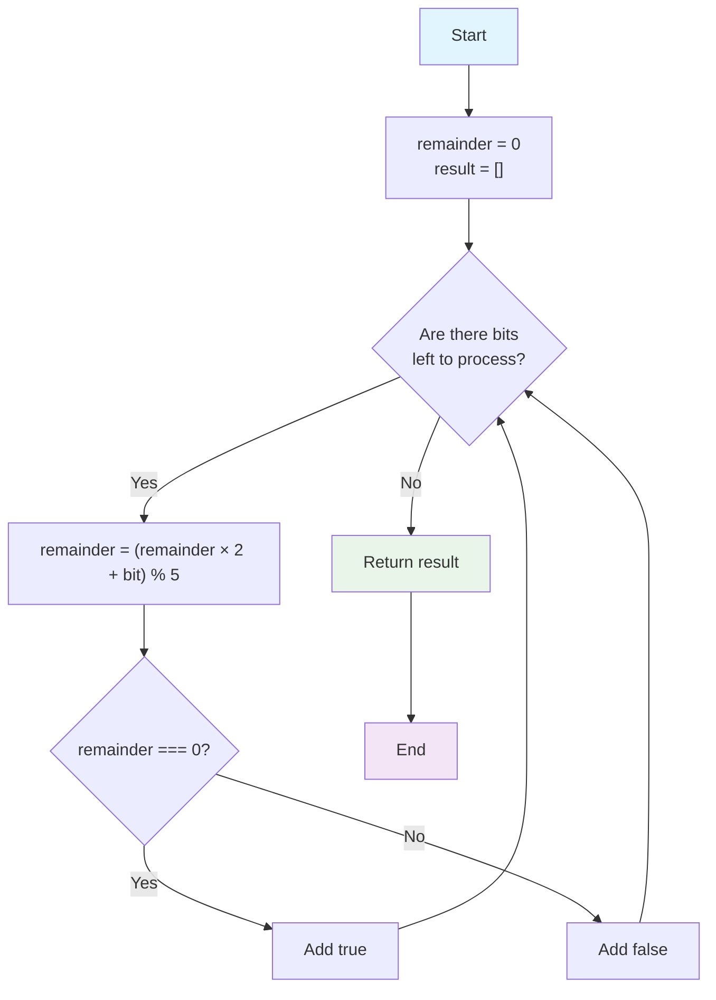

## Introduction

This LeetCode challenge (#1018) is fundamentally a mathematical exercise and also tests your ability to solve it efficiently to avoid overflow.

## Problem Statement

Given an array `nums` consisting only of 0s and 1s, each prefix (from the first element up to index `i`) is interpreted as a binary number. The goal is to return a list of booleans where each position indicates whether the number formed by that prefix is divisible by 5.

A **prefix** of an array is any segment that starts at the first element and ends at an intermediate or final position. For example, if the array is `[1, 0, 1, 1]`, its prefixes are `[1]`, `[1, 0]`, `[1, 0, 1]`, and `[1, 0, 1, 1]`. In this problem, each prefix is interpreted as a binary number, and the goal is to determine if that number is divisible by 5. Analyzing all prefixes allows us to progressively evaluate how divisibility changes as more bits are added to the number.

**Constraints:**

- `1 <= nums.length <= 10⁵`
- `nums[i]` is `0` or `1`

## Approach & Analysis

### Initial Observations

The naive solution would be to build the complete number at each step and check if it is divisible by 5. However, with arrays of up to 100,000 elements, this is not feasible due to the size of the number.

The key insight is that we only need to know the remainder when dividing the current number by 5. We can update this remainder incrementally:

$$
	ext{new\_remainder} = (\text{previous\_remainder} \times 2 + \text{current\_bit}) \mod 5
$$

This works because in binary, adding a bit is equivalent to multiplying the previous number by 2 and adding the new bit.

### Alternative Approaches Considered

- Building the complete number: not efficient.
- Using bitwise operations (`<<`): similar performance, but less clear than multiplying by 2.

The multiplication version is more readable and portable.

## Solution

Here is the implemented code in TypeScript:

```typescript
function prefixesDivBy5(nums: number[]): boolean[] {
  const result: boolean[] = []
  let remainder = 0

  for (const bit of nums) {
    remainder = (remainder * 2 + bit) % 5
    result.push(remainder === 0)
  }

  return result
}
```

**Step-by-step explanation:**

1. Initialize the remainder to 0.
2. Iterate through each bit in the array.
3. Update the remainder using the modular formula.
4. If the remainder is 0, the prefix is divisible by 5.

### Complexity

- **Time:** $O(n)$, we traverse the array once.
- **Space:** $O(1)$ auxiliary, $O(n)$ for the result.

## Edge Cases

- Array with a single element: `[0]` → `true`, `[1]` → `false`
- All zeros: all prefixes are divisible by 5.
- Long arrays: the solution avoids overflow.

## Algorithm Visualization



## Reflections & Lessons Learned

This problem demonstrates how modular arithmetic allows us to optimize algorithms that would otherwise be impossible to execute due to memory limitations. The pattern of incrementally updating state is useful in many similar challenges.

## Resources

- [Original problem on LeetCode](https://leetcode.com/problems/binary-prefix-divisible-by-5/)
- Related topics: modular arithmetic, prefix processing, binary number manipulation.
