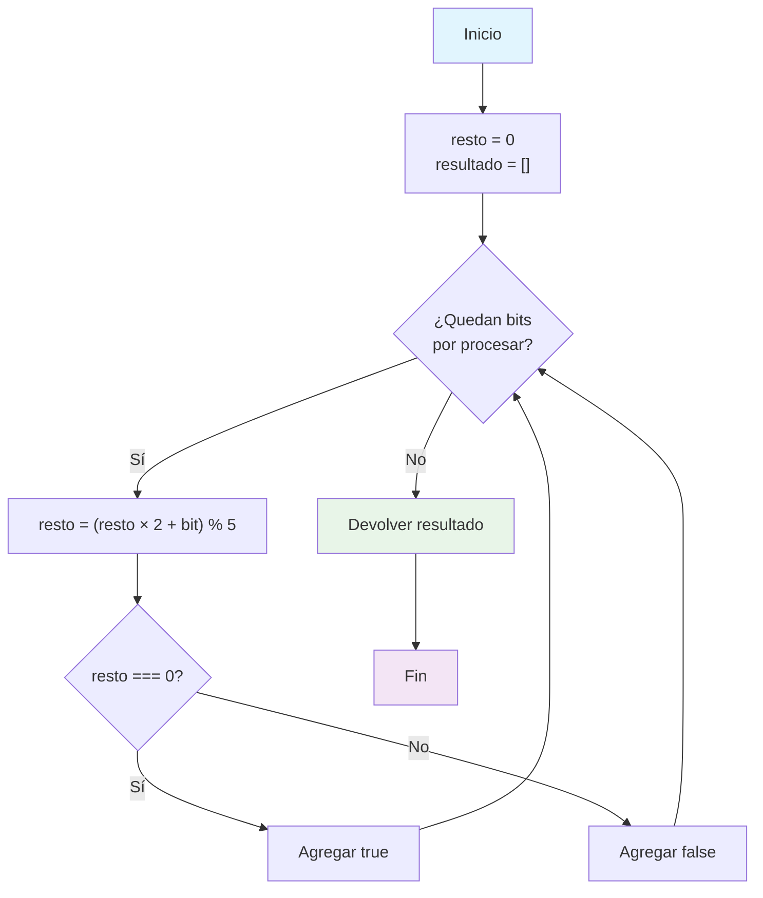

## Introducción

Este reto de LeetCode (#1018) es fundamentalmente un ejercicio matematico y tambien pone un desafio en resolverlo de manera eficiente para evitar overflow

## Enunciado del Problema

Dado un array `nums` compuesto solo por 0s y 1s, cada prefijo (desde el primer elemento hasta el índice `i`) se interpreta como un número binario. El objetivo es devolver una lista de booleanos donde cada posición indica si el número formado por ese prefijo es divisible por 5.

Un **prefijo** de un array es cualquier segmento que comienza en el primer elemento y termina en una posición intermedia o final. Por ejemplo, si el array es `[1, 0, 1, 1]`, sus prefijos son `[1]`, `[1, 0]`, `[1, 0, 1]` y `[1, 0, 1, 1]`. En este problema, cada prefijo se interpreta como un número binario, y el objetivo es determinar si ese número es divisible por 5. Analizar todos los prefijos permite evaluar progresivamente cómo cambia la divisibilidad a medida que se agregan más bits al número.

**Restricciones:**

- `1 <= nums.length <= 10⁵`
- `nums[i]` es `0` o `1`

## Enfoque y Análisis

### Observaciones Iniciales

La solución ingenua sería construir el número completo en cada paso y comprobar si es divisible por 5. Sin embargo, con arrays de hasta 100 000 elementos, esto es inviable por el tamaño del número.

La clave está en que solo necesitamos saber el resto de dividir el número actual entre 5. Podemos actualizar este resto de forma incremental:

$$
\text{nuevo\_resto} = (\text{resto\_anterior} \times 2 + \text{bit\_actual}) \mod 5
$$

Esto funciona porque en binario, añadir un bit equivale a multiplicar el número anterior por 2 y sumar el nuevo bit.

### Alternativas Consideradas

- Construir el número completo: no es eficiente.
- Usar operaciones bit a bit (`<<`): similar en rendimiento, pero menos claro que multiplicar por 2.

La versión con multiplicación es más legible y portable.

## Solución

A continuación, el código implementado en TypeScript:

```typescript
function prefixesDivBy5(nums: number[]): boolean[] {
  const result: boolean[] = []
  let remainder = 0

  for (const bit of nums) {
    remainder = (remainder * 2 + bit) % 5
    result.push(remainder === 0)
  }

  return result
}
```

**Explicación paso a paso:**

1. Inicializamos el resto en 0.
2. Recorremos cada bit del array.
3. Actualizamos el resto usando la fórmula modular.
4. Si el resto es 0, el prefijo es divisible por 5.

### Complejidad

- **Tiempo:** $O(n)$, recorremos el array una vez.
- **Espacio:** $O(1)$ auxiliar, $O(n)$ para el resultado.

## Casos Especiales

- Array de un solo elemento: `[0]` → `true`, `[1]` → `false`
- Solo ceros: todos los prefijos son divisibles por 5.
- Arrays largos: la solución evita overflow.

## Visualización del Algoritmo



## Reflexiones y Aprendizajes

Este problema demuestra cómo la aritmética modular permite optimizar algoritmos que, de otra forma, serían imposibles de ejecutar por limitaciones de memoria. El patrón de actualizar el estado incrementalmente es útil en muchos retos similares.

## Recursos

- [Problema original en LeetCode](https://leetcode.com/problems/binary-prefix-divisible-by-5/)
- Temas relacionados: aritmética modular, procesamiento de prefijos, manipulación de números binarios.
