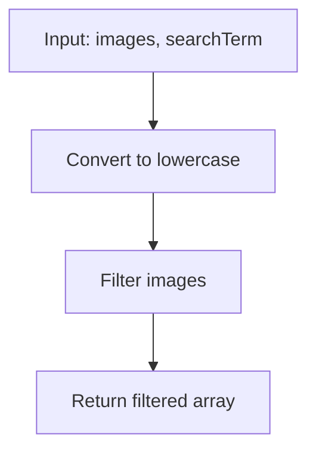

¡Hola! Hoy el desafío diario de FreeCodeCamp es el titulado "Image Search".

## El Problema

El 4 de noviembre de 2001, Google lanzó su búsqueda de imágenes, permitiendo a las personas encontrar imágenes usando términos de búsqueda. En este desafío, imitaremos esa funcionalidad.

Dada una array de nombres de imágenes y un término de búsqueda, debemos devolver una array de nombres de imágenes que contengan el término de búsqueda.

- Ignorar las mayúsculas y minúsculas al hacer coincidir los términos.
- Devolver las imágenes en el mismo orden en que aparecen en la array de entrada.

## Ejemplos

Aquí están los casos de prueba proporcionados:

1. `imageSearch(["dog.png", "cat.jpg", "parrot.jpeg"], "dog")` debería devolver `["dog.png"]`.
2. `imageSearch(["Sunset.jpg", "Beach.png", "sunflower.jpeg"], "sun")` debería devolver `["Sunset.jpg", "sunflower.jpeg"]`.
3. `imageSearch(["Moon.png", "sun.jpeg", "stars.png"], "PNG")` debería devolver `["Moon.png", "stars.png"]`.
4. `imageSearch(["cat.jpg", "dogToy.jpeg", "kitty-cat.png", "catNip.jpeg", "franken_cat.gif"], "Cat")` debería devolver `["cat.jpg", "kitty-cat.png", "catNip.jpeg", "franken_cat.gif"]`.

## Solución

La solución es bastante directa. Usaremos el método `filter()` para filtrar la array, y `includes()` para verificar si el nombre de la imagen contiene el término de búsqueda. Para ignorar las mayúsculas, convertiremos tanto el nombre de la imagen como el término de búsqueda a minúsculas.

```javascript
function imageSearch(images, searchTerm) {
  const term = searchTerm.toLowerCase()
  return images.filter(image => image.toLowerCase().includes(term))
}
```

### Explicación

1. Convertimos el `searchTerm` a minúsculas y lo guardamos en `term`.
2. Usamos `filter()` para crear una nueva array con solo los elementos que pasan la prueba.
3. La prueba es: convertir cada `image` a minúsculas y verificar si incluye el `term`.
4. Devolvemos la array filtrada, que mantiene el orden original.

Esta solución es eficiente (O(n) tiempo, donde n es el número de imágenes) y cumple con todos los requisitos.

## Solución Alternativa con Regex

Otra forma de resolver este problema es utilizando expresiones regulares (regex), que nos permiten hacer búsquedas más avanzadas si fuera necesario. Para este caso específico, podemos crear un regex con la bandera 'i' para ignorar mayúsculas y minúsculas.

```javascript
function imageSearch(images, searchTerm) {
  const regex = new RegExp(searchTerm, 'i')
  return images.filter(image => regex.test(image))
}
```

### Comparación de Soluciones

#### Pros y Contras de la Solución con filter() e includes()

**Pros:**

- Simple y legible: fácil de entender para principiantes.
- No requiere conocimientos avanzados de regex.
- Eficiente para búsquedas simples de substrings.

**Contras:**

- Limitada a búsquedas exactas de substrings; no soporta patrones complejos.
- Si el problema evolucionara para requerir búsquedas más sofisticadas (como wildcards o patrones específicos), necesitaríamos refactorizar.

#### Pros y Contras de la Solución con Regex

**Pros:**

- Más poderosa y flexible: permite patrones de búsqueda complejos si se extiende el problema.
- La bandera 'i' maneja automáticamente el case insensitive.
- Útil si queremos agregar funcionalidades como búsqueda con wildcards en el futuro.

**Contras:**

- Overhead de crear el objeto RegExp, que puede ser innecesario para búsquedas simples.
- Potencialmente menos legible para quienes no están familiarizados con regex.
- Para este problema específico, es overkill ya que no necesitamos patrones complejos.

En resumen, para este desafío diario, la solución con `filter()` e `includes()` es perfectamente adecuada y más directa. La versión con regex es una buena alternativa si anticipamos que el problema podría requerir búsquedas más avanzadas.

## Diagrama del Proceso

Para visualizar cómo funciona la búsqueda, aquí tienes un diagrama de flujo simplificado:



¡Eso es todo por hoy! ¿Hiciste este desafío también? ¿Tienes alguna otra solución o mejora? ¡Comparte en los comentarios!

<!-- TODO: Personalizar el artículo con tu voz
- Agrega una introducción personal: ¿Por qué te gusta hacer estos desafíos diarios? ¿Cómo encaja en tu rutina?
- Incluye anécdotas: ¿Encontraste alguna dificultad particular? ¿Qué aprendiste?
- Conecta con otros temas: Menciona si has hecho desafíos similares en LeetCode o otros.
- Hazlo conversacional: Usa frases como "Me sorprendió que..." o "En mi experiencia..."
- Revisa el tono: Asegúrate de que suene como tú, no como un tutorial genérico.
- Agrega llamadas a acción: Invita a los lectores a intentar el desafío o compartir sus soluciones.
-->
