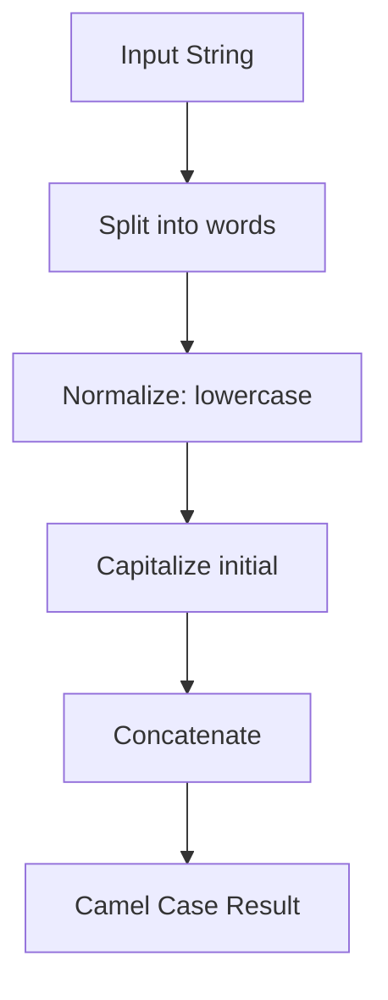

## Introduction

The "Camel Case" challenge from FreeCodeCamp asks us to transform a string into camel case format, a convention widely used in programming for naming variables and functions. This exercise is perfect for practicing string manipulation and regular expressions in JavaScript.

## Problem Statement

Given a string, return its camel case version following these rules:

- Words are separated by one or more of the following characters: space ( ), hyphen (-), or underscore (_).
- Each subsequent word should start with an uppercase letter, the rest in lowercase.
- All separators must be removed.

**Example:**

- Input: `"hello world"` → Output: `"helloWorld"`
- Input: `"secret agent-X"` → Output: `"secretAgentX"`

## Process Visualization

The process can be visualized as a flow of steps:



## Approach & Analysis

### Initial Observations

- Separators can be multiple and mixed.
- It's important to remove empty words that arise from consecutive separators.

### Strategy

1. Split the string into words using a regular expression that detects spaces, hyphens, and underscores.
2. Convert the first word to lowercase.
3. Capitalize the first letter of each subsequent word.
4. Concatenate all words.

## Step-by-Step Implementation

```javascript
function toCamelCase(s) {
  let words = s
    .toLowerCase()
    .split(/[\s-_]+/)
    .filter(Boolean)

  for (let i = 1; i < words.length; i++) {
    words[i] = words[i][0].toUpperCase() + words[i].slice(1)
  }

  return words.join('')
}

export default toCamelCase
```

**Key point:** Using `filter(Boolean)` removes empty words generated by consecutive separators.

## Complexity Analysis

- **Time:** $O(n)$, where $n$ is the length of the string.
- **Space:** $O(n)$, for the list of words and the final result.

## Test Cases and Edge Cases

```javascript
toCamelCase('hello world') // "helloWorld"
toCamelCase('HELLO WORLD') // "helloWorld"
toCamelCase('secret agent-X') // "secretAgentX"
toCamelCase('FREE cODE cAMP') // "freeCodeCamp"
toCamelCase('ye old-_-sea faring_buccaneer_-_with a - peg__leg----and a_parrot_ _named- _squawk') // "yeOldSeaFaringBuccaneerWithAPegLegAndAParrotNamedSquawk"
```

Edge cases include empty strings, only separators, or special characters. The solution handles them correctly.

## Alternatives and Optimizations

A more compact version using `replace` and a callback function:

```javascript
function toCamelCase(s) {
  return s
    .toLowerCase()
    .replace(/[\s-_]+(.)/g, (match, group1) => group1.toUpperCase())
}
```

However, the original version is more readable and maintainable.

## Reflections and Learnings

This problem is excellent for practicing:

- String manipulation
- Regular expressions
- Handling edge cases
- Complexity analysis

## Resources and References

- [Camel Case on Wikipedia](https://en.wikipedia.org/wiki/Camel_case)
- [String on MDN](https://developer.mozilla.org/en-US/docs/Web/JavaScript/Reference/Global_Objects/String)
- [Regular Expressions in JavaScript](https://developer.mozilla.org/en-US/docs/Web/JavaScript/Guide/Regular_Expressions)
