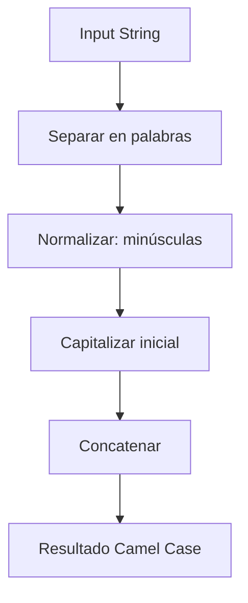

## Introducción

El reto "Camel Case" de FreeCodeCamp nos invita a transformar un string en formato camel case, una convención muy utilizada en programación para nombrar variables y funciones. Este ejercicio es ideal para practicar manipulación de strings y expresiones regulares en JavaScript.

## Enunciado del Problema

Dado un string, devuelve su versión en camel case siguiendo estas reglas:

- Las palabras están separadas por uno o más caracteres del conjunto: espacio ( ), guion (-) o guion bajo (_).
- Cada palabra subsecuente debe comenzar con mayúscula, el resto en minúscula.
- Todos los separadores deben eliminarse.

**Ejemplo:**

- Entrada: `"hello world"` → Salida: `"helloWorld"`
- Entrada: `"secret agent-X"` → Salida: `"secretAgentX"`

## Visualización del Proceso

El proceso puede visualizarse como un flujo de pasos:



## Análisis y Enfoque

### Observaciones Iniciales

- Los separadores pueden ser múltiples y mezclados.
- Es importante eliminar palabras vacías que surgen de separadores consecutivos.

### Estrategia

1. Separar el string en palabras usando una expresión regular que detecte espacios, guiones y guiones bajos.
2. Convertir la primera palabra a minúsculas.
3. Capitalizar la primera letra de cada palabra subsecuente.
4. Concatenar todas las palabras.

## Implementación Paso a Paso

```javascript
function toCamelCase(s) {
  let words = s
    .toLowerCase()
    .split(/[\s-_]+/)
    .filter(Boolean)

  for (let i = 1; i < words.length; i++) {
    words[i] = words[i][0].toUpperCase() + words[i].slice(1)
  }

  return words.join('')
}

export default toCamelCase
```

**Punto clave:** El uso de `filter(Boolean)` elimina palabras vacías generadas por separadores consecutivos.

## Análisis de Complejidad

- **Tiempo:** $O(n)$, donde $n$ es la longitud del string.
- **Espacio:** $O(n)$, por la lista de palabras y el resultado final.

## Casos de Prueba y Edge Cases

```javascript
toCamelCase('hello world') // "helloWorld"
toCamelCase('HELLO WORLD') // "helloWorld"
toCamelCase('secret agent-X') // "secretAgentX"
toCamelCase('FREE cODE cAMP') // "freeCodeCamp"
toCamelCase('ye old-_-sea faring_buccaneer_-_with a - peg__leg----and a_parrot_ _named- _squawk') // "yeOldSeaFaringBuccaneerWithAPegLegAndAParrotNamedSquawk"
```

Casos edge incluyen strings vacíos, solo separadores, o caracteres especiales. La solución los maneja correctamente.

## Alternativas y Optimizaciones

Se puede usar una versión más compacta con `replace` y una función de callback:

```javascript
function toCamelCase(s) {
  return s
    .toLowerCase()
    .replace(/[\s-_]+(.)/g, (match, group1) => group1.toUpperCase())
}
```

Sin embargo, la versión original es más legible y fácil de mantener.

## Reflexiones y Aprendizajes

Este problema es excelente para practicar:

- Manipulación de strings
- Expresiones regulares
- Manejo de casos edge
- Análisis de complejidad

## Recursos y Referencias

- [Camel Case en Wikipedia](https://en.wikipedia.org/wiki/Camel_case)
- [String en MDN](https://developer.mozilla.org/en-US/docs/Web/JavaScript/Reference/Global_Objects/String)
- [Expresiones Regulares en JavaScript](https://developer.mozilla.org/en-US/docs/Web/JavaScript/Guide/Regular_Expressions)
