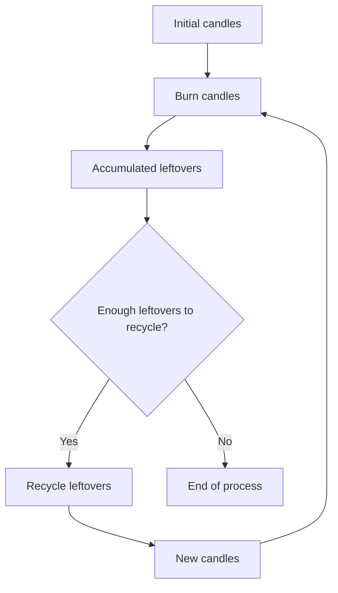

## Introduction

Today we tackle the "Candlelight" challenge from FreeCodeCamp Daily Challenge. The goal is to calculate how many candles we can burn in total, recycling used candles to create new ones, until it's no longer possible to continue.

## Problem Statement

Given:

- An initial number of candles (`candles`).
- A number indicating how many burned candles are needed to make a new one (`leftoversNeeded`).

Return the total number of candles that can be burned, recycling as many times as possible.

**Example:**
If we start with 7 candles and need 2 burned ones to create a new:

1. Burn 7 candles → 7 leftovers.

### Process Diagram

## Initial Analysis

The challenge is to simulate the process of burning and recycling candles, accumulating leftovers and creating new candles until it's no longer possible. The result is the total number of candles burned.

### Test Cases

Some examples to validate the solution:

| Input                | Output |
|----------------------|--------|
| burnCandles(7, 2)    | 13     |
| burnCandles(10, 5)   | 12     |
| burnCandles(20, 3)   | 29     |
| burnCandles(17, 4)   | 22     |
| burnCandles(2345, 3) | 3517   |

## Solution Development

### Approach

There are two ways to tackle the problem: recursive and iterative. The recursive approach is intuitive but inefficient for large numbers. That's why we choose the iterative approach, simulating the process with a loop and accumulators.

### Implementation

1. Initialize the total burned candles with the initial number.
2. Use variables for current candles and accumulated leftovers.
3. While leftovers allow recycling:
  - Calculate how many new candles can be created.
  - Add that number to the total burned candles.
  - Update the leftovers.
4. Repeat until no more candles can be created.
5. Return the total.

## Complexity Analysis

### Time

The solution is $O(n)$, where $n$ is the initial number of candles. The loop finishes quickly even for large values.

### Space

It's $O(1)$, since we only use simple counting variables.

### Edge Cases

- If `candles < leftoversNeeded`, only the initial candles are burned.
- If `leftoversNeeded = 1`, the process would be infinite (avoid this case).
- If any parameter is 0 or negative, return 0 or throw an error.

## Reflections & Learnings

This challenge is a good example of iterative simulation and accumulator usage. We chose the iterative approach to avoid efficiency and stack overflow issues.

What did we learn? Modeling recycling processes and optimizing resources can be simple if you correctly abstract the cycle and use accumulators.
