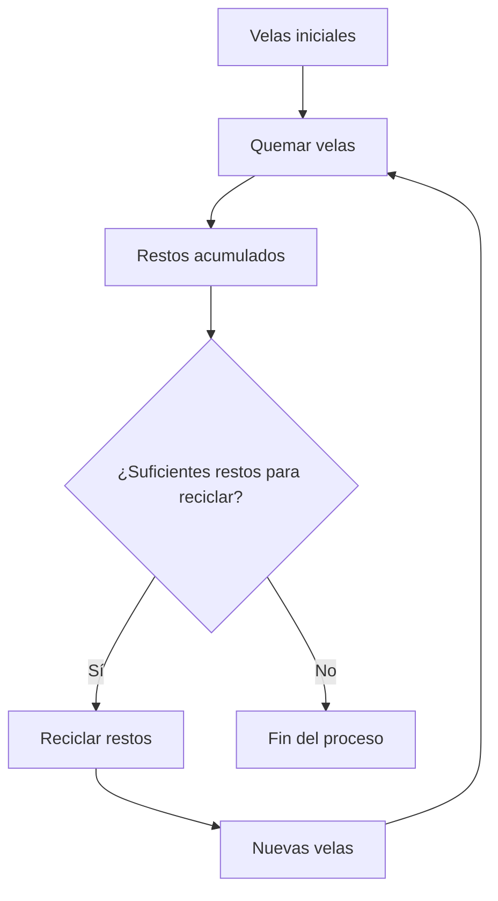

## Introducción

Hoy resolvemos el reto "Candlelight" de FreeCodeCamp Daily Challenge. El objetivo es calcular cuántas velas podemos quemar en total, reciclando las velas usadas para crear nuevas, hasta que no sea posible continuar.

## Enunciado

Dado:

- Un número inicial de velas (`candles`).
- Un número que indica cuántas velas quemadas se necesitan para fabricar una nueva (`leftoversNeeded`).

Devuelve el total de velas que se pueden quemar, reciclando tantas veces como sea posible.

**Ejemplo:**
Si comenzamos con 7 velas y necesitamos 2 quemadas para crear una nueva:

1. Quemamos 7 velas → 7 restos.

### Diagrama del Proceso

## Análisis Inicial

El reto consiste en simular el proceso de quemar y reciclar velas, acumulando restos y creando nuevas velas hasta que no se pueda continuar. El resultado es el total de velas quemadas.

### Casos de Prueba

Algunos ejemplos para validar la solución:

| Input                | Output |
|----------------------|--------|
| burnCandles(7, 2)    | 13     |
| burnCandles(10, 5)   | 12     |
| burnCandles(20, 3)   | 29     |
| burnCandles(17, 4)   | 22     |
| burnCandles(2345, 3) | 3517   |

## Desarrollo de la Solución

### Enfoque

Existen dos formas de abordar el problema: recursiva e iterativa. La recursiva es intuitiva pero poco eficiente para números grandes. Por eso, elegimos la iterativa, simulando el proceso con un bucle y acumuladores.

### Implementación

1. Inicializar el total de velas quemadas con el número inicial.
2. Usar variables para las velas actuales y los restos acumulados.
3. Mientras los restos permitan reciclar:
  - Calcular cuántas velas nuevas se pueden crear.
  - Sumar ese número al total de velas quemadas.
  - Actualizar los restos.
4. Repetir hasta que no se puedan crear más velas.
5. Devolver el total.

## Análisis de Complejidad

### Temporal

La solución es $O(n)$, donde $n$ es el número inicial de velas. El bucle termina rápido incluso para valores grandes.

### Espacial

Es $O(1)$, ya que solo usamos variables simples para el conteo.

### Casos Edge

- Si `candles < leftoversNeeded`, solo se queman las iniciales.
- Si `leftoversNeeded = 1`, el proceso sería infinito (evitar ese caso).
- Si algún parámetro es 0 o negativo, se devuelve 0 o se lanza error.

### Reflexiones y Aprendizajes

El reto es un buen ejemplo de simulación iterativa y uso de acumuladores. Elegimos el enfoque iterativo para evitar problemas de eficiencia y stack overflow.

¿Qué aprendimos? Modelar procesos de reciclaje y optimizar recursos puede ser sencillo si se abstrae correctamente el ciclo y se usan acumuladores.
