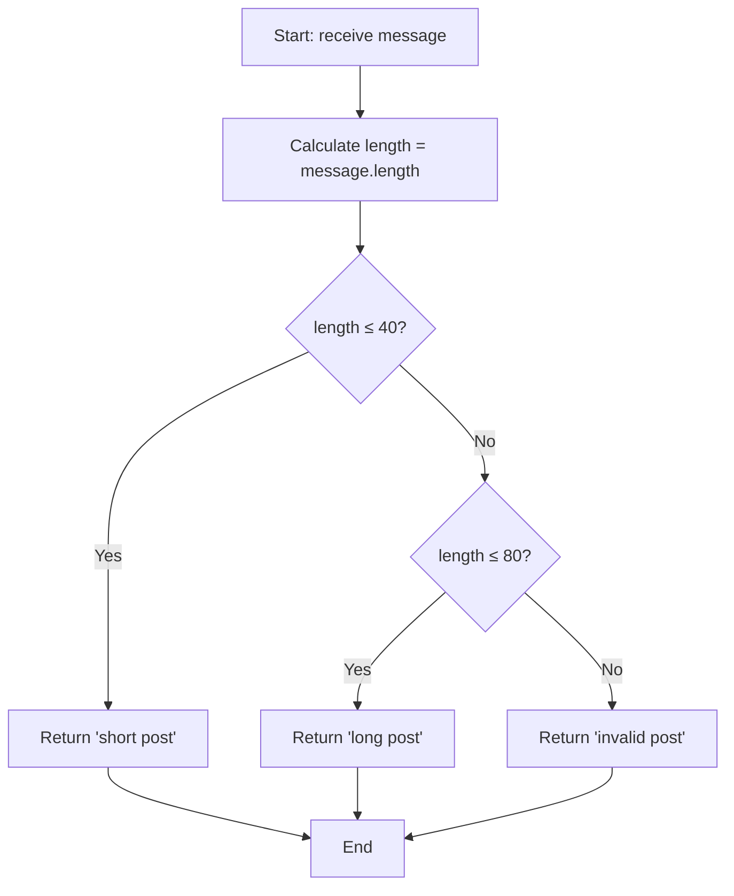

## Introduction

This FreeCodeCamp daily challenge presents a typical case in web development: **validating content length** before publishing it on social media. It's a perfect exercise for practicing conditional structures and validation logic.

## Problem Statement

In this challenge, you're given a text string and must determine if it's appropriate for a social media post. The function should return one of these three messages according to established rules:

| Condition | Result |
|-----------|--------|
| `length ≤ 40` | `"short post"` |
| `40 < length ≤ 80` | `"long post"` |
| `length > 80` | `"invalid post"` |

### Usage examples

```javascript
canPost('Hello world') // "short post" (11 characters)
canPost('This is a medium-length message for social media platforms') // "long post" (67 characters)
canPost('This message is extremely long and exceeds the established limits for posts on modern social media platforms today') // "invalid post" (122 characters)
```

## Problem Analysis

Before coding, let's analyze the cases:

1. **Base case**: Short messages (≤ 40 characters) are valid
2. **Intermediate case**: Medium messages (41-80 characters) are acceptable but long
3. **Edge case**: Excessively long messages (> 80 characters) are not valid

### Decision flow



## Implemented Solution

My approach uses the **ternary operator** to create a concise and elegant solution:

```javascript
function canPost(message) {
  // Calculate length once for better readability
  const length = message.length

  // Nested ternary operator: left-to-right evaluation
  return length <= 40
    ? 'short post'
    : length <= 80
      ? 'long post'
      : 'invalid post'
}
```

### Why use the ternary operator?

1. **Conciseness**: All logic in a single `return` expression
2. **Readability**: Clear logical flow from left to right
3. **Functional**: Behaves as an expression, not as statements
4. **Time complexity**: $O(1)$ - We only access the `length` property

:::tip Nested Ternary Operator
The ternary operator `condition ? value1 : value2` can be nested to handle multiple cases. Evaluation is performed from left to right, stopping as soon as a true condition is found.
:::

## Implementation Alternatives

### Using traditional if/else if/else

```javascript
function canPostTraditional(message) {
  const length = message.length

  // Traditional conditional structure
  if (length <= 40) {
    return 'short post'
  }
  else if (length <= 80) {
    return 'long post'
  }
  else {
    return 'invalid post'
  }
}
```

**Advantages of `if/else if/else`:**

- More familiar for beginners
- Easy to debug with breakpoints
- Allows additional logic in each block

### With input validation

```javascript
function canPostRobust(message) {
  // Input validation
  if (typeof message !== 'string') {
    throw new TypeError('Parameter must be a string')
  }

  const length = message.length

  return length <= 40
    ? 'short post'
    : length <= 80
      ? 'long post'
      : 'invalid post'
}
```

## Test Cases

```javascript
// Edge cases
console.log(canPost('')) // "short post" (0 characters)
console.log(canPost('a'.repeat(40))) // "short post" (exactly 40)
console.log(canPost('a'.repeat(41))) // "long post" (41 characters)
console.log(canPost('a'.repeat(80))) // "long post" (exactly 80)
console.log(canPost('a'.repeat(81))) // "invalid post" (81 characters)
```

## Conclusion

This challenge illustrates fundamental programming concepts:

- **Conditional structures** to handle multiple cases
- **Data validation** before processing
- **Code optimization** through auxiliary variables
- **Edge cases** we must consider when designing solutions

The solution is simple but effective, demonstrating that we don't always need complex algorithms to solve real web development problems.

### Concepts Learned

- Using `string.length` to get string length
- Conditional structures for multiple conditions
- Importance of order in conditional evaluations
- Practice with edge cases in input validation
