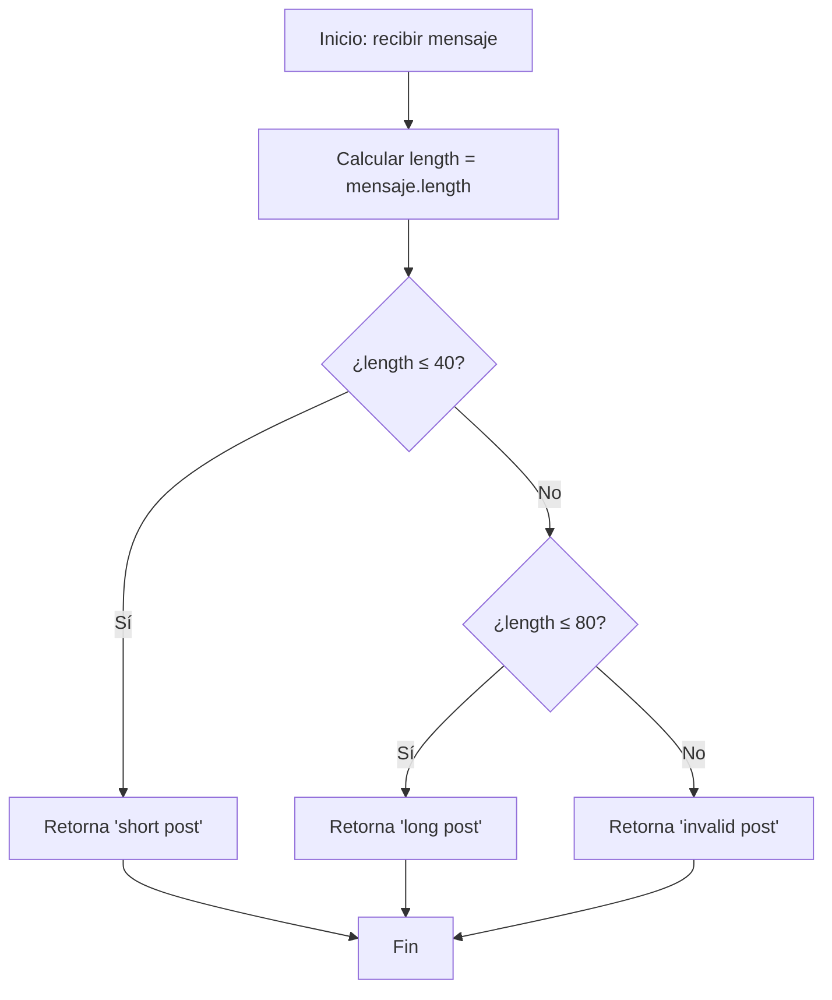

## Introducción

Este problema del desafío diario de FreeCodeCamp nos presenta un caso típico en el desarrollo web: **validar la longitud del contenido** antes de publicarlo en redes sociales. Es un ejercicio perfecto para practicar estructuras condicionales y lógica de validación.

## Enunciado del Problema

En este desafío, se te proporciona una cadena de texto y debes determinar si es apropiada para una publicación en redes sociales. La función debe retornar uno de estos tres mensajes según las reglas establecidas:

| Condición | Resultado |
|-----------|-----------|
| `longitud ≤ 40` | `"short post"` |
| `40 < longitud ≤ 80` | `"long post"` |
| `longitud > 80` | `"invalid post"` |

### Ejemplos de uso

```javascript
canPost('Hola mundo') // "short post" (10 caracteres)
canPost('Este es un mensaje de longitud media para redes sociales') // "long post" (63 caracteres)
canPost('Este mensaje es extremadamente largo y supera los límites establecidos para las publicaciones en redes sociales modernas') // "invalid post" (132 caracteres)
```

## Análisis del Problema

Antes de codificar, analicemos los casos:

1. **Caso base**: Mensajes cortos (≤ 40 caracteres) son válidos
2. **Caso intermedio**: Mensajes medianos (41-80 caracteres) son aceptables pero largos
3. **Caso límite**: Mensajes excesivamente largos (> 80 caracteres) no son válidos

### Flujo de decisión



## Solución Implementada

Mi enfoque utiliza el **operador ternario** para crear una solución concisa y elegante:

```javascript
function canPost(message) {
  // Calculamos la longitud una sola vez para mejor legibilidad
  const length = message.length

  // Operador ternario anidado: evaluación de izquierda a derecha
  return length <= 40
    ? 'short post'
    : length <= 80
      ? 'long post'
      : 'invalid post'
}
```

### ¿Por qué usar el operador ternario?

1. **Concisión**: Toda la lógica en una sola expresión `return`
2. **Legibilidad**: Flujo lógico claro de izquierda a derecha
3. **Funcional**: Se comporta como una expresión, no como declaraciones
4. **Complejidad temporal**: $O(1)$ - Solo accedemos a la propiedad `length`

:::tip Operador Ternario Anidado
El operador ternario `condición ? valor1 : valor2` se puede anidar para manejar múltiples casos. La evaluación se realiza de izquierda a derecha, y se detiene en cuanto encuentra una condición verdadera.
:::

## Alternativas de Implementación

### Usando if/else if/else tradicional

```javascript
function canPostTraditional(message) {
  const length = message.length

  // Estructura condicional tradicional
  if (length <= 40) {
    return 'short post'
  }
  else if (length <= 80) {
    return 'long post'
  }
  else {
    return 'invalid post'
  }
}
```

**Ventajas del `if/else if/else`:**

- Más familiar para principiantes
- Fácil de debuggear con breakpoints
- Permite lógica adicional en cada bloque

### Con validación de entrada

```javascript
function canPostRobust(message) {
  // Validación de entrada
  if (typeof message !== 'string') {
    throw new TypeError('El parámetro debe ser una cadena de texto')
  }

  const length = message.length

  return length <= 40
    ? 'short post'
    : length <= 80
      ? 'long post'
      : 'invalid post'
}
```

## Casos de Prueba

```javascript
// Casos de borde
console.log(canPost('')) // "short post" (0 caracteres)
console.log(canPost('a'.repeat(40))) // "short post" (exactamente 40)
console.log(canPost('a'.repeat(41))) // "long post" (41 caracteres)
console.log(canPost('a'.repeat(80))) // "long post" (exactamente 80)
console.log(canPost('a'.repeat(81))) // "invalid post" (81 caracteres)
```

## Conclusión

Este desafío ilustra conceptos fundamentales de programación:

- **Estructuras condicionales** para manejar múltiples casos
- **Validación de datos** antes del procesamiento
- **Optimización de código** mediante variables auxiliares
- **Casos de borde** que debemos considerar al diseñar soluciones

La solución es simple pero efectiva, demostrando que no siempre necesitamos algoritmos complejos para resolver problemas reales de desarrollo web.

### Conceptos Aprendidos

- Uso de `string.length` para obtener la longitud de cadenas
- Estructuras `condicionales` para múltiples condiciones
- Importancia del orden en las evaluaciones condicionales
- Práctica de casos de borde en validación de entrada
