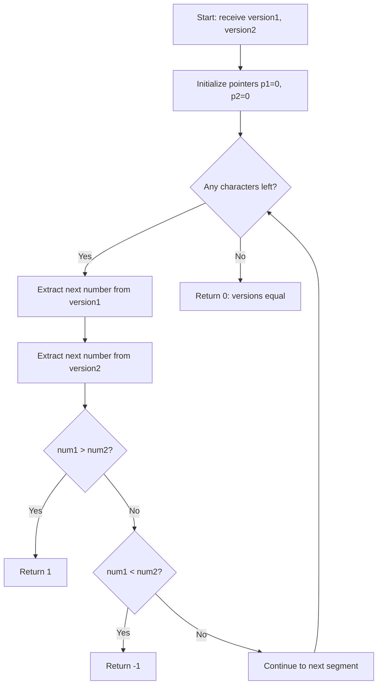

## Introduction

This LeetCode Medium problem presents a common software development challenge: **comparing version numbers** like those we encounter in dependencies, software releases, or APIs. It's a perfect exercise for practicing string manipulation and memory optimization.

## Problem Statement

**LeetCode 165:** Compare Version Numbers
**Difficulty:** Medium
**Topics:** Two Pointers, String

> Given two version strings, `version1` and `version2`, compare them. A version string consists of revisions separated by dots '.'. The value of the revision is its integer conversion ignoring any leading zeros.

**Return:**

- `1` if `version1 > version2`
- `-1` if `version1 < version2`
- `0` if `version1 == version2`

### Usage examples

```javascript
compareVersion('1.2', '1.10') // -1 (2 < 10)
compareVersion('1.01', '1.001') // 0 (01 == 001 after parseInt)
compareVersion('1.0', '1.0.0.0') // 0 (missing revisions = 0)
```

## Problem Analysis

Before implementing, let's identify the key cases:

1. **Leading zeros**: `"1.01"` vs `"1.1"` should be equal
2. **Different lengths**: `"1.0"` vs `"1.0.0.0"` should be equal
3. **Numeric comparison**: `"1.2"` vs `"1.10"` where 2 < 10

### Decision flow



## Implemented Solution

My approach uses the **Two Pointers pattern** to optimize memory usage:

```javascript
function compareVersion(version1, version2) {
  let p1 = 0 // Pointer for version1
  let p2 = 0 // Pointer for version2

  while (p1 < version1.length || p2 < version2.length) {
    // Extract next number from version1
    let num1 = 0
    while (p1 < version1.length && version1[p1] !== '.') {
      num1 = num1 * 10 + Number.parseInt(version1[p1])
      p1++
    }
    p1++ // Skip the dot

    // Extract next number from version2
    let num2 = 0
    while (p2 < version2.length && version2[p2] !== '.') {
      num2 = num2 * 10 + Number.parseInt(version2[p2])
      p2++
    }
    p2++ // Skip the dot

    // Compare extracted numbers
    if (num1 > num2)
      return 1
    if (num1 < num2)
      return -1
  }

  return 0 // All revisions are equal
}
```

### Why Two Pointers?

1. **Memory efficiency**: $O(1)$ vs $O(n+m)$ of the split approach
2. **On-demand processing**: We only extract numbers when we need them
3. **Automatic length handling**: No need for manual padding

> **Digit-by-Digit Number Construction**
>
> The technique `num = num * 10 + digit` builds numbers incrementally:
>
> - For "123": `0 → 1 → 12 → 123`
> - Automatically handles leading zeros

## Alternative Implementations

### Split Approach (more readable)

```javascript
function compareVersionSplit(version1, version2) {
  const parts1 = version1.split('.')
  const parts2 = version2.split('.')

  const maxLength = Math.max(parts1.length, parts2.length)

  for (let i = 0; i < maxLength; i++) {
    const num1 = Number.parseInt(parts1[i] || '0')
    const num2 = Number.parseInt(parts2[i] || '0')

    if (num1 > num2)
      return 1
    if (num1 < num2)
      return -1
  }

  return 0
}
```

**Split Advantages:**

- More intuitive for beginners
- Easy to debug and understand
- Explicit handling of missing segments

### Regex Approach (more concise)

```javascript
function compareVersionRegex(version1, version2) {
  const parts1 = version1.match(/\d+/g) || []
  const parts2 = version2.match(/\d+/g) || []

  const maxLength = Math.max(parts1.length, parts2.length)

  for (let i = 0; i < maxLength; i++) {
    const num1 = Number.parseInt(parts1[i] || '0')
    const num2 = Number.parseInt(parts2[i] || '0')

    if (num1 !== num2)
      return num1 > num2 ? 1 : -1
  }

  return 0
}
```

## Critical Test Cases

```javascript
// Edge cases we need to handle
console.log(compareVersion('', '1')) // -1
console.log(compareVersion('1.0', '1.0.0.0')) // 0
console.log(compareVersion('1.01', '1.001')) // 0
console.log(compareVersion('1.0', '1.0.1')) // -1
console.log(compareVersion('7.5.2.4', '7.5.3')) // -1
```

## Complexity Analysis

| Approach | Time | Space | Readability |
|----------|------|-------|-------------|
| **Two Pointers** | $O(n+m)$ | **$O(1)$** ✅ | ⭐⭐⭐⭐ |
| **Split** | $O(n+m)$ | $O(n+m)$ | ⭐⭐⭐⭐⭐ |
| **Regex** | $O(n+m)$ | $O(n+m)$ | ⭐⭐⭐ |

Where $n$ and $m$ are the lengths of the version strings.

## Conclusion

This problem illustrates fundamental programming concepts:

- **Efficient string manipulation** without creating auxiliary structures
- **Two Pointers pattern** for memory optimization
- **Edge case handling** like leading zeros and variable lengths
- **Trade-offs between readability and efficiency** in different approaches

The Two Pointers solution is ideal for technical interviews where memory efficiency is valued, while the Split approach is more appropriate for production code where readability is prioritized.

### Concepts Learned

- Incremental digit-by-digit number construction
- Simultaneous handling of multiple strings with pointers
- Memory optimization techniques in string problems
- Importance of TDD for validating complex refactors
