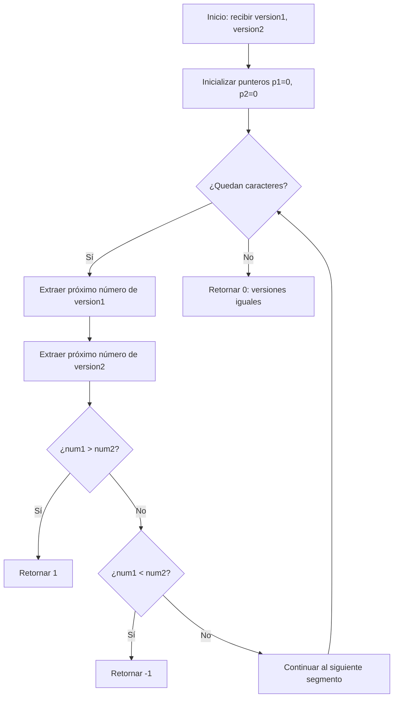

## Introducción

Este problema de LeetCode Medium nos presenta el desafío de: **comparar números de versión** como los que encontramos en dependencias, releases de software o APIs. Es un ejercicio perfecto para practicar manipulación de strings.

## Enunciado del Problema

**LeetCode 165: Compare Version Numbers**
**Dificultad:** Medium
**Temas:** Two Pointers, String

> Dados dos strings de versión, `version1` y `version2`, compáralos. Un string de versión consiste en revisiones separadas por puntos '.'. El valor de la revisión es su conversión a entero ignorando los ceros a la izquierda.

**Retornar:**

- `1` si `version1 > version2`
- `-1` si `version1 < version2`
- `0` si `version1 == version2`

### Ejemplos de uso

```javascript
compareVersion('1.2', '1.10') // -1 (2 < 10)
compareVersion('1.01', '1.001') // 0 (01 == 001 después de parseInt)
compareVersion('1.0', '1.0.0.0') // 0 (revisiones faltantes = 0)
```

## Análisis del Problema

Antes de implementar, identifiquemos los casos clave:

1. **Ceros a la izquierda**: `"1.01"` vs `"1.1"` deben ser iguales
2. **Longitudes diferentes**: `"1.0"` vs `"1.0.0.0"` deben ser iguales
3. **Comparación numérica**: `"1.2"` vs `"1.10"` donde 2 < 10

### Flujo de decisión



## Solución Implementada

Mi enfoque utiliza el **patrón Two Pointers** para optimizar el uso de memoria:

```javascript
function compareVersion(version1, version2) {
  let p1 = 0 // Puntero para version1
  let p2 = 0 // Puntero para version2

  while (p1 < version1.length || p2 < version2.length) {
    // Extraer próximo número de version1
    let num1 = 0
    while (p1 < version1.length && version1[p1] !== '.') {
      num1 = num1 * 10 + Number.parseInt(version1[p1])
      p1++
    }
    p1++ // Saltar el punto

    // Extraer próximo número de version2
    let num2 = 0
    while (p2 < version2.length && version2[p2] !== '.') {
      num2 = num2 * 10 + Number.parseInt(version2[p2])
      p2++
    }
    p2++ // Saltar el punto

    // Comparar números extraídos
    if (num1 > num2)
      return 1
    if (num1 < num2)
      return -1
  }

  return 0 // Todas las revisiones son iguales
}
```

### ¿Por qué Two Pointers?

1. **Eficiencia de memoria**: $O(1)$ vs $O(n+m)$ del enfoque split
2. **Procesamiento on-demand**: Solo extraemos números cuando los necesitamos
3. **Manejo automático de longitudes**: No necesitamos padding manual

:::tip Construcción Numérica Dígito a Dígito
La técnica `num = num * 10 + digit` construye números incrementalmente:

- Para "123": `0 → 1 → 12 → 123`
- Maneja automáticamente ceros a la izquierda

:::

## Alternativas de Implementación

### Enfoque Split (más legible)

```javascript
function compareVersionSplit(version1, version2) {
  const parts1 = version1.split('.')
  const parts2 = version2.split('.')

  const maxLength = Math.max(parts1.length, parts2.length)

  for (let i = 0; i < maxLength; i++) {
    const num1 = Number.parseInt(parts1[i] || '0')
    const num2 = Number.parseInt(parts2[i] || '0')

    if (num1 > num2)
      return 1
    if (num1 < num2)
      return -1
  }

  return 0
}
```

**Ventajas del Split:**

- Más intuitivo para principiantes
- Fácil de debuggear y entender
- Manejo explícito de segmentos faltantes

### Enfoque Regex (más conciso)

```javascript
function compareVersionRegex(version1, version2) {
  const parts1 = version1.match(/\d+/g) || []
  const parts2 = version2.match(/\d+/g) || []

  const maxLength = Math.max(parts1.length, parts2.length)

  for (let i = 0; i < maxLength; i++) {
    const num1 = Number.parseInt(parts1[i] || '0')
    const num2 = Number.parseInt(parts2[i] || '0')

    if (num1 !== num2)
      return num1 > num2 ? 1 : -1
  }

  return 0
}
```

## Casos de Prueba Críticos

```javascript
// Casos de borde que debemos manejar
console.log(compareVersion('', '1')) // -1
console.log(compareVersion('1.0', '1.0.0.0')) // 0
console.log(compareVersion('1.01', '1.001')) // 0
console.log(compareVersion('1.0', '1.0.1')) // -1
console.log(compareVersion('7.5.2.4', '7.5.3')) // -1
```

## Análisis de Complejidad

| Enfoque | Tiempo | Espacio | Legibilidad |
|---------|--------|---------|-------------|
| **Two Pointers** | $O(n+m)$ | **$O(1)$** ✅ | ⭐⭐⭐⭐ |
| **Split** | $O(n+m)$ | $O(n+m)$ | ⭐⭐⭐⭐⭐ |
| **Regex** | $O(n+m)$ | $O(n+m)$ | ⭐⭐⭐ |

Donde $n$ y $m$ son las longitudes de los strings de versión.

## Conclusión

Este problema ilustra conceptos fundamentales de programación:

- **Manipulación eficiente de strings** sin crear estructuras auxiliares
- **Patrón Two Pointers** para optimizar memoria
- **Manejo de casos edge** como ceros a la izquierda y longitudes variables
- **Trade-offs entre legibilidad y eficiencia** en diferentes enfoques

La solución Two Pointers es ideal para entrevistas técnicas donde la eficiencia de memoria es valorada, mientras que el enfoque Split es más apropiado para código de producción donde la legibilidad es prioritaria.

### Conceptos Aprendidos

- Construcción incremental de números dígito a dígito
- Manejo simultáneo de múltiples strings con punteros
- Técnicas de optimización de memoria en problemas de strings
- Importancia del TDD para validar refactorizaciones complejas
