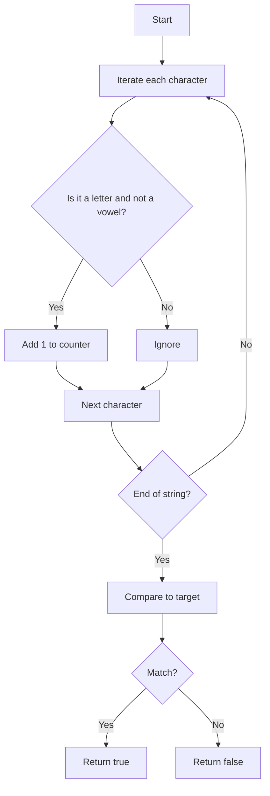

## Consonant Count

### 1. Problem Statement

Given a string and a target number, determine if the string contains exactly that number of consonants.

- **Consonants:** all letters except a, e, i, o, u.
- Ignore digits, punctuation, spaces, and any non-alphabetic character.

---

### 2. Initial Analysis

What’s required? Count consonants in a string and compare to the target.

#### Test Cases

| Text                 | Target   | Match?     |
|----------------------|----------|------------|
| "hola mundo"         | 6        | ✅         |
| "aeiou"              | 0        | ✅         |
| "123!@#"             | 0        | ✅         |
| "abcde"              | 3        | ✅         |
| ""                   | 0        | ✅         |
| "consonantes! 2025"  | 8        | ❌         |

---

### 3. Solution & Code

**Strategy:**

1. Initialize a counter at 0.
2. Iterate each character:
   - Convert to lowercase.
   - Check if it’s a letter and not a vowel.
   - If it’s a consonant, add 1.
3. Compare the total to the target.

```js
function hasConsonantCount(text, target) {
  let consonantCount = 0
  const vowels = 'aeiou'
  for (let char of text.toLowerCase()) {
    if (char >= 'a' && char <= 'z' && !vowels.includes(char)) {
      consonantCount++
    }
  }
  return consonantCount === target
}
```

#### Flowchart



---

### 4. Complexity

- **Time:** $O(n)$, single pass through the string.
- **Space:** $O(1)$, only simple variables used.

---

### 5. Edge Cases

- Empty string → target 0
- Only vowels or only symbols → target 0
- Special characters and digits: ignored

---

### 6. Reflections

- Filtering for letters and vowels is key.
- The logic is simple and robust for strings of any size.
- Can be adapted to count vowels, letters, etc.

---
