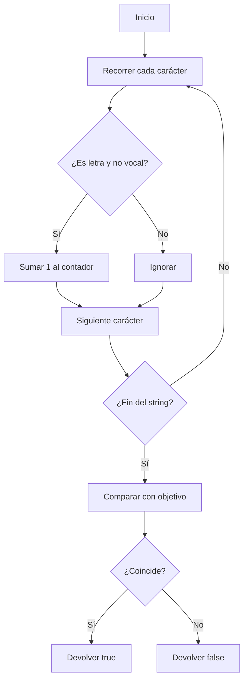

## Consonant Count

### 1. Enunciado

Dado un string y un número objetivo, determina si el string contiene exactamente esa cantidad de consonantes.

- **Consonantes:** todas las letras excepto a, e, i, o, u.
- Ignora dígitos, signos, espacios y cualquier carácter no alfabético.

---

### 2. Análisis Inicial

¿Qué pide? Contar consonantes en un string y comparar con el objetivo.

#### Casos de prueba

| Texto                | Objetivo | ¿Coincide? |
|----------------------|----------|------------|
| "hola mundo"         | 6        | ✅         |
| "aeiou"              | 0        | ✅         |
| "123!@#"             | 0        | ✅         |
| "abcde"              | 3        | ✅         |
| ""                   | 0        | ✅         |
| "consonantes! 2025"  | 8        | ❌         |

---

### 3. Solución y Código

**Estrategia:**

1. Inicializar contador en 0.
2. Recorrer cada carácter:
   - Convertir a minúscula.
   - Verificar si es letra y no vocal.
   - Si es consonante, sumar 1.
3. Comparar el total con el objetivo.

```js
function hasConsonantCount(text, target) {
  let consonantCount = 0
  const vowels = 'aeiou'
  for (let char of text.toLowerCase()) {
    if (char >= 'a' && char <= 'z' && !vowels.includes(char)) {
      consonantCount++
    }
  }
  return consonantCount === target
}
```

#### Diagrama de flujo



---

### 4. Complejidad

- **Temporal:** $O(n)$, una pasada por el string.
- **Espacial:** $O(1)$, uso de variables simples.

---

### 5. Casos Edge

- String vacío → objetivo 0
- Solo vocales o solo símbolos → objetivo 0
- Caracteres especiales y dígitos: ignorados

---

### 6. Reflexiones

- El filtrado de letras y vocales es clave.
- La lógica es simple y robusta para strings de cualquier tamaño.
- Se puede adaptar para contar vocales, letras, etc.

---
