## Count Operations to Obtain Zero (LeetCode)

### Introduction

In this post, we analyze and solve the **Count Operations to Obtain Zero** problem from LeetCode. The challenge is to determine how many operations are required for at least one of two non-negative numbers to reach zero through successive subtractions.

### Problem Statement

> Given two non-negative integers `num1` and `num2`, in each operation:
>
> - If `num1 >= num2`, subtract `num2` from `num1`.
> - If `num2 > num1`, subtract `num1` from `num2`.
>
> Repeat until one of them is zero.
> Return the total number of operations performed.

**Example:**

- Input: `num1 = 2`, `num2 = 3`
- Output: `3`
- Sequence: `(2,3) → (2,1) → (1,1) → (0,1)`

### Process Visualization

We can represent the operation flow with a flowchart:


### Step-by-Step Example

Let's take the case `num1 = 2, num2 = 3`:

| Operation | num1 | num2 | Action |
|-----------|------|------|--------|
| Initial | 2 | 3 | - |
| 1 | 2 | 1 | 3 - 2 = 1 (num2 > num1) |
| 2 | 1 | 1 | 2 - 1 = 1 (num1 >= num2) |
| 3 | 0 | 1 | 1 - 1 = 0 (num1 >= num2) |

### Total operations: 3

---

## First Solution: Direct Simulation

**Main Idea**: Simulate the process of subtracting the smaller number from the larger one until one is zero.

### TypeScript Implementation

```typescript
export function countOperations(num1: number, num2: number): number {
  let ops = 0

  while (num1 !== 0 && num2 !== 0) {
    if (num1 >= num2) {
      num1 -= num2
    }
    else {
      num2 -= num1
    }
    ops++
  }

  return ops
}
```

### How does it work?

1. **Initialize** an operation counter at 0
2. **While both numbers are different from zero**, continue:
   - Compare the numbers
   - Subtract the smaller from the larger
   - Increment the counter
3. **Return** the total number of operations

### Complexity Analysis

- **Time:** $O(\max(num1, num2))$ in the worst case when one number is much larger than the other.
- **Space:** $O(1)$, only auxiliary variables.

### Efficiency Problem

When numbers are very disparate, the algorithm is inefficient:

```text
num1 = 100, num2 = 1
Operations: 100 (we subtract 1 one hundred times)
```

Can we make this faster? **Yes, using Euclid's algorithm.**

---

## Optimization with Euclid's Algorithm

### The Key Connection

Let's observe what happens when we subtract repeatedly:

```text
num1 = 10, num2 = 3
10 - 3 = 7  (operation 1)
7 - 3 = 4   (operation 2)
4 - 3 = 1   (operation 3)
```

This is equivalent to:

```text
10 ÷ 3 = 3 with remainder 1
Operations = 3
```

**Insight:** Instead of subtracting one by one, we can use **integer division** to count how many times the smaller number fits into the larger one.

### What is Euclid's Algorithm?

Euclid's algorithm is an efficient method to find the **greatest common divisor (GCD)** of two numbers. Its process is identical to our problem, but instead of counting operations, it seeks the GCD.

**Process:**

1. Divide the larger number by the smaller one
2. Replace the larger with the smaller
3. Replace the smaller with the remainder
4. Repeat until the remainder is 0

### Detailed Example: num1 = 10, num2 = 3

**Iterative Approach (slow):**

```text
(10, 3) → (7, 3) → (4, 3) → (1, 3) → (1, 2) → (1, 1) → (0, 1)
6 operations
```

**Euclid's Algorithm (fast):**

```text
Step 1: 10 ÷ 3 = 3 with remainder 1
  → Operations: 3
  → New state: (3, 1)

Step 2: 3 ÷ 1 = 3 with remainder 0
  → Operations: 3
  → New state: (1, 0) ✓ We're done

Total: 3 + 3 = 6 operations
Iterations: 2 (vs 6 from the direct method)
```

### Mathematical Visualization

```mermaid
graph LR
    A["(10, 3)"] -->|"⌊10/3⌋ = 3 ops"| B["(3, 1)"]
    B -->|"⌊3/1⌋ = 3 ops"| C["(1, 0)"]

    style A fill:#e3f2fd
    style B fill:#fff9c4
    style C fill:#c8e6c9
```



### Key Formula

$$
\text{Operations} = \left\lfloor \frac{num1}{num2} \right\rfloor + \text{remaining operations}
$$

Where:

- $\lfloor x \rfloor$ is the floor or integer part of $x$
- The new `num1` is the previous `num2`
- The new `num2` is `num1 \mod num2`

### Performance Comparison

| Input | Iterative | Euclid | Improvement |
|-------|-----------|--------|-------------|
| (10, 3) | 6 steps | 2 steps | 3x faster |
| (48, 18) | 8 steps | 3 steps | 2.6x faster |
| (100, 1) | 100 steps | 2 steps | **50x faster** |
| (1000, 1) | 1000 steps | 2 steps | **500x faster** |

---

## Optimized Solution: Based on Euclid

### Optimized TypeScript Implementation

```typescript
export function countOperationsOptimized(num1: number, num2: number): number {
  let ops = 0
  let a = num1
  let b = num2

  while (a !== 0 && b !== 0) {
    if (a >= b) {
      // Instead of subtracting b repeatedly,
      // calculate how many times b fits into a
      const count = Math.floor(a / b)
      ops += count
      a = a % b // The remainder is the new a
    }
    else {
      // Same process when b > a
      const count = Math.floor(b / a)
      ops += count
      b = b % a
    }
  }

  return ops
}
```

### Why does it work?

**The key is in this equivalence:**

Subtracting `b` from `a` **k times** equals:

- `a - k * b`
- Which is the **remainder** of `a / b`

**Example:**

```text
10 - 3 - 3 - 3 = 1  (3 operations)
  ↓ equivalent to ↓
10 mod 3 = 1        (1 iteration, but adds 3 operations)
```

### Improved Complexity Analysis

- **Time:** $O(\log(\min(num1, num2)))$
  - Logarithmic instead of linear
  - Each iteration significantly reduces the problem
- **Space:** $O(1)$, same as before

### Visual Comparison of Approaches


---

## Complete Code with Both Solutions

```typescript
// Solution 1: Direct iterative approach
export function countOperations(num1: number, num2: number): number {
  let ops = 0

  while (num1 !== 0 && num2 !== 0) {
    if (num1 >= num2) {
      num1 -= num2
    }
    else {
      num2 -= num1
    }
    ops++
  }

  return ops
}

// Solution 2: Optimized with Euclid's algorithm
export function countOperationsOptimized(num1: number, num2: number): number {
  let ops = 0
  let a = num1
  let b = num2

  while (a !== 0 && b !== 0) {
    if (a >= b) {
      ops += Math.floor(a / b)
      a = a % b
    }
    else {
      ops += Math.floor(b / a)
      b = b % a
    }
  }

  return ops
}

// Tests
console.log(countOperations(2, 3)) // 3
console.log(countOperationsOptimized(2, 3)) // 3

console.log(countOperations(10, 3)) // 6
console.log(countOperationsOptimized(10, 3)) // 6

console.log(countOperations(100, 1)) // 100
console.log(countOperationsOptimized(100, 1)) // 100 (but in 2 iterations!)
```

---

## Conclusion

This problem demonstrates an important principle in algorithms: **look for patterns to avoid repetitive work**.

**Thought progression:**

1. ✅ Direct solution: works but is slow for extreme cases
2. 🤔 Observation: we subtract the same number many times
3. 💡 Insight: division can count those subtractions in one step
4. 🚀 Optimization: apply Euclid's algorithm

The optimized version not only solves the problem more efficiently, but also connects us with fundamental mathematical concepts such as Euclid's algorithm for calculating the greatest common divisor.

### Lessons Learned

- **Simulate first, optimize later**: The direct solution helps us understand the problem
- **Look for repetitive patterns**: They are optimization opportunities
- **Mathematics is your ally**: Classic algorithms like Euclid's have practical applications
- **Complexity matters**: From O(n) to O(log n) is a dramatic improvement for large inputs

---

**Useful links:**

- [Problem on LeetCode](https://leetcode.com/problems/count-operations-to-obtain-zero/)
- [Euclid's Algorithm - Wikipedia](https://en.wikipedia.org/wiki/Euclidean_algorithm)
