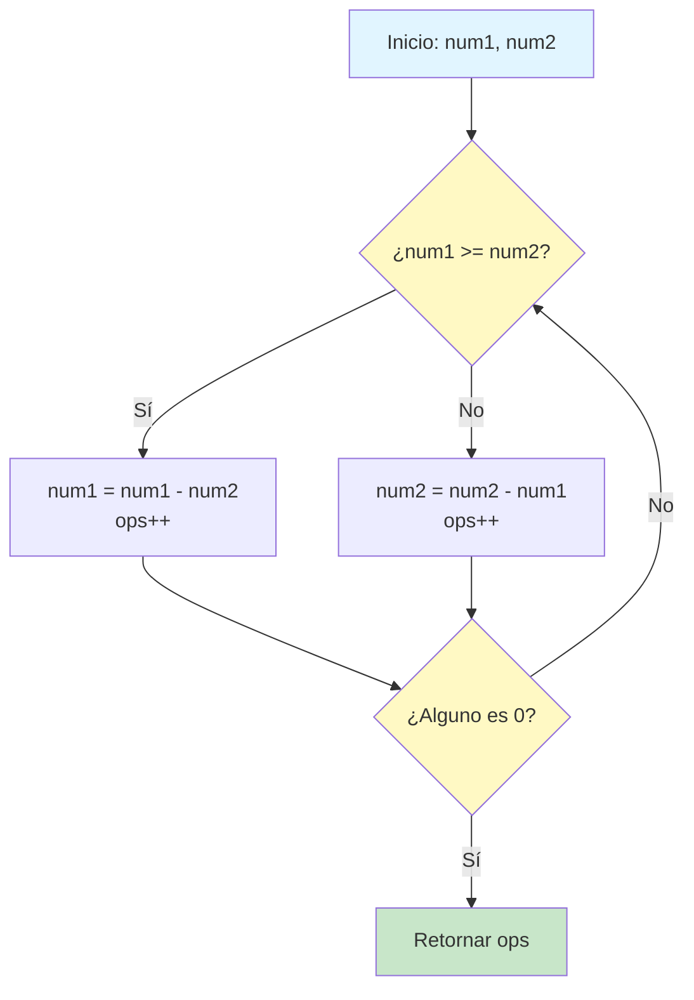
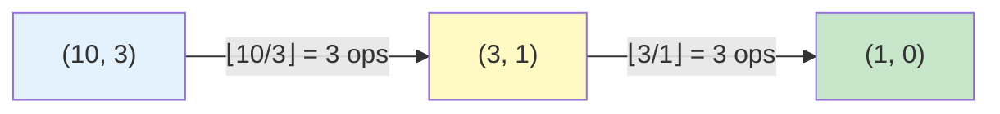
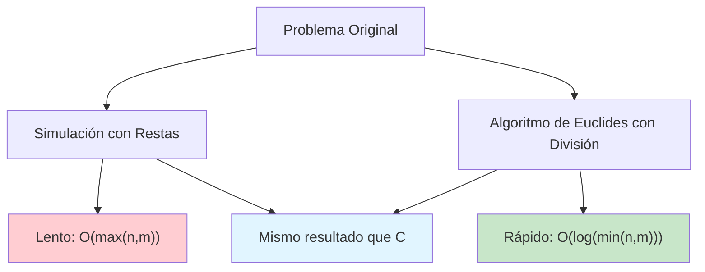

## Cantidad de operaciones para obtener cero (LeetCode)

### Introducción

En este post analizamos y resolvemos el problema **Count Operations to Obtain Zero** de LeetCode. El reto consiste en determinar cuántas operaciones se requieren para que al menos uno de dos números no negativos llegue a cero mediante restas sucesivas.

### Enunciado

> Dados dos enteros no negativos `num1` y `num2`, en cada operación:
>
> - Si `num1 >= num2`, resta `num2` de `num1`.
> - Si `num2 > num1`, resta `num1` de `num2`.
>
> Repite hasta que alguno sea cero.
> Devuelve el número total de operaciones realizadas.

**Ejemplo:**

- Entrada: `num1 = 2`, `num2 = 3`
- Salida: `3`
- Secuencia: `(2,3) → (2,1) → (1,1) → (0,1)`

### Visualización del Proceso

Podemos representar el flujo de operaciones con un diagrama de flujo:



### Ejemplo Paso a Paso

Tomemos el caso `num1 = 2, num2 = 3`:

| Operación | num1 | num2 | Acción |
|-----------|------|------|--------|
| Inicial | 2 | 3 | - |
| 1 | 2 | 1 | 3 - 2 = 1 (num2 > num1) |
| 2 | 1 | 1 | 2 - 1 = 1 (num1 >= num2) |
| 3 | 0 | 1 | 1 - 1 = 0 (num1 >= num2) |

#### Total de operaciones: 3

---

## Primera Solución: Simulación Directa

**Idea Principal**: Simular el proceso de restar el número menor del mayor hasta que uno sea cero.

### Implementación en TypeScript

```typescript
export function countOperations(num1: number, num2: number): number {
  let ops = 0

  while (num1 !== 0 && num2 !== 0) {
    if (num1 >= num2) {
      num1 -= num2
    }
    else {
      num2 -= num1
    }
    ops++
  }

  return ops
}
```

### ¿Cómo funciona?

1. **Inicializamos** un contador de operaciones en 0
2. **Mientras ambos números sean diferentes de cero**, continuamos:
   - Comparamos los números
   - Restamos el menor del mayor
   - Incrementamos el contador
3. **Retornamos** el total de operaciones

### Análisis de Complejidad

- **Tiempo:** $O(\max(num1, num2))$ en el peor caso cuando uno de los números es mucho mayor que el otro.
- **Espacio:** $O(1)$, solo variables auxiliares.

### Problema de Eficiencia

Cuando los números son muy dispares, el algoritmo es ineficiente:

```text

num1 = 100, num2 = 1
Operaciones: 100 (restamos 1 cien veces)
```

¿Podemos hacer esto más rápido? **Sí, usando el algoritmo de Euclides.**

---

## Optimización con el Algoritmo de Euclides

### La Conexión Clave

Observemos qué sucede cuando restamos repetidamente:

```text
num1 = 10, num2 = 3
10 - 3 = 7  (operación 1)
7 - 3 = 4   (operación 2)
4 - 3 = 1   (operación 3)
```

Esto es equivalente a:

```text
10 ÷ 3 = 3 con residuo 1
Operaciones = 3
```

**Insight:** En lugar de restar uno por uno, podemos usar la **división entera** para contar cuántas veces cabe el número menor en el mayor.

### ¿Qué es el Algoritmo de Euclides?

El algoritmo de Euclides es un método eficiente para encontrar el **máximo común divisor (GCD)** de dos números. Su proceso es idéntico a nuestro problema, pero en lugar de contar operaciones, busca el GCD.

**Proceso:**

1. Divide el número mayor entre el menor
2. Reemplaza el mayor con el menor
3. Reemplaza el menor con el residuo
4. Repite hasta que el residuo sea 0

### Ejemplo Detallado: num1 = 10, num2 = 3

**Enfoque Iterativo (lento):**

```text
(10, 3) → (7, 3) → (4, 3) → (1, 3) → (1, 2) → (1, 1) → (0, 1)
6 operaciones
```

**Algoritmo de Euclides (rápido):**

```text
Paso 1: 10 ÷ 3 = 3 con residuo 1
  → Operaciones: 3
  → Nuevo estado: (3, 1)

Paso 2: 3 ÷ 1 = 3 con residuo 0
  → Operaciones: 3
  → Nuevo estado: (1, 0) ✓ Terminamos

Total: 3 + 3 = 6 operaciones
Iteraciones: 2 (vs 6 del método directo)
```

### Visualización Matemática



### Fórmula Clave

$$
\text{Operaciones} = \left\lfloor \frac{num1}{num2} \right\rfloor + \text{operaciones restantes}
$$

Donde:

- $\lfloor x \rfloor$ es el piso o parte entera de $x$
- El nuevo `num1` es el `num2` anterior
- El nuevo `num2` es `num1 \mod num2`

### Comparación de Rendimiento

| Entrada | Iterativo | Euclides | Mejora |
|---------|-----------|----------|---------|
| (10, 3) | 6 pasos | 2 pasos | 3x más rápido |
| (48, 18) | 8 pasos | 3 pasos | 2.6x más rápido |
| (100, 1) | 100 pasos | 2 pasos | **50x más rápido** |
| (1000, 1) | 1000 pasos | 2 pasos | **500x más rápido** |

---

## Solución Optimizada: Basada en Euclides

### Implementación Optimizada en TypeScript

```typescript
export function countOperationsOptimized(num1: number, num2: number): number {
  let ops = 0
  let a = num1
  let b = num2

  while (a !== 0 && b !== 0) {
    if (a >= b) {
      // En lugar de restar b repetidamente,
      // calculamos cuántas veces cabe b en a
      const count = Math.floor(a / b)
      ops += count
      a = a % b // El residuo es el nuevo a
    }
    else {
      // Mismo proceso cuando b > a
      const count = Math.floor(b / a)
      ops += count
      b = b % a
    }
  }

  return ops
}
```

### ¿Por qué funciona?

**La clave está en esta equivalencia:**

Restar `b` de `a` **k veces** es igual a:

- `a - k * b`
- Que es el **residuo** de `a / b`

**Ejemplo:**

```text
10 - 3 - 3 - 3 = 1  (3 operaciones)
  ↓ equivalente a ↓
10 mod 3 = 1        (1 iteración, pero suma 3 operaciones)
```

### Análisis de Complejidad Mejorada

- **Tiempo:** $O(\log(\min(num1, num2)))$
  - Logarítmico en lugar de lineal
  - Cada iteración reduce el problema significativamente
- **Espacio:** $O(1)$, igual que antes

### Comparación Visual de Enfoques



---

## Código Completo con Ambas Soluciones

```typescript
// Solución 1: Enfoque iterativo directo
export function countOperations(num1: number, num2: number): number {
  let ops = 0

  while (num1 !== 0 && num2 !== 0) {
    if (num1 >= num2) {
      num1 -= num2
    }
    else {
      num2 -= num1
    }
    ops++
  }

  return ops
}

// Solución 2: Optimizada con algoritmo de Euclides
export function countOperationsOptimized(num1: number, num2: number): number {
  let ops = 0
  let a = num1
  let b = num2

  while (a !== 0 && b !== 0) {
    if (a >= b) {
      ops += Math.floor(a / b)
      a = a % b
    }
    else {
      ops += Math.floor(b / a)
      b = b % a
    }
  }

  return ops
}

// Tests
console.log(countOperations(2, 3)) // 3
console.log(countOperationsOptimized(2, 3)) // 3

console.log(countOperations(10, 3)) // 6
console.log(countOperationsOptimized(10, 3)) // 6

console.log(countOperations(100, 1)) // 100
console.log(countOperationsOptimized(100, 1)) // 100 (¡pero en 2 iteraciones!)
```

---

## Conclusión

Este problema demuestra un principio importante en algoritmos: **buscar patrones para evitar trabajo repetitivo**.

**Progresión de pensamiento:**

1. ✅ Solución directa: funciona pero es lenta para casos extremos
2. 🤔 Observación: restamos el mismo número muchas veces
3. 💡 Insight: la división puede contar esas restas en un solo paso
4. 🚀 Optimización: aplicar el algoritmo de Euclides

La versión optimizada no solo resuelve el problema de manera más eficiente, sino que también nos conecta con conceptos matemáticos fundamentales como el algoritmo de Euclides para calcular el máximo común divisor.

### Lecciones Aprendidas

- **Simula primero, optimiza después**: La solución directa nos ayuda a entender el problema
- **Busca patrones repetitivos**: Son oportunidades de optimización
- **La matemática es tu aliada**: Algoritmos clásicos como el de Euclides tienen aplicaciones prácticas
- **Complejidad importa**: De O(n) a O(log n) es una mejora dramática para entradas grandes

---

**Enlaces útiles:**

- [Problema en LeetCode](https://leetcode.com/problems/count-operations-to-obtain-zero/)
- [Algoritmo de Euclides - Wikipedia](https://es.wikipedia.org/wiki/Algoritmo_de_Euclides)
