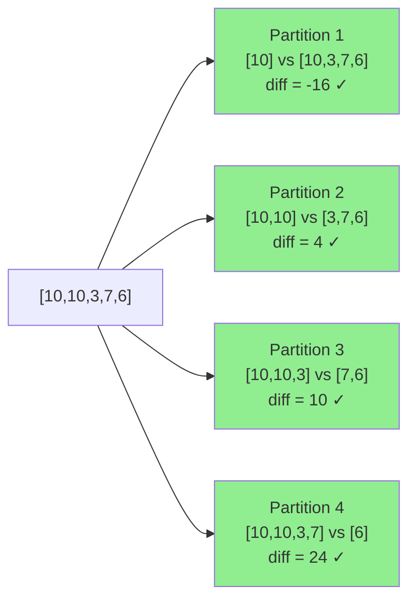
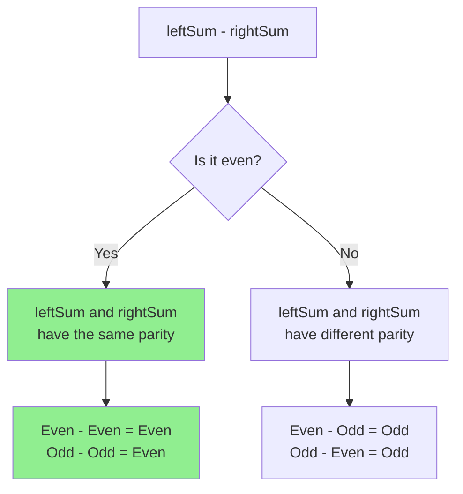
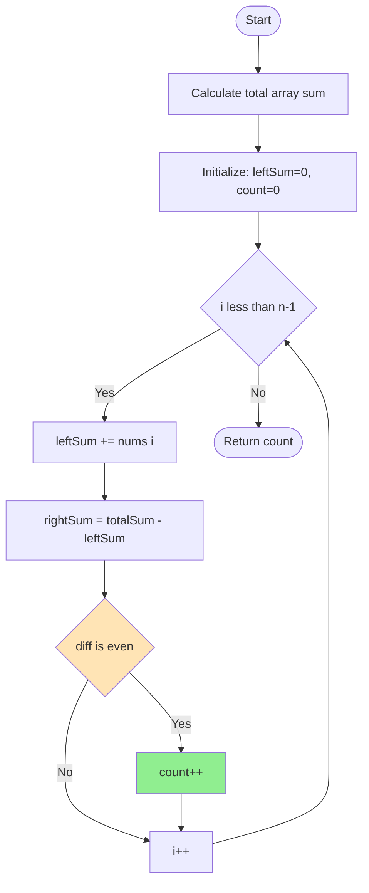
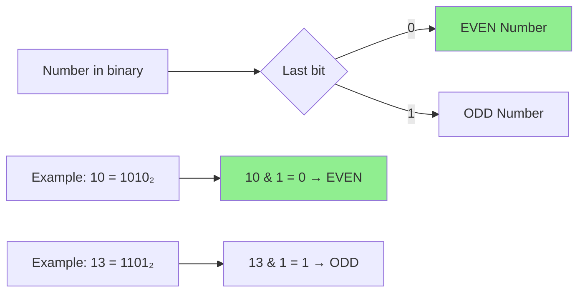

## Count Partitions With Even Sum Difference - Analysis and Explanation

### Problem Statement

Given an integer array `nums` of length `n`, we need to find all valid ways to split it into two parts.

A **partition** is defined by an index `i` where `0 <= i < n - 1`, which divides the array into two non-empty subarrays:

- **Left subarray**: contains elements from index `[0, i]`
- **Right subarray**: contains elements from index `[i + 1, n - 1]`

Our goal is to **count how many partitions** generate an **even** difference between the sum of the left subarray and the sum of the right subarray.

#### Example 1

```text
Input: nums = [10,10,3,7,6]
Output: 4
```

**Explanation:**

The 4 valid partitions are:

1. `[10] | [10, 3, 7, 6]` → difference: `10 - 26 = -16` ✓ (even)
2. `[10, 10] | [3, 7, 6]` → difference: `20 - 16 = 4` ✓ (even)
3. `[10, 10, 3] | [7, 6]` → difference: `23 - 13 = 10` ✓ (even)
4. `[10, 10, 3, 7] | [6]` → difference: `30 - 6 = 24` ✓ (even)



#### Example 2

```text
Input: nums = [1,2,2]
Output: 0
```

**Explanation:**

No partition results in an even sum difference.

- `[1] | [2, 2]` → difference: `1 - 4 = -3` ✗ (odd)
- `[1, 2] | [2]` → difference: `3 - 2 = 1` ✗ (odd)

#### Example 3

```text
Input: nums = [2,4,6,8]
Output: 3
```

**Explanation:**

All partitions result in an even sum difference.

#### Constraints

- `2 <= n == nums.length <= 100`
- `1 <= nums[i] <= 100`

---

## Initial Analysis

### Understanding the Problem

The main challenge is to efficiently determine how many ways there are to split the array such that `leftSum - rightSum` is even.

**Key observation:** If we know the total sum of the array and the sum of the left subarray up to index `i`, we can immediately deduce the sum of the right subarray using:

```text
rightSum = totalSum - leftSum
```

This allows us to evaluate each partition in **constant time** once the total sum is calculated.

### Mathematical Intuition

For the difference `leftSum - rightSum` to be even, both sums must have the same **parity** (both even or both odd).



---

## Solution Development

### Strategy

Our strategy is based on **prefix sums**, a fundamental technique in algorithms:



### Step-by-Step Implementation

**Step 1:** Calculate the total sum of the array

```typescript
const totalSum = nums.reduce((acc, num) => acc + num, 0);
```

**Step 2:** Initialize control variables

```typescript
let leftSum = 0;
let count = 0;
```

**Step 3:** Iterate up to the second-to-last element

We iterate up to `n-2` because we need at least one element in the right subarray.

```typescript
for (let i = 0; i < nums.length - 1; i++) {
  // Accumulate left sum
  leftSum += nums[i];

  // Calculate right sum
  const rightSum = totalSum - leftSum;

  // Check if the difference is even
  if (((leftSum - rightSum) & 1) === 0) {
    count++;
  }
}
```

**Step 4:** Return the counter

```typescript
return count;
```

### Optimization: Parity Check with Bits

Instead of using the modulo operator `%`, we use the bitwise operator `& 1`, which is more efficient:



**Why does it work?**

In binary representation, even numbers always end in `0` and odd numbers end in `1`. The `& 1` operator extracts exactly that last bit.

### Complete Code

```typescript
export function countPartitions(nums: number[]): number {
  const totalSum = nums.reduce((acc, num) => acc + num, 0);
  let leftSum = 0;
  let count = 0;

  for (let i = 0; i < nums.length - 1; i++) {
    leftSum += nums[i];
    const rightSum = totalSum - leftSum;

    // Check parity using bitwise operation
    if (((leftSum - rightSum) & 1) === 0) {
      count++;
    }
  }

  return count;
}
```

---

## Complexity Analysis

### Time Complexity: **O(n)**

The algorithm performs two linear traversals:

1. One to calculate the total sum
2. Another to evaluate each partition

Both are **O(n)**, so the total complexity is **O(n)**.

### Space Complexity: **O(1)**

We only use auxiliary variables (`totalSum`, `leftSum`, `count`) that don't depend on the input size. We don't create additional data structures.

---

## Edge Cases and Considerations

### Critical Test Cases

| Case                 | Example                | Consideration                     |
| -------------------- | ---------------------- | --------------------------------- |
| Minimum length       | `[1, 2]`               | Only one partition possible       |
| All equal (even)     | `[2, 2, 2, 2]`         | All partitions are valid          |
| All equal (odd)      | `[1, 1, 1, 1]`         | No partition is valid if n is odd |
| Maximum values       | `[100, 100, ..., 100]` | Check for overflow                |
| Odd total sum        | `[1, 2, 4]`            | Parity changes at each step       |
| Negative differences | `[1, 10]`              | `-9` is odd, works correctly      |

## Reflections and Learnings

### Key Concepts Applied

1. **Prefix Sums**: Fundamental technique for solving subarray problems efficiently
2. **Bitwise Operations**: Using `& 1` for faster parity checking than `% 2`
3. **Parity Analysis**: Understanding the mathematical properties of even and odd numbers

- Prefix sum to efficiently calculate subarray sums.
- Parity checking using bitwise operators.
- Linear traversal to maintain time efficiency.

---

## Resources and References

- [MDN - Bitwise Operators in JavaScript](https://developer.mozilla.org/en-US/docs/Web/JavaScript/Reference/Operators/Bitwise_AND)
- [Wikipedia - Prefix Sum](https://en.wikipedia.org/wiki/Prefix_sum)
- [LeetCode - Count Partitions With Even Sum Difference](https://leetcode.com/problems/count-partitions-with-even-sum-difference/)
- [GeeksforGeeks - Prefix Sum Array](https://www.geeksforgeeks.org/prefix-sum-array-implementation-applications-competitive-programming/)
