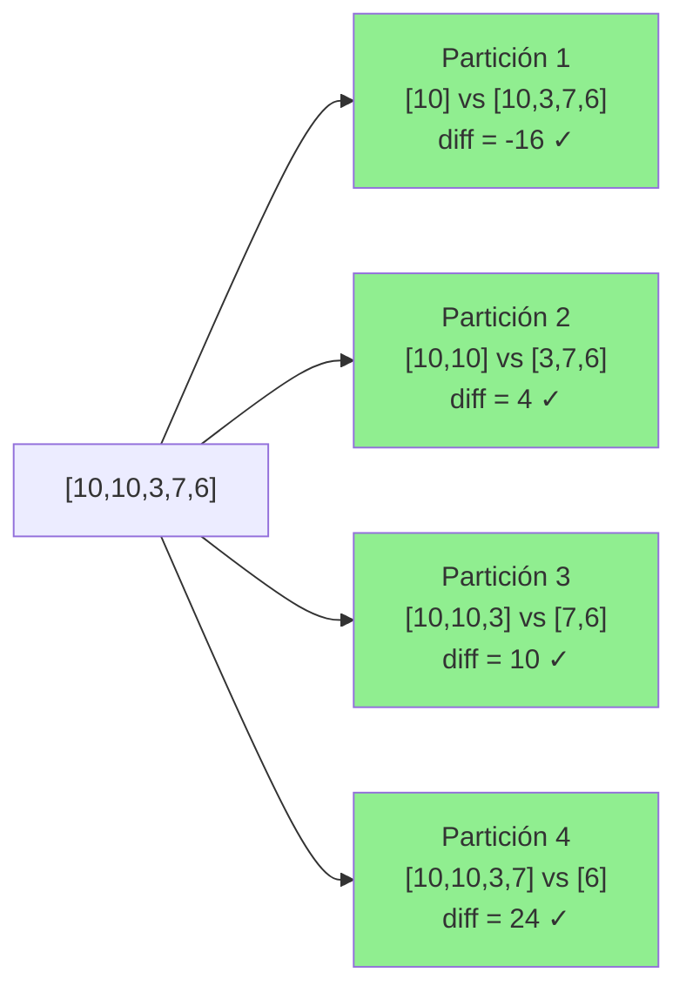
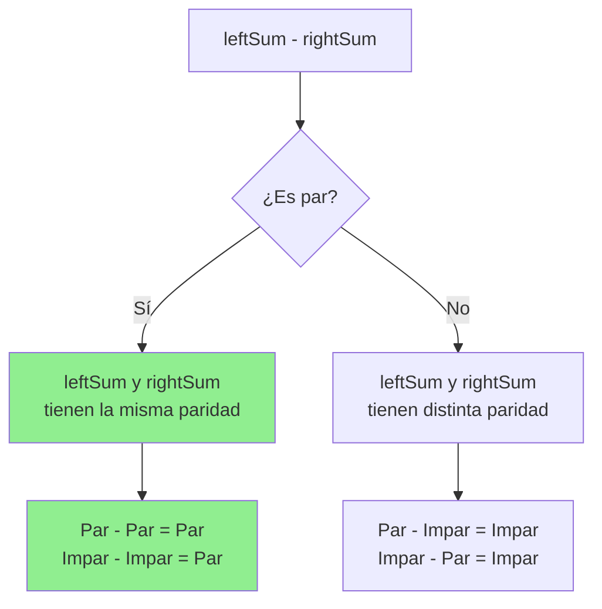
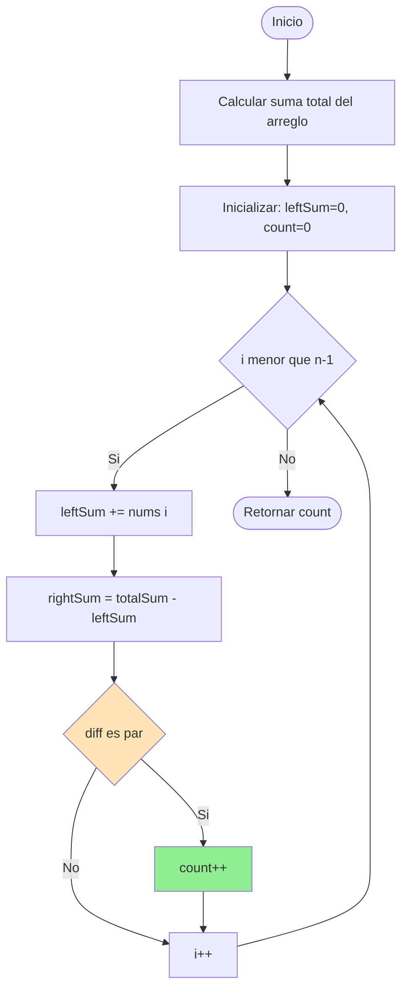
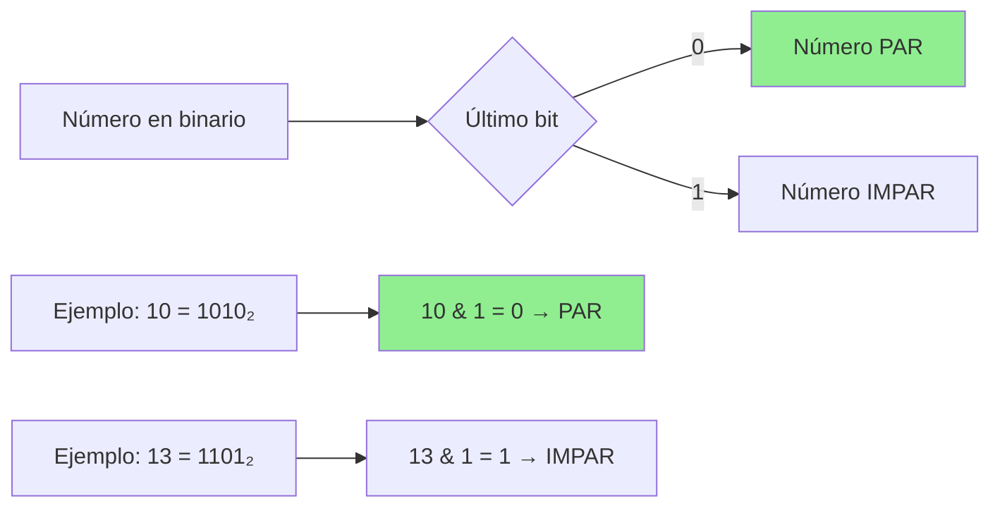

## Count Partitions With Even Sum Difference - Análisis y Explicación

### Enunciado del Problema

Dado un arreglo de enteros `nums` de longitud `n`, debemos encontrar todas las formas válidas de dividirlo en dos partes.

Una **partición** se define mediante un índice `i` donde `0 <= i < n - 1`, que divide el arreglo en dos subarreglos no vacíos:

- **Subarreglo izquierdo**: contiene los elementos desde el índice `[0, i]`
- **Subarreglo derecho**: contiene los elementos desde el índice `[i + 1, n - 1]`

Nuestro objetivo es **contar cuántas particiones** generan una diferencia **par** entre la suma del subarreglo izquierdo y la suma del subarreglo derecho.

#### Ejemplo 1

```text
Input: nums = [10,10,3,7,6]
Output: 4
```

**Explicación:**

Las 4 particiones válidas son:

1. `[10] | [10, 3, 7, 6]` → diferencia: `10 - 26 = -16` ✓ (par)
2. `[10, 10] | [3, 7, 6]` → diferencia: `20 - 16 = 4` ✓ (par)
3. `[10, 10, 3] | [7, 6]` → diferencia: `23 - 13 = 10` ✓ (par)
4. `[10, 10, 3, 7] | [6]` → diferencia: `30 - 6 = 24` ✓ (par)



#### Ejemplo 2

```text
Input: nums = [1,2,2]
Output: 0
```

**Explicación:**

Ninguna partición resulta en una diferencia de suma par.

- `[1] | [2, 2]` → diferencia: `1 - 4 = -3` ✗ (impar)
- `[1, 2] | [2]` → diferencia: `3 - 2 = 1` ✗ (impar)

#### Ejemplo 3

```text
Input: nums = [2,4,6,8]
Output: 3
```

**Explicación:**

Todas las particiones resultan en una diferencia de suma par.

#### Restricciones

- `2 <= n == nums.length <= 100`
- `1 <= nums[i] <= 100`

---

## Análisis Inicial

### Comprensión del Problema

El desafío principal es determinar eficientemente cuántas formas hay de dividir el arreglo de modo que `leftSum - rightSum` sea par.

**Observación clave:** Si conocemos la suma total del arreglo y la suma del subarreglo izquierdo hasta el índice `i`, podemos deducir inmediatamente la suma del subarreglo derecho mediante:

```text
rightSum = totalSum - leftSum
```

Esto nos permite evaluar cada partición en **tiempo constante** una vez calculada la suma total.

### Intuición Matemática

Para que la diferencia `leftSum - rightSum` sea par, ambas sumas deben tener la misma **paridad** (ambas pares o ambas impares).



---

## Desarrollo de la Solución

### Estrategia

Nuestra estrategia se basa en **sumas acumuladas** (prefix sums), una técnica fundamental en algoritmia:



### Implementación Paso a Paso

**Paso 1:** Calcular la suma total del arreglo

```typescript
const totalSum = nums.reduce((acc, num) => acc + num, 0);
```

**Paso 2:** Inicializar variables de control

```typescript
let leftSum = 0;
let count = 0;
```

**Paso 3:** Iterar hasta el penúltimo elemento

Iteramos hasta `n-2` porque necesitamos al menos un elemento en el subarreglo derecho.

```typescript
for (let i = 0; i < nums.length - 1; i++) {
  // Acumular suma izquierda
  leftSum += nums[i];

  // Calcular suma derecha
  const rightSum = totalSum - leftSum;

  // Verificar si la diferencia es par
  if (((leftSum - rightSum) & 1) === 0) {
    count++;
  }
}
```

**Paso 4:** Retornar el contador

```typescript
return count;
```

### Optimización: Verificación de Paridad con Bits

En lugar de usar el operador módulo `%`, utilizamos el operador bit a bit `& 1`, que es más eficiente:



**¿Por qué funciona?**

En representación binaria, los números pares siempre terminan en `0` y los impares en `1`. El operador `& 1` extrae exactamente ese último bit.

### Código Completo

```typescript
export function countPartitions(nums: number[]): number {
  const totalSum = nums.reduce((acc, num) => acc + num, 0);
  let leftSum = 0;
  let count = 0;

  for (let i = 0; i < nums.length - 1; i++) {
    leftSum += nums[i];
    const rightSum = totalSum - leftSum;

    // Verificar paridad usando operación bit a bit
    if (((leftSum - rightSum) & 1) === 0) {
      count++;
    }
  }

  return count;
}
```

---

## Análisis de Complejidad

### Complejidad Temporal: **O(n)**

El algoritmo realiza dos recorridos lineales:

1. Uno para calcular la suma total
2. Otro para evaluar cada partición

Ambos son **O(n)**, por lo que la complejidad total es **O(n)**.

### Complejidad Espacial: **O(1)**

Solo utilizamos variables auxiliares (`totalSum`, `leftSum`, `count`) que no dependen del tamaño de la entrada. No creamos estructuras de datos adicionales.

---

## Casos Edge y Consideraciones

### Casos de Prueba Críticos

| Caso                    | Ejemplo                | Consideración                             |
| ----------------------- | ---------------------- | ----------------------------------------- |
| Longitud mínima         | `[1, 2]`               | Solo una partición posible                |
| Todos iguales (pares)   | `[2, 2, 2, 2]`         | Todas las particiones son válidas         |
| Todos iguales (impares) | `[1, 1, 1, 1]`         | Ninguna partición es válida si n es impar |
| Valores máximos         | `[100, 100, ..., 100]` | Verificar overflow                        |
| Suma total impar        | `[1, 2, 4]`            | La paridad cambia en cada paso            |
| Diferencias negativas   | `[1, 10]`              | `-9` es impar, funciona correctamente     |

## Reflexiones y Aprendizajes

### Conceptos Clave Aplicados

1. **Sumas Acumuladas (Prefix Sums)**: Técnica fundamental para resolver problemas de subarreglos eficientemente
2. **Operaciones Bit a Bit**: Uso de `& 1` para verificación de paridad más rápida que `% 2`
3. **Análisis de Paridad**: Comprender las propiedades matemáticas de números pares e impares

- Suma acumulada (prefix sum) para calcular eficientemente las sumas de subarreglos.
- Verificación de paridad usando operadores bit a bit.
- Recorrido lineal para mantener la eficiencia temporal.

---

## Recursos y Referencias

- [MDN - Operadores Bit a Bit en JavaScript](https://developer.mozilla.org/en-US/docs/Web/JavaScript/Reference/Operators/Bitwise_AND)
- [Wikipedia - Suma Acumulada (Prefix Sum)](https://en.wikipedia.org/wiki/Prefix_sum)
- [LeetCode - Count Partitions With Even Sum Difference](https://leetcode.com/problems/count-partitions-with-even-sum-difference/)
- [GeeksforGeeks - Prefix Sum Array](https://www.geeksforgeeks.org/prefix-sum-array-implementation-applications-competitive-programming/)
