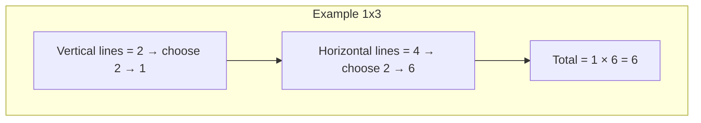

## Count Rectangles — easy and clear

Goal: Given two positive integers width `w` and height `h`, count how many axis-aligned rectangles with integer width and height fit inside the `w × h` rectangle.

Short answer (formula):
$$
R(w,h)=\frac{w(w+1)}{2}\cdot\frac{h(h+1)}{2}.
$$

What this means: first count how many different horizontal sizes there are, then how many vertical sizes, and multiply both counts.

---

## Plain explanation (step by step)

1. Draw the grid lines of the rectangle:
   - There are `w + 1` vertical grid lines.
   - There are `h + 1` horizontal grid lines.

2. To make a rectangle aligned with the axes you need:
   - 2 vertical lines (one left, one right),
   - 2 horizontal lines (one top, one bottom).

3. The number of ways to choose 2 lines out of `n` is the binomial coefficient:
   $$
   \binom{n}{2}=\frac{n(n-1)}{2}.
   $$

4. Apply that to the grid:
   - vertical choices: \(T_w=\binom{w+1}{2}=\dfrac{w(w+1)}{2}\),
   - horizontal choices: \(T_h=\binom{h+1}{2}=\dfrac{h(h+1)}{2}\).

5. Multiply:
   $$
   R(w,h)=T_w\cdot T_h=\frac{w(w+1)}{2}\cdot\frac{h(h+1)}{2}.
   $$

This counts every rectangle once: small squares, wide rectangles, tall rectangles, etc.

---

## Visual summary (Mermaid)

Flow diagram of the idea:

```mermaid
flowchart TD
  A[Start: given w and h] --> B[Línes verticales = w + 1]
  A --> C[Línes horizontales = h + 1]
  B --> D[Choose 2 verticals → T_w = (w+1)w/2]
  C --> E[Choose 2 horizontals → T_h = (h+1)h/2]
  D --> F[Total = T_w × T_h]
  E --> F
  F --> G[Result: R(w,h) = w(w+1)/2 × h(h+1)/2]
```

Simple count example (1×3) shown as steps:



---

## Numerical example

For `w = 1`, `h = 3`:

- \(T_w=\dfrac{1\cdot(1+1)}{2}=1\)
- \(T_h=\dfrac{3\cdot(3+1)}{2}=6\)

So \(R(1,3)=1\cdot 6=6\). Concretely: three 1×1 rectangles, two 1×2 rectangles, and one 1×3 rectangle.

---

## Code (easy-to-read)

JavaScript version using Number (works for moderate sizes):

```javascript
// Count axis-aligned integer rectangles inside w x h (Number)
function countRectangles(w, h) {
  if (!Number.isInteger(w) || !Number.isInteger(h) || w <= 0 || h <= 0) {
    throw new Error('w and h must be positive integers')
  }
  const tw = (w * (w + 1)) / 2
  const th = (h * (h + 1)) / 2
  return tw * th
}

// Example:
console.log(countRectangles(1, 3)) // 6
```

If you expect very large inputs, use BigInt to avoid precision loss:

```javascript
// Count using BigInt for very large w or h
function countRectanglesBigInt(w, h) {
  const W = BigInt(w)
  const H = BigInt(h)
  if (W <= 0n || H <= 0n) {
    throw new Error('w and h must be positive')
  }
  const tw = (W * (W + 1n)) / 2n
  const th = (H * (H + 1n)) / 2n
  return tw * th
}

// Example:
console.log(countRectanglesBigInt(11, 19).toString()) // "12540"
```

---

## Quick test cases

- (1, 3) → 6
- (3, 2) → 18
- (1, 2) → 3
- (5, 4) → 150
- (11, 19) → 12540

You can plug these into the code above to check.

---

## Complexity and notes (simple)

- Time: O(1) — just a few arithmetic operations.
- Space: O(1) — constant extra memory.
- Inputs: assumes `w` and `h` are positive integers. If zeros or negatives are allowed, decide whether to return 0 or throw an error.
- Precision: for huge values use BigInt (shown above).

---
