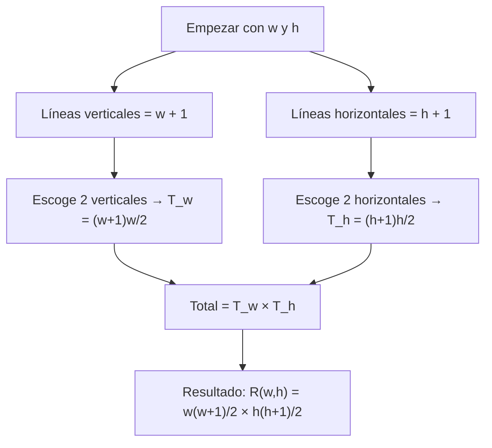
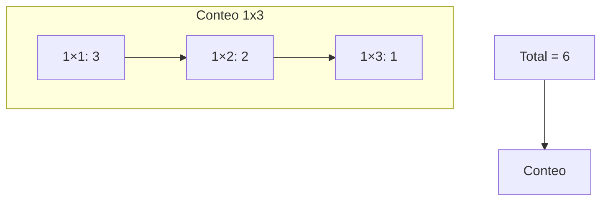

## Contar rectángulos — versión sencilla

Objetivo: dado un ancho `w` y una altura `h` (enteros positivos), contar cuántos rectángulos con lados paralelos a los ejes y dimensiones enteras caben dentro del rectángulo `w × h`.

Ejemplo muy simple: si `w = 1` y `h = 3`, hay 6 rectángulos en total:

- tres de 1×1,
- dos de 1×2,
- uno de 1×3.

---

## Idea básica (explicación clara)

Imagina las líneas que forman la cuadrícula del rectángulo:

- Hay `w + 1` líneas verticales.
- Hay `h + 1` líneas horizontales.

Para definir un rectángulo alineado con los ejes necesitamos:

- escoger 2 líneas verticales de entre las `w + 1` (una para el lado izquierdo y otra para el derecho),
- y escoger 2 líneas horizontales de entre las `h + 1`.

Número de formas de escoger 2 de `n` líneas es la combinatoria binomial C(n, 2) o, escrito de forma equivalente,
$$
\binom{n}{2}=\frac{n(n-1)}{2}.
$$

Aplicando esto:

- elecciones verticales: $\displaystyle T_w=\binom{w+1}{2}=\frac{(w+1)w}{2}$,
- elecciones horizontales: $\displaystyle T_h=\binom{h+1}{2}=\frac{(h+1)h}{2}$.

Como cada par vertical puede combinarse con cada par horizontal, el total es el producto:
$$
R(w,h)=T_w\cdot T_h=\frac{w(w+1)}{2}\cdot\frac{h(h+1)}{2}.
$$

También se puede ver como:
$$
R(w,h)=\binom{w+1}{2}\cdot\binom{h+1}{2}.
$$

---

## Diagrama (pasos sencillos)

Mermaid: muestra el razonamiento paso a paso.



---

## Ejemplo numérico (w = 1, h = 3)

Cálculo directo:
$$
T_w=\frac{1\cdot(1+1)}{2}=1,\qquad T_h=\frac{3\cdot(3+1)}{2}=6,
$$
$$
R(1,3)=1\cdot 6=6.
$$

Listando por tamaños:

- rectángulos 1×1: 3
- rectángulos 1×2: 2
- rectángulos 1×3: 1
Total = 3 + 2 + 1 = 6

Diagrama sencillo en Mermaid que muestra las piezas contadas:



---

## Implementación

Versión corta en JavaScript (para valores no extremadamente grandes):

```javascript
// Cuenta rectángulos con Number
function contarRectangulos(w, h) {
  if (!Number.isInteger(w) || !Number.isInteger(h) || w <= 0 || h <= 0) {
    throw new Error('w y h deben ser enteros positivos')
  }
  const Tw = (w * (w + 1)) / 2
  const Th = (h * (h + 1)) / 2
  return Tw * Th
}

// Ejemplo:
console.log(contarRectangulos(1, 3)) // 6
```

Si esperas números muy grandes, usa BigInt para no perder precisión:

```javascript
// Versión con BigInt
function contarRectangulosBigInt(w, h) {
  const W = BigInt(w)
  const H = BigInt(h)
  if (W <= 0n || H <= 0n) {
    throw new Error('w y h deben ser positivos')
  }
  const Tw = (W * (W + 1n)) / 2n
  const Th = (H * (H + 1n)) / 2n
  return Tw * Th
}

// Ejemplo:
console.log(contarRectangulosBigInt(11, 19).toString()) // "12540"
```

---

## Casos de prueba rápidos

- (1, 3) → 6
- (3, 2) → 18
- (1, 2) → 3
- (5, 4) → 150
- (11, 19) → 12540

---

## Notas finales

- La idea principal: contar pares de líneas verticales y pares de líneas horizontales, y multiplicar.
- La fórmula es simple y rápida: O(1) tiempo y O(1) espacio.
