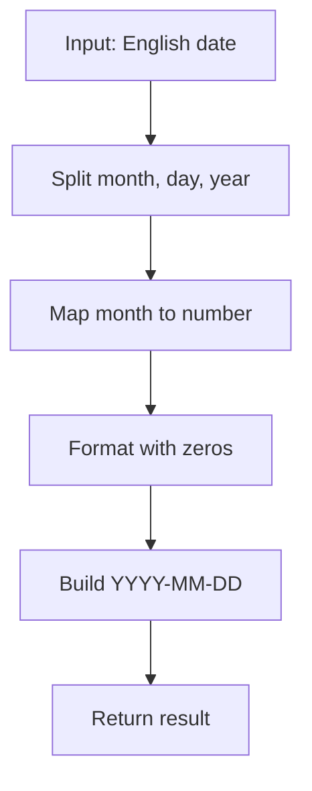

title: "date-formatter"
published: 2025-12-06T22:34:37.768Z
description: ''
updated: ''
tags:
  - algoritmos
draft: false
pin: 0
toc: true
lang: "en"
abbrlink: "date-formatter"
title: "Date Formatter: convert English dates to YYYY-MM-DD"
pubDate: 2025-12-06
description: 'How to transform English dates to ISO format with JavaScript, step by step.'
tags: [algorithms, dates, javascript]
category: algorithms
lang: en
## 🗓️ Date Formatter — Explanation & Solution

### Problem Statement

Given a date in the format "Month day, year" (e.g., `December 6, 2025`), return the date in the format `YYYY-MM-DD`.
The month is always in English and must be converted to its numeric value, padding with leading zeros if needed.

---

## 🧐 Initial Analysis

How would you approach this conversion? What parts do you need to extract? 🤔

- Separate month, day, and year.
- Map the month name to its number.
- Format with leading zeros.

### Test Cases

| Input               | Expected Output | Description                          |
| ------------------- | -------------- | ------------------------------------ |
| "December 6, 2025"  | "2025-12-06"   | Month and day are single digit       |
| "January 15, 2020"  | "2020-01-15"   | Month is single digit                |
| "March 3, 1999"     | "1999-03-03"   | Both are single digit                |
| "November 30, 2010" | "2010-11-30"   | Both are two digits                  |

---

## 🔎 Solution Development

### Flowchart Diagram



### Step-by-Step Implementation

1. Split the string using spaces and commas.
2. Map the month name to its number.
3. Format day and month to two digits.
4. Build the final string.

#### Commented JavaScript Code

```javascript
/**
 * Converts an English date to YYYY-MM-DD format
 * @param {string} dateString - Example: "December 6, 2025"
 * @returns {string} Date in ISO format
 */
function formatDate(dateString) {
  // Split parts: [Month, Day,, Year]
  const [monthName, dayWithComma, year] = dateString.split(" ");
  // Remove comma from day
  const day = dayWithComma.replace(",", "").padStart(2, "0");
  // Month mapping
  const monthMap = {
    January: "01", February: "02", March: "03", April: "04",
    May: "05", June: "06", July: "07", August: "08",
    September: "09", October: "10", November: "11", December: "12"
  };
  const month = monthMap[monthName];
  // Build result
  return `${year}-${month}-${day}`;
}
```

---

## ⏱️ Complexity Analysis

- **Time:** $O(1)$ (constant operations)
- **Space:** $O(1)$ (fixed variable usage)

---

## ⚠️ Edge Cases & Validation

- The statement assumes correct format.
- In production, validate the format and month existence.

---

## 💡 Reflections & Learnings

- String manipulation and object mapping.
- Importance of formatting and input validation.
- What if we used regular expressions for more robustness? 😉

---

## 📋 Improvement Checklist

- [x] Direct, filler-free sentences
- [x] Clear, non-redundant sections
- [x] Commented, readable code
- [x] Visual example (Mermaid)
- [x] Reviewed frontmatter

---

## 🔗 Resources

- [MDN: String in JavaScript](https://developer.mozilla.org/en-US/docs/Web/JavaScript/Reference/Global_Objects/String)
