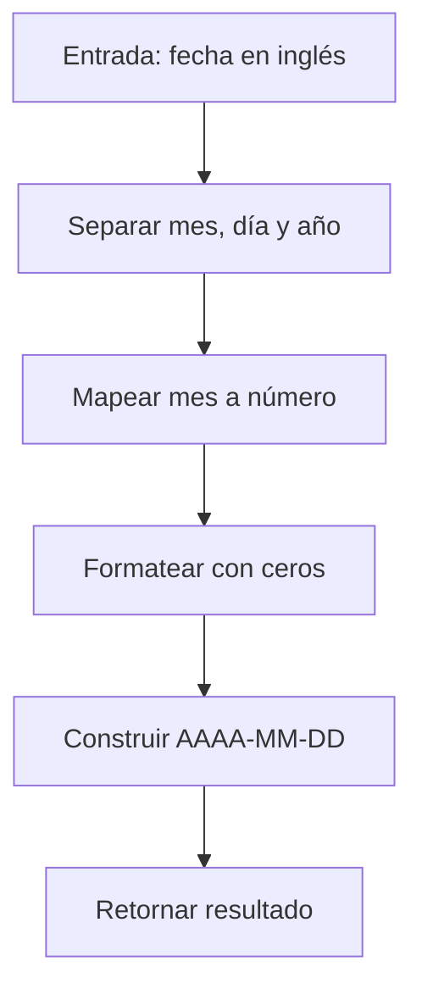

## 🗓️ Date Formatter — Explicación y Solución

### Enunciado

Dada una fecha en formato "Mes día, año" (por ejemplo, `December 6, 2025`), devuelve la fecha en formato `AAAA-MM-DD`.
El mes siempre está en inglés y debe convertirse a número, rellenando con ceros a la izquierda si es necesario.

---

## 🧐 Análisis Inicial

¿Cómo abordarías la conversión? ¿Qué partes necesitas extraer? 🤔

- Separar mes, día y año.
- Mapear el mes textual a número.
- Formatear con ceros a la izquierda.

### Casos de Prueba

| Entrada             | Salida Esperada | Descripción                           |
| ------------------- | --------------- | ------------------------------------- |
| "December 6, 2025"  | "2025-12-06"    | Mes y día de un dígito                |
| "January 15, 2020"  | "2020-01-15"    | Mes de un dígito                      |
| "March 3, 1999"     | "1999-03-03"    | Ambos de un dígito                    |
| "November 30, 2010" | "2010-11-30"    | Ambos de dos dígitos                  |

---

## 🔎 Desarrollo de la Solución

### Diagrama de Flujo



### Implementación Paso a Paso

1. Dividir la cadena usando espacios y comas.
2. Mapear el mes textual a número.
3. Formatear día y mes a dos dígitos.
4. Construir la cadena final.

#### Código JavaScript Comentado

```javascript
/**
 * Convierte una fecha en inglés a formato AAAA-MM-DD
 * @param {string} dateString - Ejemplo: "December 6, 2025"
 * @returns {string} Fecha en formato ISO
 */
function formatDate(dateString) {
  // Separar partes: [Mes, Día,, Año]
  const [monthName, dayWithComma, year] = dateString.split(' ')
  // Quitar la coma del día y rellenar con cero de ser necesario
  const day = dayWithComma.replace(',', '').padStart(2, '0')
  // Mapeo de meses
  const monthMap = {
    January: '01',
    February: '02',
    March: '03',
    April: '04',
    May: '05',
    June: '06',
    July: '07',
    August: '08',
    September: '09',
    October: '10',
    November: '11',
    December: '12'
  }
  const month = monthMap[monthName]
  // Construir resultado
  return `${year}-${month}-${day}`
}
```

---

## ⏱️ Análisis de Complejidad

- **Temporal:** $O(1)$ (operaciones constantes)
- **Espacial:** $O(1)$ (uso fijo de variables)

---

## ⚠️ Casos Edge y Validaciones

- El enunciado asume formato correcto.
- En producción, conviene validar el formato y existencia del mes.

---

## 💡 Reflexiones y Aprendizajes

- Manipulación de cadenas y mapeo de objetos.
- Importancia de formatear y validar entradas.
- ¿Y si usáramos expresiones regulares? Que ventajas o desventajas tendría?

---

## 🔗 Recursos

- [MDN: String en JavaScript](https://developer.mozilla.org/en-US/docs/Web/JavaScript/Reference/Global_Objects/String)
