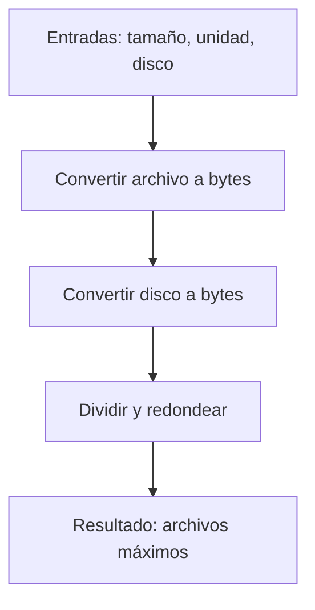

## Almacenamiento de Archivos: Análisis y Solución

### Enunciado resumido

Dado el tamaño de un archivo y la capacidad de un disco duro (en GB), ¿cuántos archivos caben? Considera:

- La unidad del archivo puede ser "B", "KB" o "MB".
- Usa las siguientes equivalencias:

| Unidad | Equivalencia |
|--------|--------------|
| 1 B    | 1 B          |
| 1 KB   | 1,000 B      |
| 1 MB   | 1,000 KB     |
| 1 GB   | 1,000 MB     |

Ejemplo: ¿Cuántos archivos de 500 KB caben en 1 GB? (Respuesta: 2,000)

---

## Análisis Inicial

### ¿Qué pide el problema?

Calcular cuántos archivos de un tamaño dado (en B, KB o MB) caben en un disco de capacidad dada (en GB). Hay que convertir ambas cantidades a la misma unidad (bytes), dividir y redondear hacia abajo.

### Entradas y salidas

- **Entradas:**
  - `fileSize`: número (tamaño del archivo)
  - `fileUnit`: string ("B", "KB", "MB")
  - `driveSizeGb`: número (capacidad del disco en GB)
- **Salida:**
  - Número entero: cantidad máxima de archivos que caben

### Casos de prueba

| Archivo | Unidad | Disco (GB) | Esperado |
|---------|--------|------------|----------|
| 500     | KB     | 1          | 2000     |
| 50000   | B      | 1          | 20000    |
| 5       | MB     | 1          | 200      |
| 4096    | B      | 1.5        | 366210   |
| 220.5   | KB     | 100        | 453514   |
| 4.5     | MB     | 750        | 166666   |

---

## Desarrollo de la Solución

### Enfoque

1. Convertir el tamaño del archivo a bytes.
2. Convertir la capacidad del disco a bytes.
3. Dividir y redondear hacia abajo.

### Diagrama de flujo (Mermaid)



### Código comentado

```js
// Calcula cuántos archivos caben en un disco
function numberOfFiles(fileSize, fileUnit, driveSizeGb) {
  // Mapeo de unidades a bytes
  const unitToBytes = {
    B: 1,
    KB: 1_000,
    MB: 1_000_000,
    GB: 1_000_000_000,
  }
  // Conversión del archivo a bytes
  const fileSizeInBytes = fileSize * unitToBytes[fileUnit]
  // Conversión del disco a bytes
  const driveSizeInBytes = driveSizeGb * unitToBytes.GB
  // División entera: máximo de archivos completos
  return Math.floor(driveSizeInBytes / fileSizeInBytes)
}
```

---

## Análisis de Complejidad

- **Tiempo:** $O(1)$ (todas las operaciones son constantes)
- **Espacio:** $O(1)$ (no crecen con la entrada)

---

## Casos edge y validaciones

- Si el tamaño del archivo es 0, la función retorna Infinity (mejor retornar 0).
- Si la unidad no es válida, retorna NaN (validar antes de operar).
- Si la capacidad del disco es 0, retorna 0 (correcto).
- Siempre se redondea hacia abajo: no hay archivos parciales.

---

## Reflexiones y aprendizajes

- Usar objetos para conversiones hace el código flexible.
- Validar entradas mejora robustez.

---

## Recursos y enlaces útiles

- [Conversión de unidades de almacenamiento (Wikipedia)](https://es.wikipedia.org/wiki/Byte)
- [Documentación de Math.floor (MDN)](https://developer.mozilla.org/es/docs/Web/JavaScript/Reference/Global_Objects/Math/floor)

---
