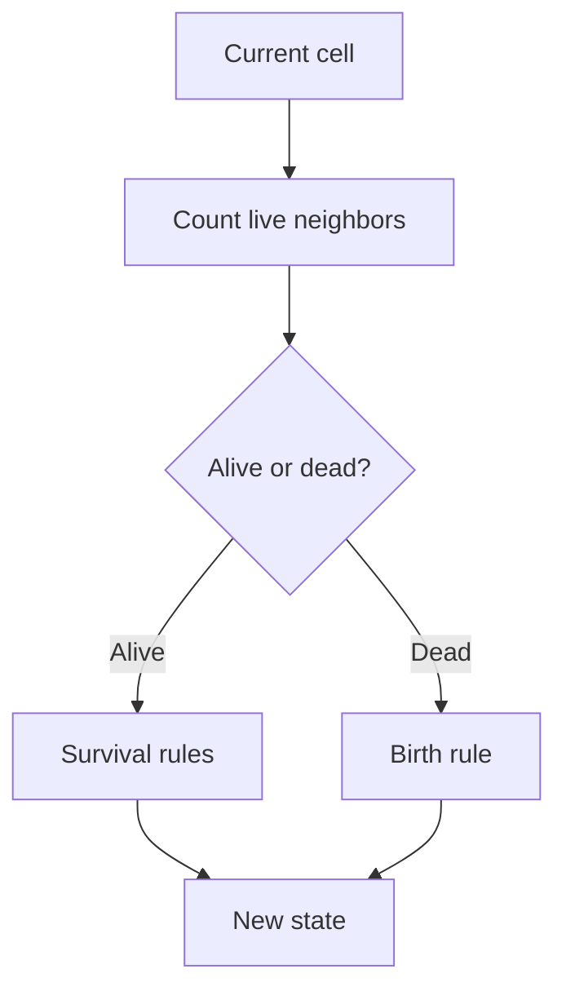

## The Game of Life

It's a mathematical model that simulates the evolution of a population of cells on a two-dimensional grid, where each cell can be alive or dead. The state of each cell in the next generation depends on the current state of its neighbors according to specific rules.

---

## Game Rules

The starting point is a 2D matrix where each cell represents a cell that can be in one of two states: 1 (alive) or 0 (dead).
The rules are simple:

- A live cell with fewer than 2 live neighbors dies (underpopulation).
- A live cell with 2 or 3 live neighbors survives.
- A live cell with more than 3 live neighbors dies (overpopulation).
- A dead cell with exactly 3 live neighbors... is born!

---

## Visual Example:

Suppose this is the initial state:

```text
[
[0, 1, 0],
[0, 0, 1],
[1, 1, 1],
]
```

Applying the rules, we get:

```text
[
[0, 0, 0],
[1, 0, 1],
[0, 1, 1],
]
```

If we look at cell [0,2] (first row, third column): In the starting point it's alive, let's check its neighbors: [0,1] (dead), [1,1] (dead), and [1,2] (alive). Because it's in the corner, it only has those three neighbors and only one is alive, so in the next "generation" it will be dead.

---

## Test Cases

- **Minimum matrix (1x1):**
[ [1] ] → [ [0] ]
[ [0] ] → [ [0] ]

- **Stable block (2x2):**
[ [1, 1], [1, 1] ] → [ [1, 1], [1, 1] ]

- **Oscillator ("blinker"):**
[ [0,1,0], [0,1,0], [0,1,0] ] → [ [0,0,0], [1,1,1], [0,0,0] ]

- **Edges and corners:**
[ [1,0,0], [0,0,0], [0,0,1] ] → [ [0,0,0], [0,0,0], [0,0,0] ]

---

## Step by Step

For each cell, count the live neighbors and determine its next state according to the rules, returning a new matrix with the next state.

### 1. Count live neighbors

```js
function countLiveNeighbors(matrix, i, j) {
  const rows = matrix.length
  const cols = matrix[0].length
  let live = 0
  for (let dx = -1; dx <= 1; dx++) {
    for (let dy = -1; dy <= 1; dy++) {
      if (dx === 0 && dy === 0)
        continue
      const ni = i + dx
      const nj = j + dy
      if (ni >= 0 && ni < rows && nj >= 0 && nj < cols) {
        live += matrix[ni][nj]
      }
    }
  }
  return live
}
```

### 2. Decide the cell's fate

```js
function nextCellState(current, liveNeighbors) {
  if (current === 1) {
    if (liveNeighbors < 2 || liveNeighbors > 3)
      return 0
    if (liveNeighbors === 2 || liveNeighbors === 3)
      return 1
  }
  else {
    if (liveNeighbors === 3)
      return 1
  }
  return 0
}
```

### 3. Build the new generation

```js
function gameOfLife(grid) {
  const rows = grid.length
  const cols = grid[0].length
  const newGrid = []
  for (let i = 0; i < rows; i++) {
    const newRow = []
    for (let j = 0; j < cols; j++) {
      const neighbors = countLiveNeighbors(grid, i, j)
      const newState = nextCellState(grid[i][j], neighbors)
      newRow.push(newState)
    }
    newGrid.push(newRow)
  }
  return newGrid
}
```

---

## Visualizing the process



---

## Complexity and optimizations

- **Time:** $O(m \times n)$ (each cell and its neighbors)
- **Space:** $O(m \times n)$ (new matrix)

## Reflections and learnings

- Splitting logic into small functions helps debugging and extending the code.
- Testing edge cases (borders, corners, weird patterns) is key for robustness.

---

## Resources and useful links

- [Wikipedia: Conway's Game of Life](https://en.wikipedia.org/wiki/Conway%27s_Game_of_Life)
- [Famous patterns and online simulators](https://playgameoflife.com/)
