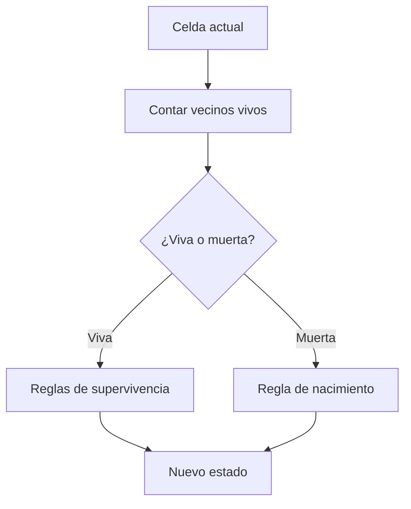

## El Juego de la Vida

Es un modelo matemático que simula la evolución de una población de células en una cuadrícula bidimensional, donde cada célula puede estar viva o muerta. El estado de cada célula en la siguiente generación depende del estado actual de sus vecinos según reglas específicas.

---

## Reglas del Juego

El punto de partida es una matriz 2D que donde cada celda representa una celúla que puede tener uno de dos estados 1 (viva) o 0 (muerta).
Las reglas son simples:

- Una célula viva con menos de 2 vecinos vivos muere (soledad).
- Una célula viva con 2 o 3 vecinos vivos sobrevive.
- Una célula viva con más de 3 vecinos vivos muere (sobrepoblación).
- Una célula muerta con exactamente 3 vecinos vivos… ¡nace!

---

## Ejemplo Visual:

Supón este estado inicial:

```text
[
[0, 1, 0],
[0, 0, 1],
[1, 1, 1],
]
```

Al aplicar las reglas, obtenemos:

```text
[
[0, 0, 0],
[1, 0, 1],
[0, 1, 1],
]
```

Si tomamos como referencia la celda [0,2] (primera fila, tercera columna): En el punto de partida esta viva, veamos sus vecinos, [0,1] (muerta), [1,1] (muerta) y [1,2] (viva). Debido a su ubicacion en la esquina solo tiene esos tres vecinos y solo uno esta vivo por lo que en la proxima "generacion" esta muerta.

---

## Casos de Prueba

- **Matriz mínima (1x1):**
[ [1] ] → [ [0] ]
[ [0] ] → [ [0] ]

- **Bloque estable (2x2):**
[ [1, 1], [1, 1] ] → [ [1, 1], [1, 1] ]

- **Oscilador (“parpadeador”):**
[ [0,1,0], [0,1,0], [0,1,0] ] → [ [0,0,0], [1,1,1], [0,0,0] ]

- **Bordes y esquinas:**
[ [1,0,0], [0,0,0], [0,0,1] ] → [ [0,0,0], [0,0,0], [0,0,0] ]

---

## Paso a paso

Para cada celda contar los vecinos vivos y determinar su proximo estado según las reglas devolviendo una nueva matriz con el siguiente estado.

### 1. Contar vecinos vivos

```js
function contarVecinosVivos(matriz, i, j) {
  const filas = matriz.length
  const columnas = matriz[0].length
  let vivos = 0
  for (let dx = -1; dx <= 1; dx++) {
    for (let dy = -1; dy <= 1; dy++) {
      if (dx === 0 && dy === 0)
        continue
      const ni = i + dx
      const nj = j + dy
      if (ni >= 0 && ni < filas && nj >= 0 && nj < columnas) {
        vivos += matriz[ni][nj]
      }
    }
  }
  return vivos
}
```

### 2. Decidir el destino de la celda

```js
function siguienteEstadoCelda(actual, vecinosVivos) {
  if (actual === 1) {
    if (vecinosVivos < 2 || vecinosVivos > 3)
      return 0
    if (vecinosVivos === 2 || vecinosVivos === 3)
      return 1
  }
  else {
    if (vecinosVivos === 3)
      return 1
  }
  return 0
}
```

### 3. Construir la nueva generación

```js
function gameOfLife(grid) {
  const rows = grid.length
  const cols = grid[0].length
  const nuevoGrid = []
  for (let i = 0; i < rows; i++) {
    const nuevaFila = []
    for (let j = 0; j < cols; j++) {
      const vecinos = contarVecinosVivos(grid, i, j)
      const nuevoEstado = siguienteEstadoCelda(grid[i][j], vecinos)
      nuevaFila.push(nuevoEstado)
    }
    nuevoGrid.push(nuevaFila)
  }
  return nuevoGrid
}
```

---

## Visualizando el proceso (¡Mermaid!)



---

## Complejidad y optimizaciones

- **Tiempo:** $O(m \times n)$ (cada celda y sus vecinos)
- **Espacio:** $O(m \times n)$ (nueva matriz)

## Reflexiones y aprendizajes

- Separar la lógica en funciones pequeñas ayuda a depurar y extender el código.
- Probar casos edge (bordes, esquinas, patrones raros) es clave para robustez.

---

## Recursos y enlaces útiles

- [Wikipedia: Conway's Game of Life](https://es.wikipedia.org/wiki/Juego_de_la_vida)
- [Patrones famosos y simuladores online](https://playgameoflife.com/)
