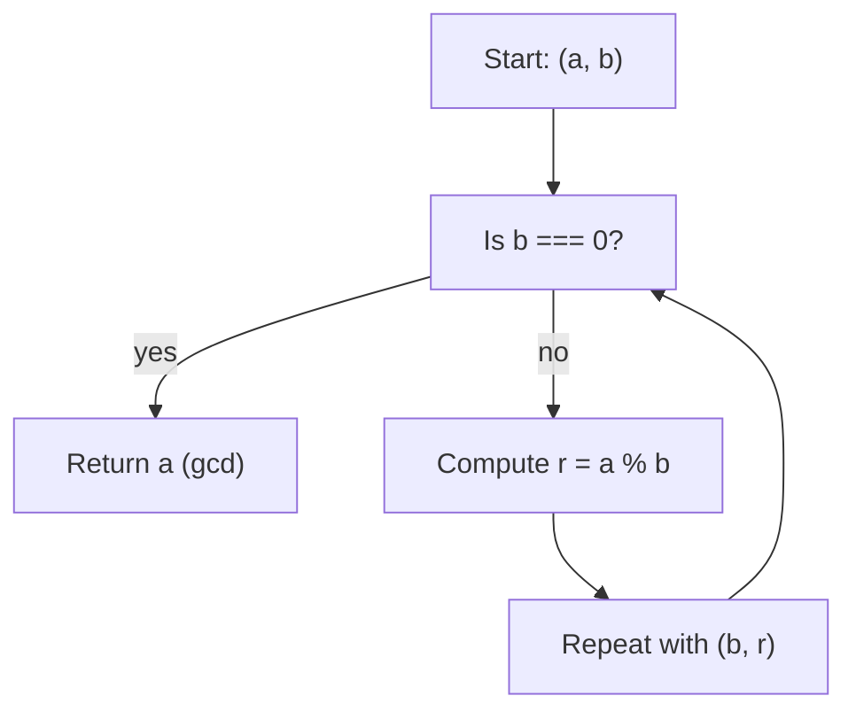

## Greatest Common Divisor

In this post, we solve the "Greatest Common Divisor (GCD)" problem using the classic Euclid's Algorithm. We'll cover the mathematical idea, a recursive implementation (used in the solution), an iterative alternative, examples, tests, and visualizations.

---

## 📝 Problem Statement

Given two positive integers $a$ and $b$, return their greatest common divisor (GCD), denoted as $\gcd(a, b)$.

The GCD of two integers is the largest number $d$ such that $d \mid a$ and $d \mid b$ (i.e., $d$ divides both without remainder).

Example: divisors of $4 \to \{1, 2, 4\}$; divisors of $6 \to \{1, 2, 3, 6\}$. $\gcd(4, 6) = 2$.

---

## 🔬 Mathematical Idea (Euclid's Algorithm)

Euclid's Algorithm relies on the following property:

If $a$ and $b$ are integers, with $b \neq 0$,
$$
\gcd(a, b) = \gcd(b, a \bmod b)
$$

and if $b = 0$ then
$$
\gcd(a, 0) = a
$$

That is: the GCD of $(a, b)$ is the same as the GCD of $(b, a \% b)$. By applying this repeatedly, we reduce the problem until the second number is $0$.

---

## 📊 Process Diagram (Mermaid)



---

## ✅ JavaScript Implementation (Recursive — Used Version)

This is the code found in the repository (the proposed solution):

```javascript
/**
 * FreeCodeCamp Problem: Gcd
 * Category: FreeCodeCamp
 *
 * @param {number} x - First positive integer
 * @param {number} y - Second positive integer
 * @returns {number} The greatest common divisor of x and y
 */
function gcd(x, y) {
  if (y === 0) {
    return x
  }
  return gcd(y, x % y)
}

export default gcd
```

### Step by Step (Recursive)

1. If `y === 0`, return `x` (base case).
2. Otherwise, call `gcd(y, x % y)`, quickly reducing the magnitude of the numbers.
3. The recursion ends when `y` reaches 0.

---

## 🔁 Alternative: Iterative Implementation

The iterative version avoids recursion and uses a while loop. It works just as well and may be preferable when there is a risk of reaching recursion limits:

```javascript
function gcdIterative(x, y) {
  while (y !== 0) {
    const temp = y
    y = x % y
    x = temp
  }
  return x
}
```

---

## 🧪 Included Tests

The repository includes tests covering representative cases:

```javascript
import { describe, expect, it } from 'vitest'
import gcd from './gcd'

describe('Gcd', () => {
  it('gcd(4, 6) should return 2.', () => {
    expect(gcd(4, 6)).toBe(2)
  })
  it('gcd(20, 15) should return 5.', () => {
    expect(gcd(20, 15)).toBe(5)
  })
  it('gcd(13, 17) should return 1.', () => {
    expect(gcd(13, 17)).toBe(1)
  })
  it('gcd(654, 456) should return 6.', () => {
    expect(gcd(654, 456)).toBe(6)
  })
  it('gcd(3456, 4320) should return 864.', () => {
    expect(gcd(3456, 4320)).toBe(864)
  })
})
```

These tests verify:
- small cases with a common divisor,
- when one number is a multiple of the other,
- relatively prime numbers (GCD = 1),
- medium-large numbers and cases with a large GCD.

---

## 🧮 Manual Example of the Algorithm

Let's take $\gcd(654, 456)$:

\[
\begin{align*}
\gcd(654, 456) &\to \gcd(456, 198) \\
\gcd(456, 198) &\to \gcd(198, 60) \\
\gcd(198, 60) &\to \gcd(60, 18) \\
\gcd(60, 18) &\to \gcd(18, 6) \\
\gcd(18, 6) &\to \gcd(6, 0) = 6
\end{align*}
\]

Result: $6$.

---

## 📐 Complexity

- Time complexity: $O(\log(\min(a, b)))$.
  The algorithm quickly reduces the operands; each step roughly halves the problem size.
- Space complexity:
  - Recursive: $O(\text{depth})$, practically $O(\log(\min(a,b)))$.
  - Iterative: $O(1)$ (constant).

---

## ⚠️ Edge Cases and Considerations

Some key points and special cases:

- **Domain:** The problem is defined for positive integers $a, b \in \mathbb{N}$.

- **Mathematical convention:**
  $$
  \gcd(a, 0) = a
  $$
  for any $a > 0$.

- **Equal numbers:**
  $$
  \gcd(a, a) = a
  $$

- **Relatively prime:** If $a$ and $b$ are relatively prime ($\gcd(a, b) = 1$), then they have no common divisors except $1$.

- **Negatives and decimals:** The classic algorithm does not consider negatives or decimals. If needed, use $|a|$ and $|b|$:
  $$
  \gcd(a, b) = \gcd(|a|, |b|)
  $$
  and validate that both are integers.

- **Large inputs:** For very large values of $a$ and $b$, the iterative version is preferable to avoid stack overflows from deep recursion.

**Visual examples:**

- $\gcd(12, 0) = 12$
- $\gcd(7, 7) = 7$
- $\gcd(13, 17) = 1$ (relatively prime)

---

## 🔍 Reflections and Learnings

- Euclid's Algorithm is elegant, simple, and very efficient for this classic problem.
- Recursive implementations are shorter and more expressive; iterative ones are safer regarding the stack.
- Understanding the mathematical property ($\gcd(a,b) = \gcd(b, a \bmod b)$) makes it easier to reason about the algorithm's correctness.

---

## 📚 Resources and References

- [Wikipedia: Euclid's Algorithm](https://en.wikipedia.org/wiki/Euclidean_algorithm)

---

Would you like me to add a small benchmark (timings) between the recursive and iterative versions for very large numbers, or leave it as is?
