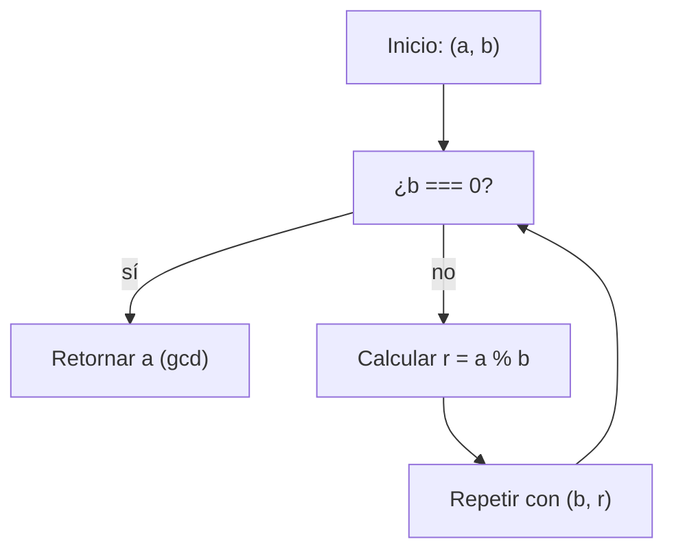

## Máximo Común Divisor

En este post resolvemos el problema "Greatest Common Divisor (GCD)" aplicando el clásico Algoritmo de Euclides. Veremos la idea matemática, una implementación recursiva (la usada en la solución), una alternativa iterativa, ejemplos, tests y visualizaciones.

---

## 📝 Enunciado del problema

Dado dos enteros positivos $a$ y $b$, devuelve su máximo común divisor (MCD), denotado como $\gcd(a, b)$.

El MCD de dos enteros es el mayor número $d$ tal que $d \mid a$ y $d \mid b$ (es decir, $d$ divide a ambos sin dejar residuo).

Ejemplo: divisores de $4 \to \{1, 2, 4\}$; divisores de $6 \to \{1, 2, 3, 6\}$. El $\gcd(4, 6) = 2$.

---

## 🔬 Idea matemática (algoritmo de Euclides)

El Algoritmo de Euclides se apoya en la siguiente propiedad:

Si $a$ y $b$ son enteros, con $b \neq 0$,
$$
\gcd(a, b) = \gcd(b, a \bmod b)
$$

y si $b = 0$ entonces
$$
\gcd(a, 0) = a
$$

Es decir: el MCD de $(a, b)$ es el mismo que el MCD de $(b, a \% b)$. Aplicando esto repetidamente reducimos el problema hasta que el segundo número sea $0$.

---

## 📊 Diagrama del proceso (Mermaid)



---

## ✅ Implementación en JavaScript (recursiva — versión usada)

Este es el código que se encuentra en el repositorio (exactamente la solución propuesta):

```javascript
/**
 * FreeCodeCamp Problem: Gcd
 * Category: FreeCodeCamp
 *
 * @param {number} x - First positive integer
 * @param {number} y - Second positive integer
 * @returns {number} The greatest common divisor of x and y
 */
function gcd(x, y) {
  if (y === 0) {
    return x
  }
  return gcd(y, x % y)
}

export default gcd
```

### Paso a paso (recursivo)
1. Si `y === 0`, devolvemos `x` (caso base).
2. Si no, llamamos `gcd(y, x % y)`, reduciendo la magnitud de los números rápidamente.
3. La recursión termina cuando `y` llega a 0.

---

## 🔁 Alternativa: implementación iterativa

La versión iterativa evita la recursión y usa un bucle while. Funciona igual de bien y puede ser preferible cuando hay riesgo de alcanzar límites de recursión:

```javascript
function gcdIterative(x, y) {
  while (y !== 0) {
    const temp = y
    y = x % y
    x = temp
  }
  return x
}
```

---

## 🧪 Tests incluidos

En el repositorio se agregaron tests que cubren casos representativos:

```javascript
import { describe, expect, it } from 'vitest'
import gcd from './gcd'

describe('Gcd', () => {
  it('gcd(4, 6) should return 2.', () => {
    expect(gcd(4, 6)).toBe(2)
  })
  it('gcd(20, 15) should return 5.', () => {
    expect(gcd(20, 15)).toBe(5)
  })
  it('gcd(13, 17) should return 1.', () => {
    expect(gcd(13, 17)).toBe(1)
  })
  it('gcd(654, 456) should return 6.', () => {
    expect(gcd(654, 456)).toBe(6)
  })
  it('gcd(3456, 4320) should return 864.', () => {
    expect(gcd(3456, 4320)).toBe(864)
  })
})
```

Estos tests verifican:
- casos pequeños con divisor común,
- cuando un número es múltiplo del otro,
- primos relativos (MCD = 1),
- números medianamente grandes y casos con MCD grande.

---

## 🧮 Ejemplo manual del algoritmo

Tomemos $\gcd(654, 456)$:

\[
\begin{align*}
\gcd(654, 456) &\to \gcd(456, 198) \\
\gcd(456, 198) &\to \gcd(198, 60) \\
\gcd(198, 60) &\to \gcd(60, 18) \\
\gcd(60, 18) &\to \gcd(18, 6) \\
\gcd(18, 6) &\to \gcd(6, 0) = 6
\end{align*}
\]

Resultado: $6$.

---

## 📐 Complejidad

- Complejidad temporal: \(O(\log(\min(a, b)))\).
  El algoritmo reduce rápidamente los operandos; cada paso aproximadamente divide el problema de forma significativa.
- Complejidad espacial:
  - Recursiva: \(O(\text{profundidad})\), en la práctica \(O(\log(\min(a,b)))\).
  - Iterativa: \(O(1)\) (constante).

---

## ⚠️ Casos borde y consideraciones

Algunos puntos clave y casos especiales:

- **Dominio:** El problema está definido para enteros positivos $a, b \in \mathbb{N}$.

- **Convención matemática:**
  $$
  \gcd(a, 0) = a
  $$
  para cualquier $a > 0$.

- **Números iguales:**
  $$
  \gcd(a, a) = a
  $$

- **Primos** Si $a$ y $b$ son primos, entonces no tienen divisores comunes salvo $1$.
- **Inputs grandes:** Para valores muy grandes de $a$ y $b$, la versión iterativa es preferible para evitar desbordes de pila por recursión profunda.

---

## 🔍 Reflexiones y aprendizajes

- El Algoritmo de Euclides es elegante, simple y muy eficiente para este problema clásico.
- Implementaciones recursivas son más cortas y expresivas; las iterativas son más seguras respecto al stack.
- Entender la propiedad matemática (gcd(a,b) = gcd(b, a mod b)) facilita razonar sobre la corrección del algoritmo.

---

## 📚 Recursos y referencias

- [Wikipedia: Algoritmo de Euclides](https://es.wikipedia.org/wiki/Algoritmo_de_Euclides)
