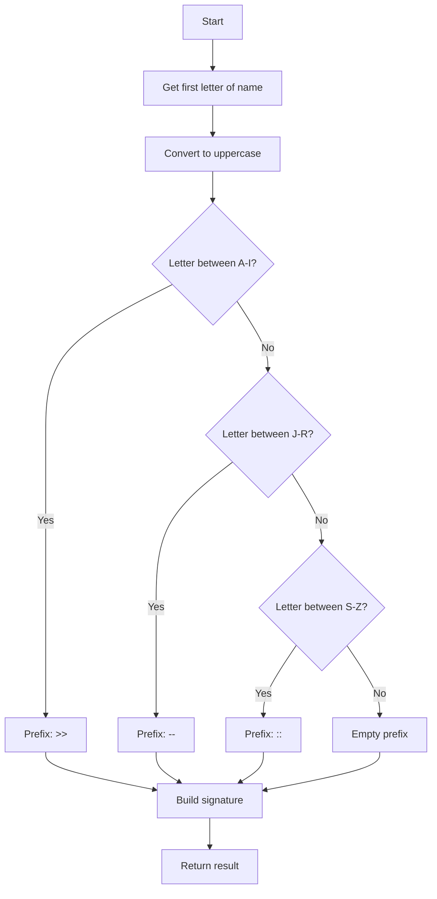
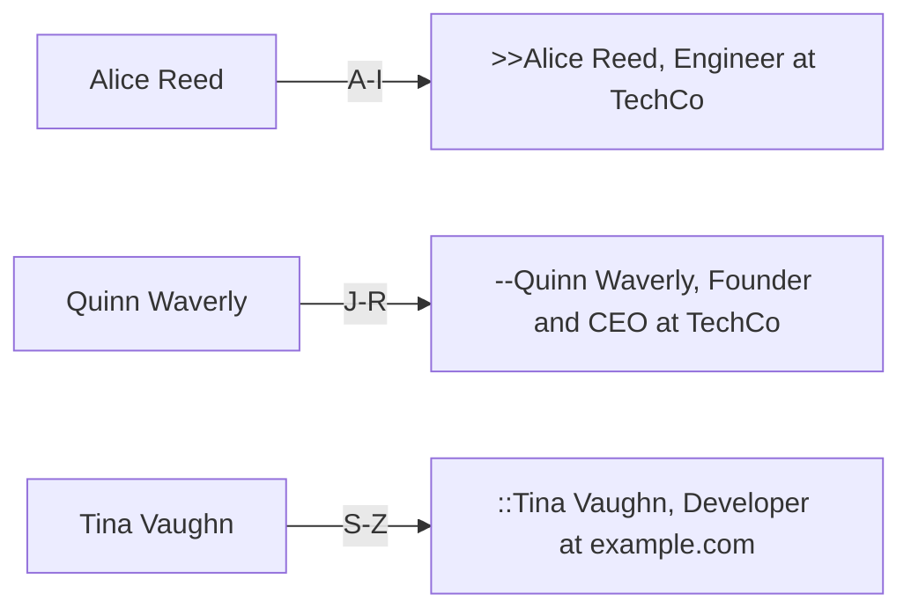
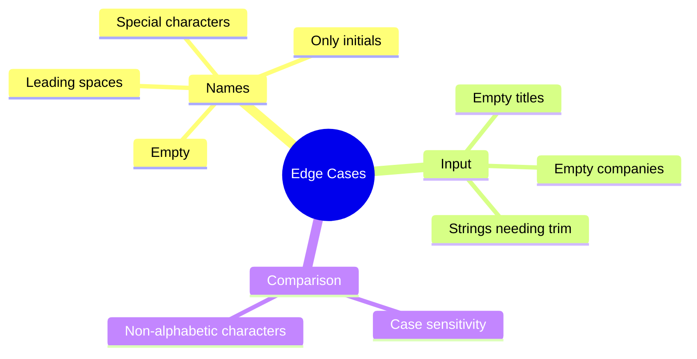
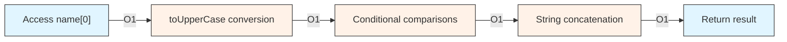

## 📋 Problem Description

The challenge is to create a function that generates personalized email signatures. Given three strings (name, title, and company), we must return a formatted signature following specific rules.

### Formatting Rules

1. **Prefix based on name's initial:**
   - `A-I`: Use `>>` as prefix
   - `J-R`: Use `--` as prefix
   - `S-Z`: Use `::` as prefix

2. **Signature structure:**

```bash
   [prefix][name], [title] at [company]
   ```

### Example

```bash
   >>Alice Reed, Engineer at TechCo
   --Quinn Waverly, Founder and CEO at TechCo
   ::Tina Vaughn, Developer at example.com

```javascript
generateSignature('Quinn Waverly', 'Founder and CEO', 'TechCo')
// Result: "--Quinn Waverly, Founder and CEO at TechCo"
```

## 🔍 Problem Analysis

### Decision Flow



### Test Cases



## 💡 Solution

### JavaScript Implementation

```javascript
function generateSignature(name, title, company) {
  const firstNameLetter = name[0].toUpperCase()
  let prefix = ''

  if (firstNameLetter >= 'A' && firstNameLetter <= 'I') {
    prefix = '>>'
  }
  else if (firstNameLetter >= 'J' && firstNameLetter <= 'R') {
    prefix = '--'
  }
  else if (firstNameLetter >= 'S' && firstNameLetter <= 'Z') {
    prefix = '::'
  }

  return `${prefix}${name}, ${title} at ${company}`
}
```

## 🎯 Edge Cases and Considerations

### Special Cases Table

| Case | Input | Output | Consideration |
|------|-------|--------|---------------|
| Lowercase name | `"windstorm"` | `"::windstorm, ..."` | Converted to uppercase for comparison |
| Name with initials | `"B. B."` | `">>B. B., ..."` | Takes first character |
| Empty name | `""` | Potential error | Requires validation |
| Special character | `"@lex"` | `", ..."` | Empty prefix |

### Edge Cases Diagram



## 📊 Complexity Analysis

### Time Complexity: O(1)



- **First character access:** O(1)
- **Uppercase conversion:** O(1)
- **Comparisons:** O(1) - maximum 3 comparisons
- **Concatenation:** O(1) for fixed-length strings

### Space Complexity: O(1)

Only temporary variables (`firstNameLetter`, `prefix`) are used, regardless of input size.

## 🔧 Possible Optimizations

### 1. Input Validation

```javascript
function generateSignature(name, title, company) {
  // Validation
  if (!name || name.trim().length === 0) {
    throw new Error('Name cannot be empty')
  }

  const trimmedName = name.trim()
  const firstNameLetter = trimmedName[0].toUpperCase()
  let prefix = ''

  if (firstNameLetter >= 'A' && firstNameLetter <= 'I') {
    prefix = '>>'
  }
  else if (firstNameLetter >= 'J' && firstNameLetter <= 'R') {
    prefix = '--'
  }
  else if (firstNameLetter >= 'S' && firstNameLetter <= 'Z') {
    prefix = '::'
  }

  return `${prefix}${trimmedName}, ${title} at ${company}`
}
```

### 2. Using Map for Prefixes

```javascript
function generateSignature(name, title, company) {
  const prefixMap = {
    'A-I': '>>',
    'J-R': '--',
    'S-Z': '::'
  }

  const firstLetter = name[0].toUpperCase()
  let prefix = ''

  if (firstLetter >= 'A' && firstLetter <= 'I')
    prefix = prefixMap['A-I']
  else if (firstLetter >= 'J' && firstLetter <= 'R')
    prefix = prefixMap['J-R']
  else if (firstLetter >= 'S' && firstLetter <= 'Z')
    prefix = prefixMap['S-Z']

  return `${prefix}${name}, ${title} at ${company}`
}
```

### 3. Finding First Valid Letter with Regex

```javascript
function generateSignature(name, title, company) {
  // Find first alphabetic letter
  const match = name.match(/[a-z]/i)
  if (!match)
    return `${name}, ${title} at ${company}`

  const firstLetter = match[0].toUpperCase()
  let prefix = ''

  if (firstLetter >= 'A' && firstLetter <= 'I')
    prefix = '>>'
  else if (firstLetter >= 'J' && firstLetter <= 'R')
    prefix = '--'
  else if (firstLetter >= 'S' && firstLetter <= 'Z')
    prefix = '::'

  return `${prefix}${name}, ${title} at ${company}`
}
```

## 🧪 Testing

### Test Suite

```javascript
const testCases = [
  {
    input: ['Quinn Waverly', 'Founder and CEO', 'TechCo'],
    expected: '--Quinn Waverly, Founder and CEO at TechCo'
  },
  {
    input: ['Alice Reed', 'Engineer', 'TechCo'],
    expected: '>>Alice Reed, Engineer at TechCo'
  },
  {
    input: ['Tina Vaughn', 'Developer', 'example.com'],
    expected: '::Tina Vaughn, Developer at example.com'
  },
  {
    input: ['B. B.', 'Product Tester', 'AcmeCorp'],
    expected: '>>B. B., Product Tester at AcmeCorp'
  },
  {
    input: ['windstorm', 'Cloud Architect', 'Atmospheronics'],
    expected: '::windstorm, Cloud Architect at Atmospheronics'
  }
]

testCases.forEach(({ input, expected }, index) => {
  const result = generateSignature(...input)
  console.log(`Test ${index + 1}: ${result === expected ? '✅ PASS' : '❌ FAIL'}`)
})
```

## 🎓 Key Concepts Learned

1. **String Manipulation**
   - Individual character access
   - Case conversion
   - Template literals for concatenation

2. **Character Comparison**
   - Lexicographic comparison in JavaScript
   - Case-insensitive matching

3. **Conditional Structures**
   - Efficient use of if-else if
   - Alternatives with switch or maps

4. **Input Validation**
   - Edge case handling
   - Defensive programming

## 🔗 Resources and References

- [String.prototype.toUpperCase() - MDN](https://developer.mozilla.org/en-US/docs/Web/JavaScript/Reference/Global_Objects/String/toUpperCase)
- [String.prototype.charAt() - MDN](https://developer.mozilla.org/en-US/docs/Web/JavaScript/Reference/Global_Objects/String/charAt)
- [Template Literals - MDN](https://developer.mozilla.org/en-US/docs/Web/JavaScript/Reference/Template_literals)
- [Regular Expressions in JS - MDN](https://developer.mozilla.org/en-US/docs/Web/JavaScript/Guide/Regular_Expressions)

## 💭 Final Thoughts

This exercise, though seemingly simple, allows us to practice fundamental concepts:

- **Clear and maintainable conditional logic**
- **Efficient string handling**
- **Edge case consideration from the start**
- **Optimization without over-engineering**

The proposed solution is straightforward and readable, with constant time and space complexity, making it ideal for production.

---

**Did you like this article?** Share it and follow me for more programming challenge solutions! 🚀
