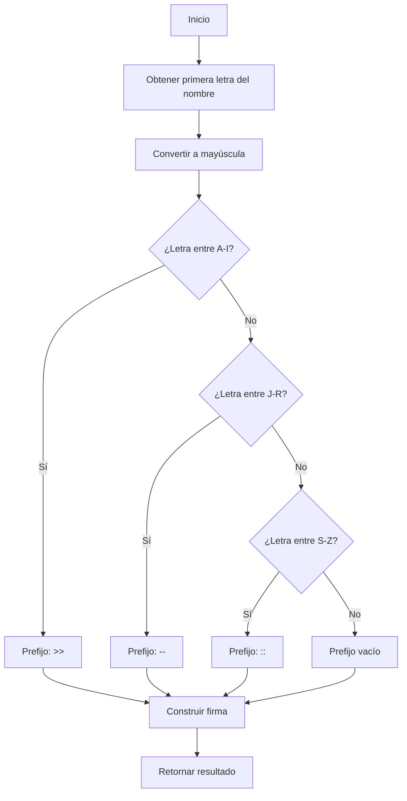
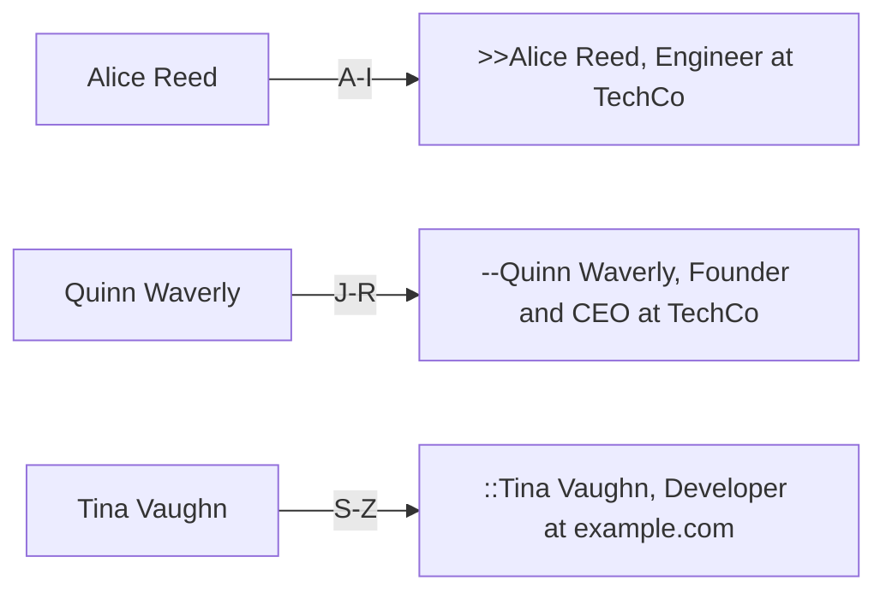
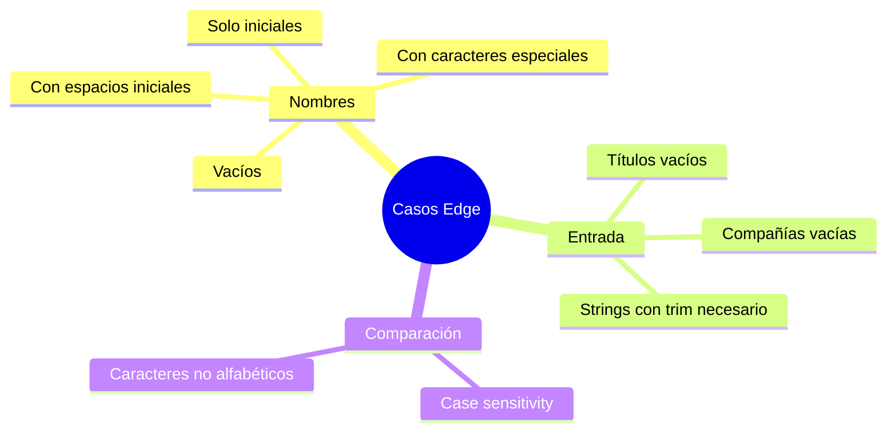

## Generador de Firma de Email - FreeCodeCamp Daily Challenge

## 📋 Descripción del Problema

El desafío consiste en crear una función que genere firmas de correo electrónico personalizadas. Dadas tres cadenas de texto (nombre, título y compañía), debemos retornar una firma formateada siguiendo reglas específicas.

### Reglas de Formateo

1. **Prefijo según inicial del nombre:**
   - `A-I`: Usar `>>` como prefijo
   - `J-R`: Usar `--` como prefijo
   - `S-Z`: Usar `::` como prefijo

2. **Estructura de la firma:**

   ```bash
   [prefijo][nombre], [título] at [compañía]
   ```

### Ejemplo

```javascript
generateSignature('Quinn Waverly', 'Founder and CEO', 'TechCo')
// Resultado: "--Quinn Waverly, Founder and CEO at TechCo"
```

## 🔍 Análisis del Problema

### Flujo de Decisión



### Casos de Prueba



## 💡 Solución

### Implementación en JavaScript

```javascript
function generateSignature(name, title, company) {
  const firstNameLetter = name[0].toUpperCase()
  let prefix = ''

  if (firstNameLetter >= 'A' && firstNameLetter <= 'I') {
    prefix = '>>'
  }
  else if (firstNameLetter >= 'J' && firstNameLetter <= 'R') {
    prefix = '--'
  }
  else if (firstNameLetter >= 'S' && firstNameLetter <= 'Z') {
    prefix = '::'
  }

  return `${prefix}${name}, ${title} at ${company}`
}
```

### Implementación en TypeScript

```typescript
function generateSignature(name: string, title: string, company: string): string {
  const firstNameLetter = name[0].toUpperCase()
  let prefix = ''

  if (firstNameLetter >= 'A' && firstNameLetter <= 'I') {
    prefix = '>>'
  }
  else if (firstNameLetter >= 'J' && firstNameLetter <= 'R') {
    prefix = '--'
  }
  else if (firstNameLetter >= 'S' && firstNameLetter <= 'Z') {
    prefix = '::'
  }

  return `${prefix}${name}, ${title} at ${company}`
}
```

## 🎯 Casos Edge y Consideraciones

### Tabla de Casos Especiales

| Caso | Input | Output | Consideración |
|------|-------|--------|---------------|
| Nombre con minúscula | `"windstorm"` | `"::windstorm, ..."` | Se convierte a mayúscula para comparar |
| Nombre con iniciales | `"B. B."` | `">>B. B., ..."` | Toma el primer carácter |
| Nombre vacío | `""` | Error potencial | Requiere validación |
| Carácter especial | `"@lex"` | `", ..."` | Prefijo vacío |

### Diagrama de Casos Edge



## 📊 Análisis de Complejidad

### Complejidad Temporal: O(1)

```mermaid
graph LR
    A[Acceso a name[0]] -->|O1| B[Conversión toUpperCase]
    B -->|O1| C[Comparaciones condicionales]
    C -->|O1| D[Concatenación de strings]
    D -->|O1| E[Return]
    style A fill:#e1f5ff
    style E fill:#e1f5ff
```

- **Acceso al primer carácter:** O(1)
- **Conversión a mayúscula:** O(1)
- **Comparaciones:** O(1) - máximo 3 comparaciones
- **Concatenación:** O(1) para strings de longitud fija

### Complejidad Espacial: O(1)

Solo se utilizan variables temporales (`firstNameLetter`, `prefix`), independientemente del tamaño de la entrada.

## 🔧 Optimizaciones Posibles

### 1. Validación de Entrada

```javascript
function generateSignature(name, title, company) {
  // Validación
  if (!name || name.trim().length === 0) {
    throw new Error('Name cannot be empty')
  }

  const trimmedName = name.trim()
  const firstNameLetter = trimmedName[0].toUpperCase()
  let prefix = ''

  if (firstNameLetter >= 'A' && firstNameLetter <= 'I') {
    prefix = '>>'
  }
  else if (firstNameLetter >= 'J' && firstNameLetter <= 'R') {
    prefix = '--'
  }
  else if (firstNameLetter >= 'S' && firstNameLetter <= 'Z') {
    prefix = '::'
  }

  return `${prefix}${trimmedName}, ${title} at ${company}`
}
```

### 2. Uso de Map para Prefijos

```javascript
function generateSignature(name, title, company) {
  const prefixMap = {
    'A-I': '>>',
    'J-R': '--',
    'S-Z': '::'
  }

  const firstLetter = name[0].toUpperCase()
  let prefix = ''

  if (firstLetter >= 'A' && firstLetter <= 'I')
    prefix = prefixMap['A-I']
  else if (firstLetter >= 'J' && firstLetter <= 'R')
    prefix = prefixMap['J-R']
  else if (firstLetter >= 'S' && firstLetter <= 'Z')
    prefix = prefixMap['S-Z']

  return `${prefix}${name}, ${title} at ${company}`
}
```

### 3. Búsqueda de Primera Letra Válida con Regex

```javascript
function generateSignature(name, title, company) {
  // Buscar la primera letra alfabética
  const match = name.match(/[a-z]/i)
  if (!match)
    return `${name}, ${title} at ${company}`

  const firstLetter = match[0].toUpperCase()
  let prefix = ''

  if (firstLetter >= 'A' && firstLetter <= 'I')
    prefix = '>>'
  else if (firstLetter >= 'J' && firstLetter <= 'R')
    prefix = '--'
  else if (firstLetter >= 'S' && firstLetter <= 'Z')
    prefix = '::'

  return `${prefix}${name}, ${title} at ${company}`
}
```

## 🧪 Testing

### Suite de Pruebas

```javascript
const testCases = [
  {
    input: ['Quinn Waverly', 'Founder and CEO', 'TechCo'],
    expected: '--Quinn Waverly, Founder and CEO at TechCo'
  },
  {
    input: ['Alice Reed', 'Engineer', 'TechCo'],
    expected: '>>Alice Reed, Engineer at TechCo'
  },
  {
    input: ['Tina Vaughn', 'Developer', 'example.com'],
    expected: '::Tina Vaughn, Developer at example.com'
  },
  {
    input: ['B. B.', 'Product Tester', 'AcmeCorp'],
    expected: '>>B. B., Product Tester at AcmeCorp'
  },
  {
    input: ['windstorm', 'Cloud Architect', 'Atmospheronics'],
    expected: '::windstorm, Cloud Architect at Atmospheronics'
  }
]

testCases.forEach(({ input, expected }, index) => {
  const result = generateSignature(...input)
  console.log(`Test ${index + 1}: ${result === expected ? '✅ PASS' : '❌ FAIL'}`)
})
```

## 🎓 Conceptos Clave Aprendidos

1. **Manipulación de Strings**
   - Acceso a caracteres individuales
   - Conversión de mayúsculas/minúsculas
   - Template literals para concatenación

2. **Comparación de Caracteres**
   - Comparación lexicográfica en JavaScript
   - Case-insensitive matching

3. **Estructuras Condicionales**
   - Uso eficiente de if-else if
   - Alternativas con switch o maps

4. **Validación de Entrada**
   - Manejo de edge cases
   - Defensive programming

## 🔗 Recursos y Referencias

- [String.prototype.toUpperCase() - MDN](https://developer.mozilla.org/es/docs/Web/JavaScript/Reference/Global_Objects/String/toUpperCase)
- [String.prototype.charAt() - MDN](https://developer.mozilla.org/es/docs/Web/JavaScript/Reference/Global_Objects/String/charAt)
- [Template Literals - MDN](https://developer.mozilla.org/es/docs/Web/JavaScript/Reference/Template_literals)
- [Expresiones regulares en JS - MDN](https://developer.mozilla.org/es/docs/Web/JavaScript/Guide/Regular_Expressions)

## 💭 Reflexiones Finales

Este ejercicio, aunque simple en apariencia, nos permite practicar conceptos fundamentales:

- **Lógica condicional clara y mantenible**
- **Manejo de strings de forma eficiente**
- **Consideración de casos edge desde el inicio**
- **Optimización sin sobre-ingeniería**

La solución propuesta es directa y legible, con complejidad temporal y espacial constante, lo que la hace ideal para producción.

---

**¿Te gustó este artículo?** Compártelo y sígueme para más soluciones de desafíos de programación. 🚀
