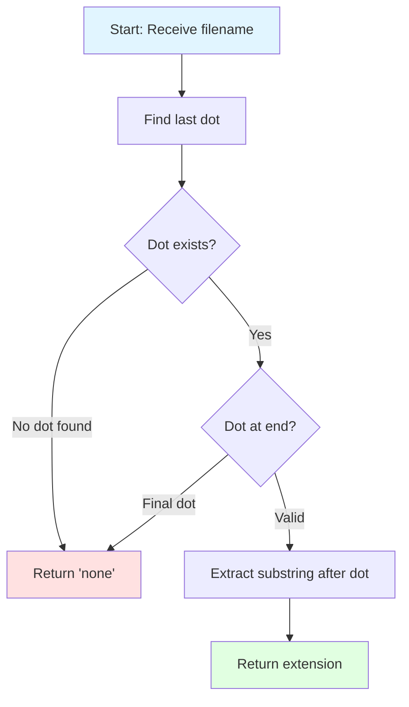

## Extension Extractor - FreeCodeCamp Daily Challenge

This problem challenges us to extract the extension from a given filename. We'll explore an efficient step-by-step solution, handling special cases and common edge cases.

---

## 📋 Problem Statement

### Extension Extractor

Given a string representing a filename, return its extension.

**Specifications:**

- The extension is the part of the name that comes after the **last dot** (`.`)
- If the file contains no dot or ends with a dot, return `"none"`
- The extension must preserve case sensitivity

## 🧠 Problem Analysis

### Understanding the Problem

We need to identify and extract a file's extension. However, several special cases must be handled:

| File Type | Example | Result | Reason |
|-----------|---------|--------|--------|
| No extension | `"README"` | `"none"` | No dot present |
| Standard extension | `"document.txt"` | `"txt"` | Extension after dot |
| Starts with dot | `".gitignore"` | `"gitignore"` | Initial dot doesn't count |
| Multiple dots | `"archive.tar.gz"` | `"gz"` | Only last dot matters |
| Ends with dot | `"final.draft."` | `"none"` | Nothing after the dot |

### Resolution Strategy

The solution is based on three fundamental steps:

1. **Locate** the last dot in the filename
2. **Validate** that a valid extension exists
3. **Extract** the corresponding substring



---

## 🛠️ Solution Development

### JavaScript Implementation

```javascript
function getExtension(filename) {
  // Find the position of the last dot
  const lastDotIndex = filename.lastIndexOf('.')

  // Validate cases where there's no valid extension
  if (lastDotIndex === -1 || lastDotIndex === filename.length - 1) {
    return 'none'
  }

  // Extract and return the extension
  return filename.substring(lastDotIndex + 1)
}
```

### Detailed Code Explanation

### 1. Last dot search

```javascript
const lastDotIndex = filename.lastIndexOf('.')
```

The `lastIndexOf('.')` method traverses the string from end to beginning, returning the position of the last dot found, or `-1` if it doesn't exist.

### 2. Special case validation

```javascript
if (lastDotIndex === -1 || lastDotIndex === filename.length - 1) {
  return 'none';
}
```

- `lastDotIndex === -1`: No dot exists in the name
- `lastDotIndex === filename.length - 1`: The dot is the last character

### 3. Extension extraction

```javascript
return filename.substring(lastDotIndex + 1);
```
`substring(lastDotIndex + 1)` extracts from the position after the dot to the end of the string.

## 📊 Test Cases

### Complete Test Suite

```javascript
// Case 1: Standard extension
console.log(getExtension('document.txt')) // 'txt'

// Case 2: No extension
console.log(getExtension('README')) // 'none'

// Case 3: Case preservation
console.log(getExtension('image.PNG')) // 'PNG'

// Case 4: File starting with dot (Unix hidden file)
console.log(getExtension('.gitignore')) // 'gitignore'

// Case 5: Multiple dots in name
console.log(getExtension('archive.tar.gz')) // 'gz'

// Case 6: Ends with dot
console.log(getExtension('final.draft.')) // 'none'

// Case 7: Single character extension
console.log(getExtension('script.c')) // 'c'

// Case 8: Long extension
console.log(getExtension('backup.backup')) // 'backup'
```

### Results Table

| # | Input | Output | Explanation |
|:-:|-------|:------:|-------------|
| 1 | `"document.txt"` | `"txt"` | Standard 3-character extension |
| 2 | `"README"` | `"none"` | No dot present |
| 3 | `"image.PNG"` | `"PNG"` | Preserves original case |
| 4 | `".gitignore"` | `"gitignore"` | Unix/Linux hidden file |
| 5 | `"archive.tar.gz"` | `"gz"` | Only considers last dot |
| 6 | `"final.draft."` | `"none"` | Dot at end, no valid extension |
| 7 | `"script.c"` | `"c"` | Single character extension |
| 8 | `"backup.backup"` | `"backup"` | Extension can repeat the name |

---

## 📈 Complexity Analysis

### Time Complexity: **O(n)**

- `lastIndexOf('.')`: O(n) - traverses the string once
- `substring()`: O(k) where k is the extension length
- Worst case: O(n)

### Space Complexity: **O(k)**

- Where k is the extension length
- `substring()` creates a new string
- Worst case: O(n) if the entire string is the extension

### Optimization

This solution is already optimal. We cannot improve time complexity because we need to examine the string at least once to find the last dot.

## 🎯 Alternative Solutions

### Alternative 1: Using `split()`

```javascript
function getExtensionAlt1(filename) {
  const parts = filename.split('.')

  if (parts.length === 1 || filename.endsWith('.')) {
    return 'none'
  }

  return parts[parts.length - 1]
}
```

**Advantages:** More declarative code
**Disadvantages:** Less efficient (O(n) additional space)

### Alternative 2: Using Regular Expressions

```javascript
function getExtensionAlt2(filename) {
  const match = filename.match(/\.([^.]+)$/)
  return match ? match[1] : 'none'
}
```

**Advantages:** Compact and expressive
**Disadvantages:** May be less readable for some developers

---

## 💡 Key Concepts Learned

1. **`lastIndexOf()`** is ideal for searching from the end
2. **Early validation** prevents errors and simplifies logic
3. **`substring()`** is efficient for extracting string parts
4. **Edge cases** are crucial in string manipulation problems

---

## 🤔 Final Reflections

This problem illustrates the importance of:

- **Identifying special cases** before implementing
- **Choosing the right tools** (`lastIndexOf` vs `split`)
- **Writing defensive code** that handles all scenarios

String manipulation is fundamental in programming. Mastering methods like `lastIndexOf()`, `substring()`, and understanding when to use them makes the difference between robust and fragile code.

---

## 🔗 Additional Resources

- [MDN: String.prototype.lastIndexOf()](https://developer.mozilla.org/en-US/docs/Web/JavaScript/Reference/Global_Objects/String/lastIndexOf)
- [MDN: String.prototype.substring()](https://developer.mozilla.org/en-US/docs/Web/JavaScript/Reference/Global_Objects/String/substring)
- [FreeCodeCamp JavaScript Algorithms](https://www.freecodecamp.org/learn/javascript-algorithms-and-data-structures/)
