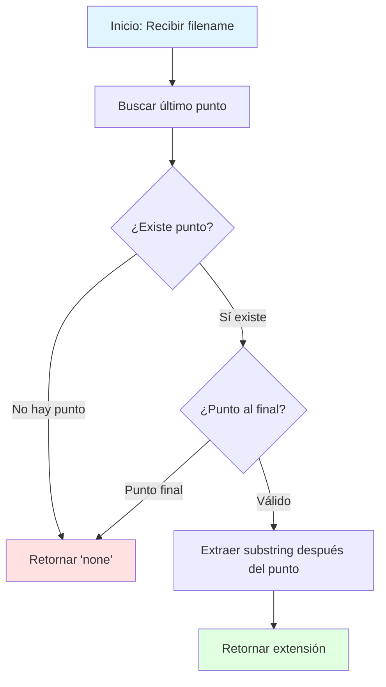

## Extension Extractor - Desafío Diario de FreeCodeCamp

Este problema nos desafía a extraer la extensión de un nombre de archivo dado. Exploraremos una solución eficiente paso a paso, manejando casos especiales y edge cases comunes.

---

## 📋 Enunciado del Problema

## Extension Extractor

Dado una cadena de texto que representa el nombre de un archivo, devuelve su extensión.

**Especificaciones:**

- La extensión es la parte del nombre que viene después del **último punto** (`.`)
- Si el archivo no contiene un punto o termina con un punto, devuelve `"none"`
- La extensión debe preservar mayúsculas y minúsculas

## 🧠 Análisis del Problema

### Comprensión del Problema

Necesitamos identificar y extraer la extensión de un archivo. Sin embargo, existen varios casos especiales que debemos manejar:

| Tipo de Archivo | Ejemplo | Resultado | Razón |
|-----------------|---------|-----------|-------|
| Sin extensión | `"README"` | `"none"` | No hay punto |
| Extensión estándar | `"document.txt"` | `"txt"` | Extensión después del punto |
| Empieza con punto | `".gitignore"` | `"gitignore"` | El punto inicial no cuenta |
| Múltiples puntos | `"archive.tar.gz"` | `"gz"` | Solo el último punto importa |
| Termina con punto | `"final.draft."` | `"none"` | No hay nada después del punto |

### Estrategia de Resolución

La solución se basa en tres pasos fundamentales:

1. **Localizar** el último punto en el nombre del archivo
2. **Validar** que existe una extensión válida
3. **Extraer** la subcadena correspondiente



---

## 🛠️ Desarrollo de la Solución

### Implementación en JavaScript

```javascript
function getExtension(filename) {
  // Encontrar la posición del último punto
  const lastDotIndex = filename.lastIndexOf('.')

  // Validar casos donde no hay extensión válida
  if (lastDotIndex === -1 || lastDotIndex === filename.length - 1) {
    return 'none'
  }

  // Extraer y retornar la extensión
  return filename.substring(lastDotIndex + 1)
}
```

### Explicación Detallada del Código

### 1. Búsqueda del último punto

```javascript
const lastDotIndex = filename.lastIndexOf('.')
```

El método `lastIndexOf('.')` recorre el string desde el final hasta el principio, retornando la posición del último punto encontrado, o `-1` si no existe.

### 2. Validación de casos especiales

```javascript
if (lastDotIndex === -1 || lastDotIndex === filename.length - 1) {
  return 'none';
}
```

```javascript
if (lastDotIndex === -1 || lastDotIndex === filename.length - 1) {
  return 'none';
}
```

- `lastDotIndex === -1`: No existe ningún punto en el nombre
- `lastDotIndex === filename.length - 1`: El punto es el último carácter

### 3. Extracción de la extensión

```javascript
return filename.substring(lastDotIndex + 1);
```

`substring(lastDotIndex + 1)` extrae desde la posición después del punto hasta el final del string.

---

## 📊 Casos de Prueba

### Suite de Pruebas Completa

```javascript
// Caso 1: Extensión estándar
console.log(getExtension('document.txt')) // 'txt'

// Caso 2: Sin extensión
console.log(getExtension('README')) // 'none'

// Caso 3: Preservación de mayúsculas
console.log(getExtension('image.PNG')) // 'PNG'

// Caso 4: Archivo que empieza con punto (archivo oculto Unix)
console.log(getExtension('.gitignore')) // 'gitignore'

// Caso 5: Múltiples puntos en el nombre
console.log(getExtension('archive.tar.gz')) // 'gz'

// Caso 6: Termina con punto
console.log(getExtension('final.draft.')) // 'none'

// Caso 7: Extensión de un solo carácter
console.log(getExtension('script.c')) // 'c'

// Caso 8: Extensión larga
console.log(getExtension('backup.backup')) // 'backup'
```

### Tabla de Resultados

| # | Entrada | Salida | Explicación |
|:-:|---------|:------:|-------------|
| 1 | `"document.txt"` | `"txt"` | Extensión estándar de 3 caracteres |
| 2 | `"README"` | `"none"` | No contiene punto |
| 3 | `"image.PNG"` | `"PNG"` | Preserva mayúsculas originales |
| 4 | `".gitignore"` | `"gitignore"` | Archivo oculto Unix/Linux |
| 5 | `"archive.tar.gz"` | `"gz"` | Solo considera el último punto |
| 6 | `"final.draft."` | `"none"` | Punto al final, sin extensión válida |
| 7 | `"script.c"` | `"c"` | Extensión de un solo carácter |
| 8 | `"backup.backup"` | `"backup"` | Extensión puede repetir el nombre |

---

## 📈 Análisis de Complejidad

### Complejidad Temporal: **O(n)**

- `lastIndexOf('.')`: O(n) - recorre el string una vez
- `substring()`: O(k) donde k es la longitud de la extensión
- En el peor caso: O(n)

### Complejidad Espacial: **O(k)**

- Donde k es la longitud de la extensión
- `substring()` crea una nueva cadena
- En el peor caso: O(n) si todo el string es la extensión

### Optimización

Esta solución ya es óptima. No podemos mejorar la complejidad temporal porque necesitamos examinar el string al menos una vez para encontrar el último punto.

---

## 🎯 Soluciones Alternativas

### Alternativa 1: Usando `split()`

```javascript
function getExtensionAlt1(filename) {
  const parts = filename.split('.')

  if (parts.length === 1 || filename.endsWith('.')) {
    return 'none'
  }

  return parts[parts.length - 1]
}
```

**Ventajas:** Código más declarativo
**Desventajas:** Menos eficiente (O(n) espacio adicional)

### Alternativa 2: Usando Expresiones Regulares

```javascript
function getExtensionAlt2(filename) {
  const match = filename.match(/\.([^.]+)$/)
  return match ? match[1] : 'none'
}
```

**Ventajas:** Compacto y expresivo
**Desventajas:** Puede ser menos legible para algunos desarrolladores

---

## 💡 Conceptos Clave Aprendidos

1. **`lastIndexOf()`** es ideal para buscar desde el final
2. **Validación temprana** evita errores y simplifica la lógica
3. **`substring()`** es eficiente para extraer partes de un string
4. **Edge cases** son cruciales en problemas de manipulación de strings

---

## 🤔 Reflexiones Finales

Este problema ilustra la importancia de:

- **Identificar casos especiales** antes de implementar
- **Elegir las herramientas correctas** (`lastIndexOf` vs `split`)
- **Escribir código defensivo** que maneje todos los escenarios

La manipulación de strings es fundamental en programación. Dominar métodos como `lastIndexOf()`, `substring()`, y entender cuándo usarlos marca la diferencia entre código robusto y código frágil.

---

## 🔗 Recursos Adicionales

- [MDN: String.prototype.lastIndexOf()](https://developer.mozilla.org/es/docs/Web/JavaScript/Reference/Global_Objects/String/lastIndexOf)
- [MDN: String.prototype.substring()](https://developer.mozilla.org/es/docs/Web/JavaScript/Reference/Global_Objects/String/substring)
- [FreeCodeCamp JavaScript Algorithms](https://www.freecodecamp.org/learn/javascript-algorithms-and-data-structures/)
