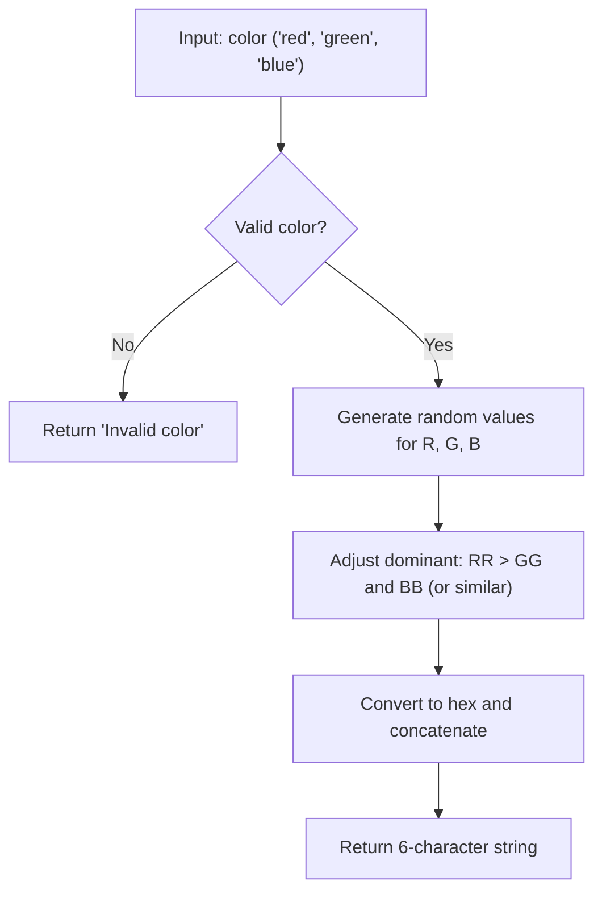

## Hex Generator: Analysis and Solution

## Problem Statement

Given a string representing a CSS color (`"red"`, `"green"`, or `"blue"`), implement a function that generates a random six-character hexadecimal color code, where the dominant color matches the specified one. If the input is invalid, return exactly `"Invalid color"`.

**Requirements:**

- Only accepts `"red"`, `"green"`, or `"blue"` (lowercase).
- The dominant component must be strictly greater than the other two.
- The result is a 6-character hexadecimal string (RGB).
- If the input is invalid, return `"Invalid color"`.

## How does the RGB Hexadecimal Format Work?

A hexadecimal color is represented as `#RRGGBB`, where:

- `RR` are two hexadecimal digits for red (00 to FF)
- `GG` for green (00 to FF)
- `BB` for blue (00 to FF)

For example:

```txt
#FF0000 → Pure red (red at max, green and blue at zero)
#00FF00 → Pure green
#0000FF → Pure blue
```

The function should generate a 6-character string (e.g., `FF00AA`), where the dominant component is strictly greater than the other two.

## Test Cases

| Input       | Expected Output         | Explanation         |
|-------------|------------------------|---------------------|
| "yellow"    | "Invalid color"        | Invalid color       |
| "red"       | 6-character string     | Valid hex, red dominant |
| "green"     | 6-character string     | Valid hex, green dominant |
| "blue"      | 6-character string     | Valid hex, blue dominant  |

**Dominance:**

- If the input is "red", the red value ($RR$) must be $> GG$ and $> BB$.
- If it's "green", $GG > RR$ and $GG > BB$.
- If it's "blue", $BB > RR$ and $BB > GG$.

## Flowchart



## Strategy and Steps

1. Validate input: only "red", "green", or "blue".
2. Generate random values for R, G, B.
3. Adjust the dominant so it is strictly greater.
4. Convert each value to two-digit hexadecimal.
5. Concatenate and return the string.

## Complexity Analysis

### Time

- All operations are constant: $O(1)$

### Space

- Fixed variable usage: $O(1)$

## Edge Cases and Considerations

- Invalid input → returns "Invalid color"
- Dominant never exceeds 255
- The other two values can be equal
- The result is always a 6-character uppercase string

## Reflections and Learnings

- Input validation and error handling
- Random number generation and RGB manipulation
- Hexadecimal conversion and padding
- Ensuring color dominance

## Resources

- [Hexadecimal colors in CSS - MDN](https://developer.mozilla.org/en-US/docs/Web/CSS/color_value)
- [Math.random() - MDN](https://developer.mozilla.org/en-US/docs/Web/JavaScript/Reference/Global_Objects/Math/random)
- [toString(radix) method - MDN](https://developer.mozilla.org/en-US/docs/Web/JavaScript/Reference/Global_Objects/Number/toString)
