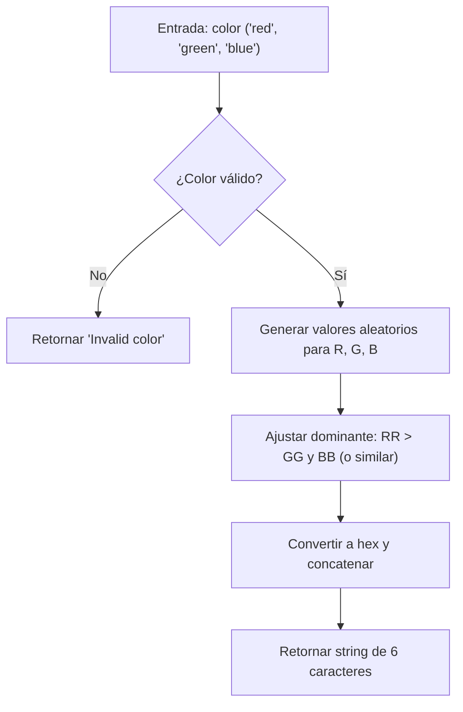

## Generador de Hex: Análisis y Solución

## Enunciado

Dada una cadena que representa un color CSS (`"red"`, `"green"` o `"blue"`), implementa una función que genere un código hexadecimal de color aleatorio de seis caracteres, donde el color dominante corresponda al color indicado. Si la entrada no es válida, retorna exactamente `"Invalid color"`.

**Requisitos:**

- Solo acepta `"red"`, `"green"` o `"blue"` (minúsculas).
- El componente dominante debe ser estrictamente mayor que los otros dos.
- El resultado es un string hexadecimal de 6 caracteres (RGB).
- Si la entrada es inválida, retorna `"Invalid color"`.

## ¿Cómo funciona el formato hexadecimal RGB?

Un color hexadecimal se representa como `#RRGGBB`, donde:

- `RR` son dos dígitos hexadecimales para el rojo (00 a FF)
- `GG` para el verde (00 a FF)
- `BB` para el azul (00 a FF)

Por ejemplo:

```txt
#FF0000 → Rojo puro (rojo al máximo, verde y azul en cero)
#00FF00 → Verde puro
#0000FF → Azul puro
```

La función debe generar un string de 6 caracteres (ej: `FF00AA`), donde el componente dominante es estrictamente mayor que los otros dos.

## Casos de Prueba

| Entrada     | Salida esperada         | Explicación |
|-------------|-------------------------|-------------|
| "yellow"    | "Invalid color"         | Color no válido |
| "red"       | String de 6 caracteres  | Hex válido, dominante rojo |
| "green"     | String de 6 caracteres  | Hex válido, dominante verde |
| "blue"      | String de 6 caracteres  | Hex válido, dominante azul |

**Dominancia:**

- Si la entrada es "red", el valor de rojo ($RR$) debe ser $> GG$ y $> BB$.
- Si es "green", $GG > RR$ y $GG > BB$.
- Si es "blue", $BB > RR$ y $BB > GG$.

## Diagrama de Flujo



## Estrategia y Pasos

1. Validar la entrada: solo "red", "green" o "blue".
2. Generar valores aleatorios para R, G, B.
3. Ajustar el dominante para que sea estrictamente mayor.
4. Convertir cada valor a hexadecimal de dos dígitos.
5. Concatenar y retornar el string.

## Análisis de Complejidad

### Temporal

- Todas las operaciones son constantes: $O(1)$

### Espacial

- Uso fijo de variables: $O(1)$

## Casos Edge y Consideraciones

- Entrada inválida → retorna "Invalid color"
- Dominante nunca supera 255
- Los otros dos valores pueden ser iguales
- El resultado siempre es un string de 6 caracteres en mayúsculas

## Reflexiones y Aprendizajes

- Validación de entradas y manejo de errores
- Generación de números aleatorios y manipulación de RGB
- Conversión a hexadecimal y padding
- Garantizar dominancia en el color

## Recursos

- [Colores hexadecimales en CSS - MDN](https://developer.mozilla.org/es/docs/Web/CSS/color_value)
- [Math.random() - MDN](https://developer.mozilla.org/es/docs/Web/JavaScript/Reference/Global_Objects/Math/random)
- [Método toString(radix) - MDN](https://developer.mozilla.org/es/docs/Web/JavaScript/Reference/Global_Objects/Number/toString)
