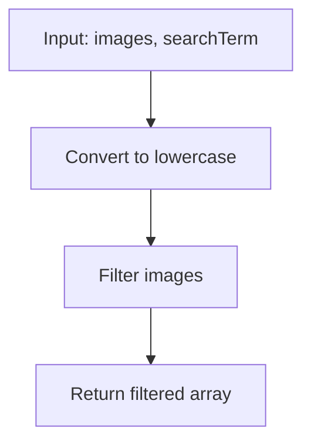

## The Problem

On November 4, 2001, Google launched its image search, allowing people to find images using search terms. In this challenge, we will imitate that functionality.

Given an array of image names and a search term, we must return an array of image names containing the search term.

- Ignore case when matching search terms.
- Return the images in the same order they appear in the input array.

## Examples

Here are the provided test cases:

1. `imageSearch(["dog.png", "cat.jpg", "parrot.jpeg"], "dog")` should return `["dog.png"]`.
2. `imageSearch(["Sunset.jpg", "Beach.png", "sunflower.jpeg"], "sun")` should return `["Sunset.jpg", "sunflower.jpeg"]`.
3. `imageSearch(["Moon.png", "sun.jpeg", "stars.png"], "PNG")` should return `["Moon.png", "stars.png"]`.
4. `imageSearch(["cat.jpg", "dogToy.jpeg", "kitty-cat.png", "catNip.jpeg", "franken_cat.gif"], "Cat")` should return `["cat.jpg", "kitty-cat.png", "catNip.jpeg", "franken_cat.gif"]`.

## Solution

The solution is quite straightforward. We will use the `filter()` method to filter the array, and `includes()` to check if the image name contains the search term. To ignore case, we will convert both the image name and the search term to lowercase.

```javascript
function imageSearch(images, searchTerm) {
  const term = searchTerm.toLowerCase()
  return images.filter(image => image.toLowerCase().includes(term))
}
```

Below are short explanations of the JavaScript methods used:

- `filter` is an Array method that creates a new array with all elements that pass a test implemented by the provided function. It takes a function executed for each element of the original array; if the function returns `true`, the element is included in the new array.
- `includes` is a String method that determines whether a string contains a specific sequence of characters. It takes a substring and returns `true` if the substring is found inside the string, otherwise `false`.
- `toLowerCase` is a String method that converts all characters in a string to lowercase. It does not mutate the original string but returns a new one with characters converted.

### Explanation

1. We convert the `searchTerm` to lowercase and store it in `term`.
2. We use `filter()` to create a new array with only the elements that pass the test.
3. The test is: convert each `image` to lowercase and check if it includes the `term`.
4. We return the filtered array, which maintains the original order.

This solution is efficient (O(n) time, where n is the number of images) and meets all the requirements.

## Alternative Solution with Regex

Another way to solve this problem is by using regular expressions (regex), which allow us to perform more advanced searches if needed. For this specific case, we can create a regex with the 'i' flag to ignore case.

```javascript
function imageSearch(images, searchTerm) {
  const regex = new RegExp(searchTerm, 'i')
  return images.filter(image => regex.test(image))
}
```

### Solution Comparison

#### Pros and Cons of the filter() and includes() Solution

**Pros:**

- Simple and readable: easy to understand for beginners.
- No need for advanced regex knowledge.
- Efficient for simple substring searches.

**Cons:**

- Limited to exact substring searches; does not support complex patterns.
- If the problem evolves to require more sophisticated searches (like wildcards or specific patterns), we would need to refactor.

#### Pros and Cons of the Regex Solution

**Pros:**

- More powerful and flexible: allows complex search patterns if the problem is extended.
- The 'i' flag automatically handles case insensitivity.
- Useful if we want to add features like wildcard searches in the future.

**Cons:**

- Overhead of creating the RegExp object, which may be unnecessary for simple searches.
- Potentially less readable for those unfamiliar with regex.
- Overkill for this specific problem since we don't need complex patterns.

In summary, for this daily challenge, the solution with `filter()` and `includes()` is perfectly adequate and more straightforward. The regex version is a good alternative if we anticipate the problem requiring more advanced searches.

## Process Diagram

To visualize how the search works, here's a simplified flowchart:



That's all for today! Did you do this challenge too? Do you have any other solution or improvement? Share in the comments!

<!-- TODO: Personalize the article with your voice
- Add a personal introduction: Why do you enjoy doing these daily challenges? How does it fit into your routine?
- Include anecdotes: Did you encounter any particular difficulties? What did you learn?
- Connect with other topics: Mention if you've done similar challenges on LeetCode or elsewhere.
- Make it conversational: Use phrases like "I was surprised that..." or "In my experience..."
- Review the tone: Make sure it sounds like you, not a generic tutorial.
- Add calls to action: Encourage readers to try the challenge or share their solutions.
-->
