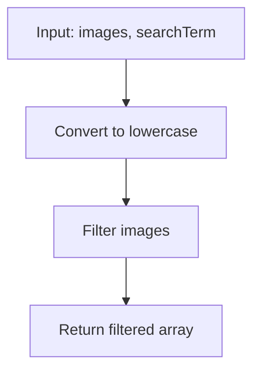

## El Problema

El 4 de noviembre de 2001, Google lanzó su búsqueda de imágenes, permitiendo a las personas encontrar imágenes usando términos de búsqueda. En este desafío, imitaremos esa funcionalidad.

Dado un array de nombres de imágenes y un término de búsqueda, debemos devolver un array de nombres de imágenes que contengan el término de búsqueda.

- Ignorar las mayúsculas y minúsculas al hacer coincidir los términos.
- Devolver las imágenes en el mismo orden en que aparecen en la array de entrada.

## Ejemplos

Aquí están los casos de prueba proporcionados:

1. `imageSearch(["dog.png", "cat.jpg", "parrot.jpeg"], "dog")` debería devolver `["dog.png"]`.
2. `imageSearch(["Sunset.jpg", "Beach.png", "sunflower.jpeg"], "sun")` debería devolver `["Sunset.jpg", "sunflower.jpeg"]`.
3. `imageSearch(["Moon.png", "sun.jpeg", "stars.png"], "PNG")` debería devolver `["Moon.png", "stars.png"]`.
4. `imageSearch(["cat.jpg", "dogToy.jpeg", "kitty-cat.png", "catNip.jpeg", "franken_cat.gif"], "Cat")` debería devolver `["cat.jpg", "kitty-cat.png", "catNip.jpeg", "franken_cat.gif"]`.

## Solución

La solución es bastante directa. Usaremos el método `filter()` para filtrar el array, y `includes()` para verificar si el nombre de la imagen contiene el término de búsqueda. Para ignorar las mayúsculas, convertiremos tanto el nombre de la imagen como el término de búsqueda a minúsculas usando `toLowerCase()`.

- filter es un método de arrays en JavaScript que crea un nuevo array con todos los elementos que pasan una prueba implementada por la función proporcionada. toma una función como argumento que se ejecuta en cada elemento del array original. Si la función devuelve true, el elemento se incluye en el nuevo array; si devuelve false, se excluye.
- includes es un método de strings en JavaScript que determina si una cadena de texto contiene una secuencia específica de caracteres. Toma una subcadena como argumento y devuelve true si la subcadena se encuentra dentro de la cadena original, y false si no.
- toLowerCase es un método de strings en JavaScript que convierte todos los caracteres de una cadena a minúsculas. No modifica la cadena original, sino que devuelve una nueva cadena con los caracteres convertidos.

```javascript
function imageSearch(images, searchTerm) {
  const term = searchTerm.toLowerCase()
  return images.filter(image => image.toLowerCase().includes(term))
}
```

### Explicación

La funcion `imageSearch` toma dos parámetros: un array de nombres de imágenes (`images`) y un término de búsqueda (`searchTerm`).

1. Convertimos el `searchTerm` a minúsculas y lo almacenamos en la variable `term`.
2. Usamos el método `filter()` para crear un nuevo array que contiene solo los elementos que pasan la prueba.
3. La prueba es: convertimos cada `image` a minúsculas y verificamos si incluye el `term`.
4. Devolvemos el array filtrado, que mantiene el orden original.

## Solución Alternativa con Regex

Otra forma de resolver este problema es utilizando expresiones regulares (regex), que nos permiten hacer búsquedas más avanzadas si fuera necesario. Para este caso específico, podemos crear un regex con la bandera 'i' para ignorar mayúsculas y minúsculas.

```javascript
function imageSearch(images, searchTerm) {
  const regex = new RegExp(searchTerm, 'i')
  return images.filter(image => regex.test(image))
}
```

### Comparación de Soluciones

#### Pros y Contras de la Solución con filter() e includes()

**Pros:**

- Simple y legible: fácil de entender para principiantes.
- No requiere conocimientos avanzados de regex.
- Eficiente para búsquedas simples de substrings.

**Contras:**

- Limitada a búsquedas exactas de substrings; no soporta patrones complejos.
- Si el problema evolucionara para requerir búsquedas más sofisticadas (como wildcards o patrones específicos), necesitaríamos refactorizar.

#### Pros y Contras de la Solución con Regex

**Pros:**

- Más poderosa y flexible: permite patrones de búsqueda complejos si se extiende el problema.
- La bandera 'i' maneja automáticamente el case insensitive.
- Útil si queremos agregar funcionalidades como búsqueda con wildcards en el futuro.

**Contras:**

- Overhead de crear el objeto RegExp, que puede ser innecesario para búsquedas simples.
- Potencialmente menos legible para quienes no están familiarizados con regex.
- Para este problema específico, es overkill ya que no necesitamos patrones complejos.

En resumen, para este desafío diario, la solución con `filter()` e `includes()` es perfectamente adecuada y más directa. La versión con regex es una buena alternativa si anticipamos que el problema podría requerir búsquedas más avanzadas.

## Diagrama del Proceso

Para visualizar cómo funciona la búsqueda, aquí tienes un diagrama de flujo simplificado:


