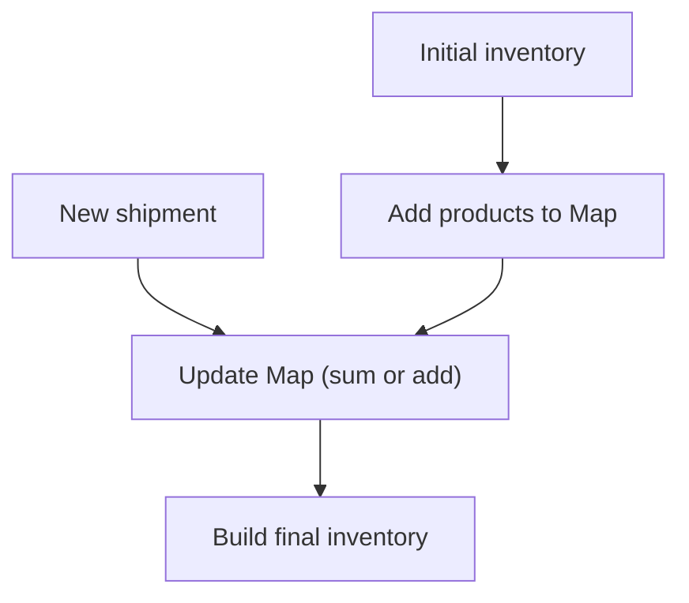

## Inventory Update - Analysis and Explanation

## Problem Statement

You are given two 2D arrays:

- The first represents your store's current inventory.
- The second, a new shipment of products.

Each element has the format `[quantity, product name]`.

**Goal:** Update the inventory by adding quantities for existing products and appending new products at the end, preserving the original order.

For example:

```js
// Initial inventory
[[2, 'apples'], [5, 'bananas']]
// New shipment
  [[1, 'apples'], [3, 'bananas']]
// Updated inventory
  [[3, 'apples'], [8, 'bananas']]
```

## Initial Analysis

### What does the challenge ask?

Update the store's inventory after a new shipment, summing quantities for existing products and adding new ones at the end, without losing the original order.

### Key Test Cases

These are the most important scenarios:

1. **Update existing products:**
   - Inventory and shipment have the same products. Quantities are summed.
   - Example: `[[2, "apples"], [5, "bananas"]]` and `[[1, "apples"], [3, "bananas"]]` → `[[3, "apples"], [8, "bananas"]]`.
2. **Add new products:**
   - Shipment brings products not present in inventory. They are added at the end.
   - Example: `[[2, "apples"], [5, "bananas"]]` and `[[1, "apples"], [3, "bananas"], [4, "oranges"]]` → `[[3, "apples"], [8, "bananas"], [4, "oranges"]]`.
3. **Empty inventory:**
   - If inventory is empty, the result is the shipment.
   - Example: `[]` and `[[10, "apples"], [30, "bananas"], [20, "oranges"]]` → `[[10, "apples"], [30, "bananas"], [20, "oranges"]]`.
4. **Inventory with zeros and mixed shipment:**
   - Update products with zero quantity and add new ones.
   - Example: `[[0, "Bowling Ball"], [0, "Dirty Socks"], [0, "Hair Pin"], [0, "Microphone"]]` and `[[1, "Hair Pin"], [1, "Half-Eaten Apple"], [1, "Bowling Ball"], [1, "Toothpaste"]]` → `[[1, "Bowling Ball"], [0, "Dirty Socks"], [1, "Hair Pin"], [0, "Microphone"], [1, "Half-Eaten Apple"], [1, "Toothpaste"]]`.

---

## Solution Development

### Visual Approach (Mermaid)



### Strategy

1. Use a `Map` to store products and quantities.
2. Iterate over the original inventory and register products in the `Map`.
3. Iterate over the shipment:
   - If the product exists, sum the quantity.
   - If not, add it and record its order.
4. Build the final array:
   - First, original products (with updated quantities).
   - Then, new products in the received order.

This method is efficient and clear, ideal for interviews and production.

### Step-by-Step Implementation

```js
function updateInventory(inventory, shipment) {
  const map = new Map()
  const originalOrder = []
  const newOnes = []

  // Register original inventory
  for (const [qty, prod] of inventory) {
    map.set(prod, qty)
    originalOrder.push(prod)
  }

  // Process shipment
  for (const [qty, prod] of shipment) {
    if (map.has(prod)) {
      map.set(prod, map.get(prod) + qty)
    }
    else {
      map.set(prod, qty)
      newOnes.push(prod)
    }
  }

  // Build result
  const result = []
  for (const prod of originalOrder) {
    result.push([map.get(prod), prod])
  }
  for (const prod of newOnes) {
    result.push([map.get(prod), prod])
  }
  return result
}
```

## Complexity Analysis

### Time Complexity

The algorithm iterates both arrays once and uses $O(1)$ operations in the `Map`.

$$
O(n + m)
$$

where $n$ is the number of products in the inventory and $m$ in the shipment.

### Space Complexity

Auxiliary structures are proportional to the total number of products:

$$
O(n + m)
$$

## Edge Cases and Considerations

- Empty inventory or shipment.
- Products with zero quantity.
- Repeated products in the shipment (the algorithm sums them).
- Case sensitivity in product names.
- Order: original order is preserved, new ones go at the end.

## Reflections and Learnings

### What did I learn?

- Using `Map` simplifies updating and searching for products.
- The algorithm is efficient and easy to understand.

### Can it be optimized?

Only if memory is critical, but we would lose clarity and speed. For most cases, this approach is ideal.

## Resources and References

- [JavaScript Map documentation](https://developer.mozilla.org/en-US/docs/Web/JavaScript/Reference/Global_Objects/Map)
- [JavaScript Array documentation](https://developer.mozilla.org/en-US/docs/Web/JavaScript/Reference/Global_Objects/Array)
