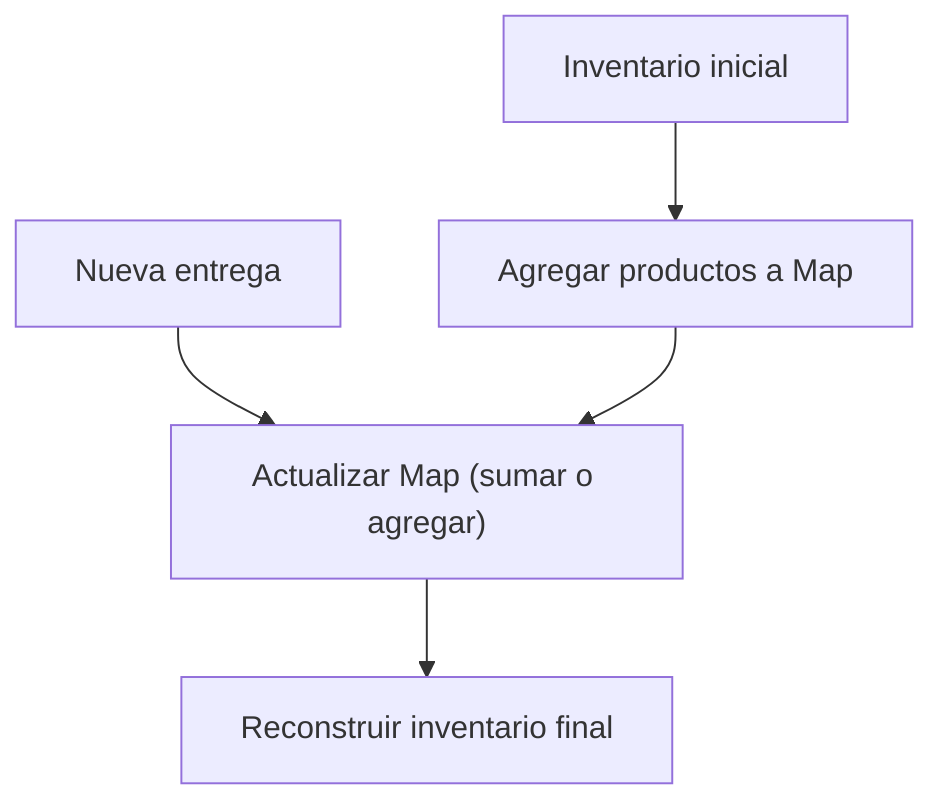

## Inventory Update - Análisis y Explicación

## Enunciado del Problema

Tienes dos arrays bidimensionales:

- El primero representa el inventario actual de tu tienda.
- El segundo, una nueva entrega de productos.

Cada elemento tiene el formato `[cantidad, nombre del producto]`.

**Objetivo:** Actualizar el inventario sumando las cantidades de productos existentes y agregando los nuevos productos al final, respetando el orden original.

Por ejemplo:

```js
// Inventario inicial
[[2, 'apples'], [5, 'bananas']]
// Nueva entrega
  [[1, 'apples'], [3, 'bananas']]
// Inventario actualizado
  [[3, 'apples'], [8, 'bananas']]
```

## Análisis Inicial

### ¿Qué pide el reto?

Actualizar el inventario de una tienda a partir de una nueva entrega, sumando cantidades de productos existentes y agregando los nuevos al final, sin perder el orden original.

### Casos de Prueba Clave

Estos son los escenarios más importantes:

1. **Actualizar productos existentes:**

- Inventario y entrega tienen los mismos productos. Se suman cantidades.
- Ejemplo: `[[2, "apples"], [5, "bananas"]]` y `[[1, "apples"], [3, "bananas"]]` → `[[3, "apples"], [8, "bananas"]]`.

2. **Agregar nuevos productos:**

- La entrega trae productos no presentes en el inventario. Se agregan al final.
- Ejemplo: `[[2, "apples"], [5, "bananas"]]` y `[[1, "apples"], [3, "bananas"], [4, "oranges"]]` → `[[3, "apples"], [8, "bananas"], [4, "oranges"]]`.

3. **Inventario vacío:**

- Si el inventario está vacío, el resultado es igual a la entrega.
- Ejemplo: `[]` y `[[10, "apples"], [30, "bananas"], [20, "oranges"]]` → `[[10, "apples"], [30, "bananas"], [20, "oranges"]]`.

4. **Inventario con ceros y entrega mixta:**

- Se actualizan productos con cantidad cero y se agregan nuevos.
- Ejemplo: `[[0, "Bowling Ball"], [0, "Dirty Socks"], [0, "Hair Pin"], [0, "Microphone"]]` y `[[1, "Hair Pin"], [1, "Half-Eaten Apple"], [1, "Bowling Ball"], [1, "Toothpaste"]]` → `[[1, "Bowling Ball"], [0, "Dirty Socks"], [1, "Hair Pin"], [0, "Microphone"], [1, "Half-Eaten Apple"], [1, "Toothpaste"]]`.

---

## Desarrollo de la Solución

### Enfoque Visual (Mermaid)



### Estrategia

1. Usar un `Map` para almacenar productos y cantidades.
2. Recorrer el inventario original y registrar productos en el `Map`.
3. Recorrer la entrega:
  - Si el producto existe, sumar la cantidad.
  - Si no existe, agregarlo y registrar su orden.
4. Construir el array final:
  - Primero, productos originales (con cantidades actualizadas).
  - Luego, los nuevos productos en el orden recibido.

### Implementación Paso a Paso

```js
function actualizarInventario(inventario, entrega) {
  const map = new Map()
  const ordenOriginal = []
  const nuevos = []

  // Registrar inventario original
  for (const [cant, prod] of inventario) {
    map.set(prod, cant)
    ordenOriginal.push(prod)
  }

  // Procesar entrega
  for (const [cant, prod] of entrega) {
    if (map.has(prod)) {
      map.set(prod, map.get(prod) + cant)
    }
    else {
      map.set(prod, cant)
      nuevos.push(prod)
    }
  }

  // Construir resultado
  const resultado = []
  for (const prod of ordenOriginal) {
    resultado.push([map.get(prod), prod])
  }
  for (const prod of nuevos) {
    resultado.push([map.get(prod), prod])
  }
  return resultado
}
```

## Análisis de Complejidad

### Complejidad Temporal

El algoritmo recorre ambos arreglos una sola vez y usa operaciones $O(1)$ en el `Map`.

$$
O(n + m)
$$

donde $n$ es el número de productos en el inventario y $m$ en la entrega.

### Complejidad Espacial

Se usan estructuras auxiliares proporcionales al total de productos:

$$
O(n + m)
$$

## Casos Edge y Consideraciones

- Inventario o entrega vacíos.
- Productos con cantidad cero.
- Productos repetidos en la entrega (el algoritmo los suma).
- Sensibilidad a mayúsculas/minúsculas en nombres.
- Orden: siempre se respeta el original y los nuevos van al final.

## Reflexiones y Aprendizajes

### ¿Qué aprendí?

- El uso de `Map` simplifica la actualización y búsqueda de productos.
- El algoritmo es eficiente y fácil de entender.

### ¿Se puede optimizar?

Solo si la memoria es crítica, pero perderíamos claridad y velocidad. Para la mayoría de los casos, este enfoque es ideal.

## Recursos y Referencias

- [Documentación de Map en JavaScript](https://developer.mozilla.org/es/docs/Web/JavaScript/Reference/Global_Objects/Map)
- [Manipulación de arrays en JavaScript](https://developer.mozilla.org/es/docs/Web/JavaScript/Reference/Global_Objects/Array)
