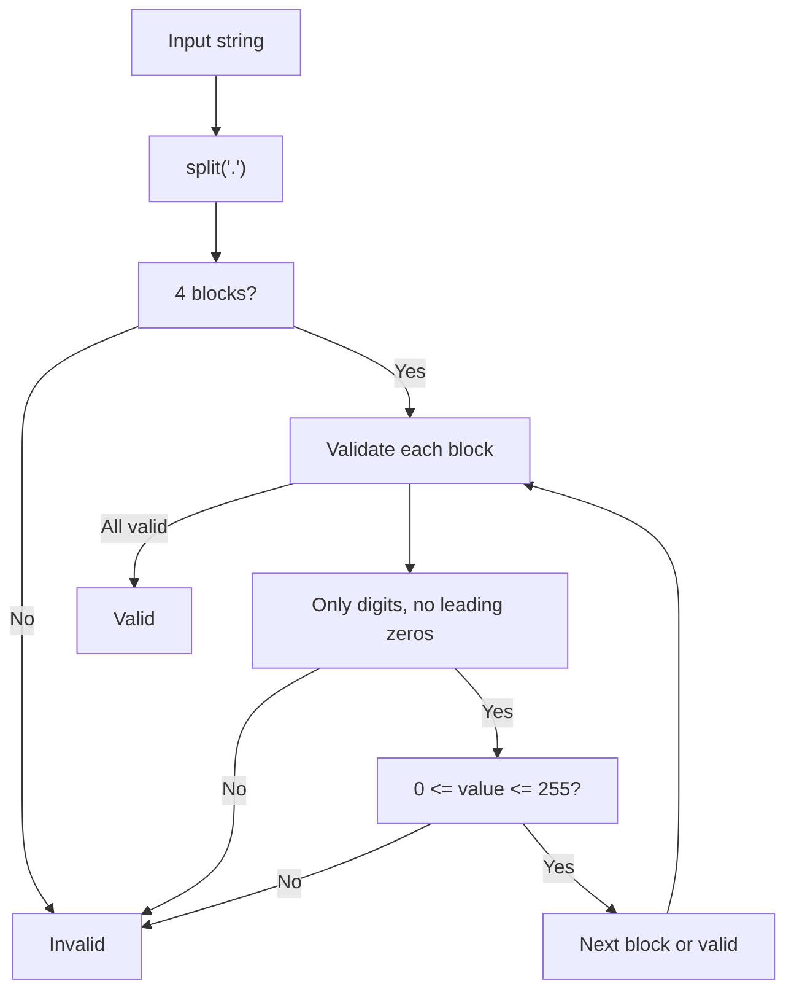

## IPv4 Validator: Analysis and Explanation

### Problem Statement

Given a string, determine if it represents a valid IPv4 address. An IPv4 address:

- Has four integer numbers separated by dots.
- Each number is between 0 and 255 (inclusive).
- No leading zeros ("0" is valid, "01" is not).
- Only contains digits (0-9).

## Initial Analysis

### Key Test Cases

- `192.168.1.1` → ✅ Valid
- `255.255.255.255` → ✅ Valid (upper limit)
- `0.0.0.0` → ✅ Valid (lower limit)
- `192.168.01.1` → ❌ Invalid (leading zero)
- `256.100.100.100` → ❌ Invalid (out of range)
- `192.168.1` → ❌ Invalid (missing blocks)
- `192.168.1.1.1` → ❌ Invalid (extra blocks)
- `192.168.a.1` → ❌ Invalid (non-numeric)
- `192.168.1.-1` → ❌ Invalid (negative)
- `192.168.1. 1` → ❌ Invalid (space)
- `192.168.1.01` → ❌ Invalid (leading zero)
- `00.0.0.0` → ❌ Invalid (leading zero)

## Solution Development

### Strategy

1. Split the string by `.` to get the blocks.
2. Check that there are exactly 4 blocks.
3. For each block:
   - Only digits (`/^\d+$/`).
   - No leading zeros (except "0").
   - Value between 0 and 255.
4. If all checks pass, it's a valid IPv4.

#### Flowchart



### Final Code

#### JavaScript Implementation

```js
function isValidIPv4(ipv4) {
  const blocks = ipv4.split('.')
  if (blocks.length !== 4)
    return false
  for (const block of blocks) {
    if (!/^\d+$/.test(block))
      return false // Only digits
    if (block.length > 1 && block[0] === '0')
      return false // Leading zero
    const num = Number(block)
    if (num < 0 || num > 255)
      return false
  }
  return true
}
```

## Complexity Analysis

### Time Complexity

The function is $O(n)$, where $n$ is the length of the string:

- `split('.')` scans the whole string.
- The loop is fixed (4 blocks), each validation is $O(1)$.

### Space Complexity

It's $O(1)$: only 4 blocks and simple variables are used.

## Edge Cases and Considerations

- Empty or only spaces: `"   "`, `""` → ❌
- Empty blocks: `"192..1.1"`, `"192.168..1"` → ❌
- Special characters/letters: `"192.168.a.1"`, `"192.168.1.@"` → ❌
- Negative numbers: `"192.168.1.-1"` → ❌
- Leading zeros: `"01.2.3.4"`, `"192.168.01.1"` → ❌
- Incorrect number of blocks: `"192.168.1"`, `"192.168.1.1.1"` → ❌
- Out of range: `"256.100.100.100"`, `"192.168.1.300"` → ❌
- Spaces in blocks: `"192.168.1. 1"`, `" 192.168.1.1"` → ❌

## Reflections and Learnings

### What concepts are applied?

- String manipulation (`split`)
- Regular expressions
- Numeric conversion and validation
- Multiple validation in a loop

### Can it be optimized?

- A global regex could be used, but the current solution is clearer and more maintainable.
- If processing millions of IPs, you can skip number conversion if the block is already invalid.

## Resources

- [IPv4 - Wikipedia](https://en.wikipedia.org/wiki/IPv4)
- [Regular Expressions in JavaScript - MDN](https://developer.mozilla.org/en-US/docs/Web/JavaScript/Guide/Regular_Expressions)
