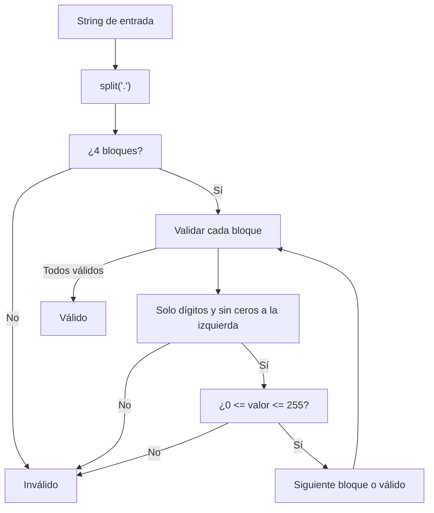

## Ipv4 Validator - Análisis y Explicación

## Enunciado del Problema

Dado un string, determinar si representa una dirección IPv4 válida. Una dirección IPv4:

- Tiene cuatro números enteros separados por puntos.
- Cada número está entre 0 y 255 (inclusive).
- No tiene ceros a la izquierda ("0" es válido, "01" no).
- Solo contiene dígitos (0-9).

## Análisis Inicial

### Casos de Prueba Clave

- `192.168.1.1` → ✅ Válido
- `255.255.255.255` → ✅ Válido (límite superior)
- `0.0.0.0` → ✅ Válido (límite inferior)
- `192.168.01.1` → ❌ Inválido (cero a la izquierda)
- `256.100.100.100` → ❌ Inválido (fuera de rango)
- `192.168.1` → ❌ Inválido (faltan bloques)
- `192.168.1.1.1` → ❌ Inválido (sobran bloques)
- `192.168.a.1` → ❌ Inválido (caracteres no numéricos)
- `192.168.1.-1` → ❌ Inválido (negativo)
- `192.168.1. 1` → ❌ Inválido (espacio)
- `192.168.1.01` → ❌ Inválido (cero a la izquierda)
- `00.0.0.0` → ❌ Inválido (cero a la izquierda)

## Desarrollo de la Solución

### Estrategia

1. Dividir el string por `.` para obtener los bloques.
2. Verificar que haya exactamente 4 bloques.
3. Para cada bloque:
  - Solo dígitos (`/^\d+$/`).
  - Sin ceros a la izquierda (excepto "0").
  - Valor entre 0 y 255.
4. Si todo se cumple, es IPv4 válida.

#### Diagrama de Flujo



### Código Final

### Implementación en JavaScript

```js
function isValidIPv4(ipv4) {
  const blocks = ipv4.split('.')
  if (blocks.length !== 4)
    return false
  for (const block of blocks) {
    if (!/^\d+$/.test(block))
      return false // Solo dígitos
    if (block.length > 1 && block[0] === '0')
      return false // Cero a la izquierda
    const num = Number(block)
    if (num < 0 || num > 255)
      return false
  }
  return true
}
```

## Análisis de Complejidad

### Temporal

La función es $O(n)$, donde $n$ es la longitud del string:

- `split('.')` recorre todo el string.
- El bucle es fijo (4 bloques), cada validación es $O(1)$.

### Espacial

Es $O(1)$: solo se usan 4 bloques y variables simples.

## Casos Edge y Consideraciones

## Casos Edge y Consideraciones

- Vacío o solo espacios: `"   "`, `""` → ❌
- Bloques vacíos: `"192..1.1"`, `"192.168..1"` → ❌
- Caracteres especiales/letras: `"192.168.a.1"`, `"192.168.1.@"` → ❌
- Números negativos: `"192.168.1.-1"` → ❌
- Ceros a la izquierda: `"01.2.3.4"`, `"192.168.01.1"` → ❌
- Cantidad incorrecta de bloques: `"192.168.1"`, `"192.168.1.1.1"` → ❌
- Fuera de rango: `"256.100.100.100"`, `"192.168.1.300"` → ❌
- Espacios en bloques: `"192.168.1. 1"`, `" 192.168.1.1"` → ❌

## Reflexiones y Aprendizajes

## Reflexiones y Aprendizajes

### ¿Qué conceptos se aplican?

- Manipulación de strings (`split`)
- Expresiones regulares
- Conversión y validación numérica
- Validación múltiple en bucle

### ¿Se puede optimizar?

- Se podría usar una regex global, pero la solución actual es más clara y mantenible.
- Si se procesan millones de IPs, se puede evitar la conversión a número si el bloque ya es inválido.

## Recursos y Referencias

## Recursos

- [IPv4 - Wikipedia](https://es.wikipedia.org/wiki/IPv4)
- [Expresiones regulares en JavaScript - MDN](https://developer.mozilla.org/es/docs/Web/JavaScript/Guide/Regular_Expressions)

---
